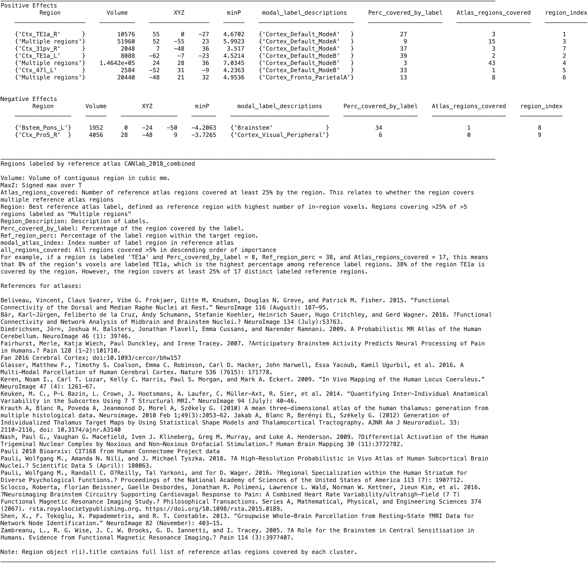

# `region.table` — print and return an atlas-labeled table of regions

[← back to `region` methods](../region_methods.md) ·
[Object methods index](../Object_methods.md)

Print a results table for a `region` object array, one row per region,
with peak coordinates, volume, mean / max statistic value, and an
atlas-derived anatomical label. Returns the labelled region object plus
a MATLAB table for further analysis. The underlying engine for the
`fmri_data.table` / `statistic_image.table` wrappers — call directly
when you already have a region object.

## Quick example

```matlab
imgs = load_image_set('emotionreg');
t = ttest(imgs);
t = threshold(t, .005, 'unc', 'k', 10);
r = region(t);
table(r);
```



## See also

- [`region.montage`](region_montage.md) — render the same regions as a per-region mini-montage
- [`fmri_data.table`](fmri_data_table.md) — wrapper that calls `region.table` after running `region(...)` for you
- [`fmri_data.table_of_atlas_regions_covered`](fmri_data_table_of_atlas_regions_covered.md) — complementary atlas-coverage view
