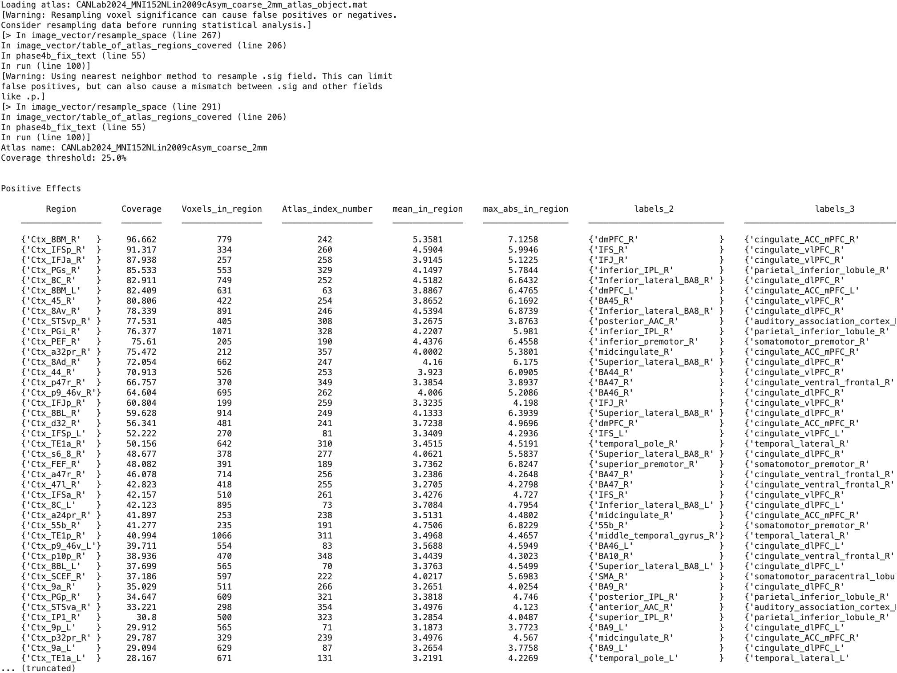

# `region.table_of_atlas_regions_covered` — atlas-coverage table for a region set

[← back to `region` methods](../region_methods.md) ·
[Object methods index](../Object_methods.md)

For each atlas parcel covered (≥25% of voxels by default) by at least
one region in the input region object, print a row reporting the parcel
name, volume, peak coordinates, mean statistic, and percent coverage.
Complements [`region.table`](region_table.md) (which lists *blobs*) by
listing *atlas parcels* — useful when a single thresholded blob spans
multiple distinct anatomical regions.

> **Note:** the `@region` implementation currently has indexing bugs
> (the source itself flags this with a `disp` warning at runtime). For
> reliable output, use the `@image_vector` / `@statistic_image` method
> instead — see [`fmri_data.table_of_atlas_regions_covered`](fmri_data_table_of_atlas_regions_covered.md).
> The example below uses that path.

## Quick example

```matlab
imgs = load_image_set('emotionreg');
t = ttest(imgs);
t = threshold(t, .005, 'unc', 'k', 10);
% Use the @image_vector / @statistic_image method (works reliably):
[results_table_pos, results_table_neg, r] = table_of_atlas_regions_covered(t);
```



## See also

- [`fmri_data.table_of_atlas_regions_covered`](fmri_data_table_of_atlas_regions_covered.md) — recommended `@image_vector` / `@statistic_image` entry point
- [`region.table`](region_table.md) — blob-by-blob summary instead of parcel-by-parcel
- [`subdivide_by_atlas`](../image_vector_methods.md) — the underlying split primitive
