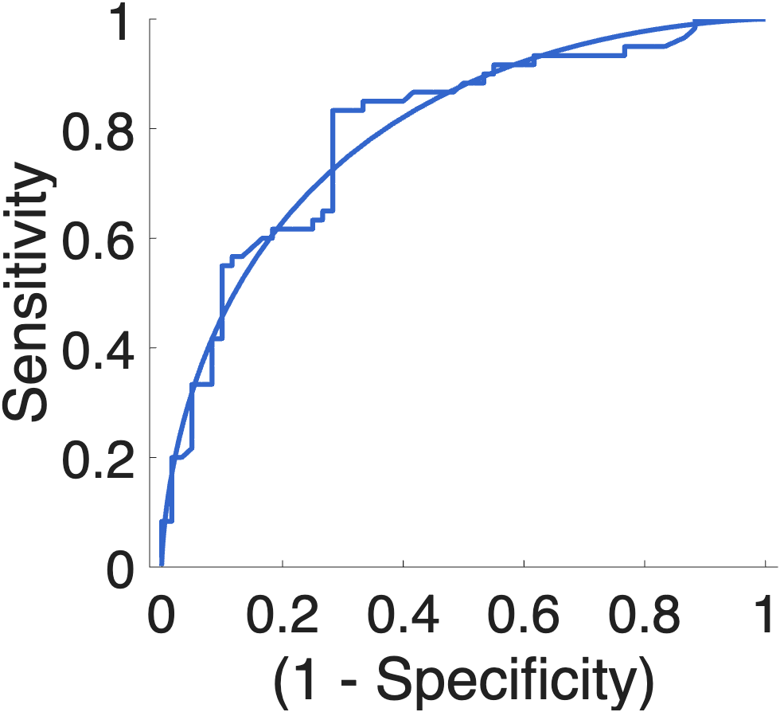

# `roc_plot` — ROC curve, accuracy stats, and signal-detection fits for a binary classifier

[Object methods index](../Object_methods.md) ·
[Atlases / regions / patterns](../atlases_regions_and_patterns.md)

`roc_plot` takes a vector of continuous decision values (e.g., pattern
expression, model scores, log-likelihood ratios) plus a logical outcome
vector and produces a publication-style ROC plot with the standard
sensitivity / specificity / PPV / NPV / AUC / d′ statistics returned in a
single struct. It can fit a Gaussian equal-variance signal-detection model
to overlay on the empirical curve, choose an optimal threshold by overall
accuracy or balanced error rate, and bootstrap 95% confidence intervals
for sensitivity / specificity / PPV at that threshold.

The function is the canonical CANlab plotting helper after a multivariate
classifier (`xval_SVM`, `predict`, `xval_classify`) returns scores. It is
also useful for evaluating a hand-rolled univariate marker — point any
continuous variable at any binary outcome and you get the same set of
statistics in one call.

## Quick example

Two synthetic Gaussian populations stand in for "positives" and "negatives"
on some continuous score:

```matlab
rng(42);
n = 60;
neg = randn(n, 1) - 0.5;          % "negatives" (class 0)
pos = randn(n, 1) + 0.8;          % "positives" (class 1)
input_values   = [neg; pos];
binary_outcome = [false(n, 1); true(n, 1)];
ROC = roc_plot(input_values, binary_outcome, ...
               'color', [.2 .4 .8], 'plotmethod', 'observed', 'noboot');
```



The thin step-function is the empirical ROC; the smooth curve is the fitted
Gaussian equal-variance model. AUC, d′, optimal threshold, and the
binomial-test p-value are printed and stored in `ROC`.

## Usage

```matlab
ROC = roc_plot(input_values, binary_outcome)
ROC = roc_plot(input_values, binary_outcome, 'include', logical_vec, ...)
ROC = roc_plot(input_values, binary_outcome, 'threshold', t, ...)
```

`input_values` is a continuous vector; `binary_outcome` is a logical (or
0/1) vector of the same length. Internally the function calls
[`roc_calc`](https://github.com/canlab/CanlabCore) for the empirical ROC
and adds Gaussian fits, accuracy stats, and the plot.

## Inputs

| Argument | Type | Description |
|---|---|---|
| `input_values` | numeric vector | Continuous decision variable (pattern expression, score, etc.). |
| `binary_outcome` | logical / 0-1 vector | Ground truth, same length as `input_values`. |

## Optional inputs

### Threshold selection

| Argument | Type | Description |
|---|---|---|
| `'threshold', t` | scalar | Use a pre-specified threshold rather than picking one. |
| `'threshold_type', s` | string | One of `'Optimal balanced error rate'`, `'Optimal overall accuracy'` (default), `'Minimum SDT bias'`. |
| `'balanced'` | flag | Balanced accuracy for single-interval classification (NB: affects accuracy estimates only, not p-values). |

### Plot control

| Argument | Type | Description |
|---|---|---|
| `'color', c` | RGB or string | Curve colour, e.g., `'r'` or `[0 .4 .8]`. |
| `'plotmethod', s` | string | `'deciles'` (default) or `'observed'` — which set of FPR/TPR points to draw. |
| `'plothistograms'` | flag | Overlay histograms of the two outcome distributions. |
| `'nonormfit'` | flag | Suppress the Gaussian equal-variance fit overlay. |
| `'noplot'` | flag | Compute statistics only — return the struct, draw nothing. |

### Inference / bootstrap

| Argument | Type | Description |
|---|---|---|
| `'boot'` | flag (default) | Bootstrap 95% CIs for sensitivity, specificity, PPV at the chosen threshold. |
| `'noboot'` | flag | Skip bootstrap — faster for large `N`. |
| `'dependent', ids` | integer vector | Subject-id vector for repeated-measures (multilevel binomial test for single-interval classification). |
| `'twochoice'` | flag | Two-alternative forced-choice mode (binary outcomes are paired). |
| `'valuestoevaluate', v` | numeric vector | Evaluate ROC at specific input-value cut-points (useful for whole-image p-value maps). |

### Output control

| Argument | Type | Description |
|---|---|---|
| `'nooutput'` | flag | Suppress the printed-table chatter. |
| `'writerscoreplus'` | flag | Write a text file in RScorePlus (Lew Harvey) format for external analysis. |

## Outputs

`ROC` is a struct with at least:

| Field | Description |
|---|---|
| `tpr`, `fpr` | True / false positive rates along the curve. |
| `thr` | Criterion thresholds corresponding to each (tpr, fpr) point. |
| `AUC` | Area under the ROC curve. |
| `accuracy`, `accuracy_p` | Accuracy at the chosen threshold and binomial-test p-value. |
| `sensitivity`, `specificity`, `PPV`, `NPV` | Standard accuracy statistics at the threshold. |
| `sensitivity_ci`, `specificity_ci`, `PPV_ci` | 95% bootstrap CIs (when `'boot'` is on). |
| `d_a` (or `d`) | Effect size from the Gaussian equal-variance signal-detection fit. |
| `class_threshold` | The threshold actually used (entered or chosen). |
| `line_handle`, `fitline_handle` | Graphics handles for the empirical and fitted curves. |
| `misclass_indx` | Indices of misclassified observations. |

## Notes

- "Sensitivity" = `P(predicted yes | true yes)`, "Specificity" =
  `P(predicted no | true no)`, "PPV" = `P(true yes | predicted yes)`,
  "NPV" = `P(true no | predicted no)`.
- AUC is computed from the empirical curve, not the Gaussian fit. Larger
  AUC → stronger separability; max = 1 (perfect classification).
- The Gaussian equal-variance model assumes the two outcome distributions
  are normal with equal variance. With `'nonormfit'` the smooth curve is
  suppressed and only the empirical step function is drawn.
- For an entire image of voxelwise p-values, pass `1 - p` as
  `input_values` and the truth as `binary_outcome`, then specify
  `'valuestoevaluate'` at the p-value cut-points you care about (e.g.
  `1 - [.5:-.1:.1 .05 .01 .005 .001 .0001]`).
- With `'dependent'`, the function performs a multilevel binomial test for
  single-interval classification, treating subject id as a grouping
  variable.

## Examples

```matlab
% Basic call with bootstrap
ROC = roc_plot(pattern_exp_values, ishot);

% Fixed threshold, no Gaussian fit
ROC = roc_plot(pattern_exp_values, ishot, 'threshold', 2.5, 'nonormfit');

% Two-alternative forced-choice
ROC = roc_plot(pexp, logical(outcome), 'color', 'r', 'twochoice');

% With histograms of the two distributions overlaid
ROC = roc_plot(pexp, logical(outcome), 'color', 'g', ...
               'plothistograms', 'threshold', 0.3188);

% Whole-image p-value evaluation at pre-chosen p-cutpoints
rocout = roc_plot(1 - t.p, truevals, 'plotmethod', 'observed', ...
                  'valuestoevaluate', ...
                  1 - [.5:-.1:.1 .05 .01 .005 .001 .0001]);
```

## See also

- [`xval_SVM`](xval_SVM.md) — repeated-CV SVM classifier whose `ROC_plot`
  output is consumed here
- [`xval_SVR`](xval_SVR.md) — SVR analogue (continuous outcomes)
- [`xval_classify`](xval_classify.md) — k-fold linear discriminant
- [`xval_select_holdout_set`](xval_select_holdout_set.md) — build holdout
  sets balanced on outcome and nuisance covariates
- `roc_calc` — empirical ROC computation used internally
