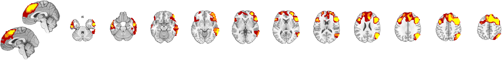

# `statistic_image.multi_threshold` — pruned multi-level threshold montage

[← back to `statistic_image` methods](../statistic_image_methods.md) ·
[Object methods index](../Object_methods.md)

Apply a sequence of thresholds (default: p < .001, p < .01, p < .05) to a
`statistic_image`, prune to clusters that survive the most stringent
threshold and grow them out at progressively more lenient ones, and
render the result as a layered montage with a registered `fmridisplay`
handle. Lets you see "where the strong effects are" and "what they grow
into at more permissive thresholds" in a single figure.

## Quick example

```matlab
imgs = load_image_set('emotionreg');
t = ttest(imgs);
[o2, sig, poscl, negcl] = multi_threshold(t);
% Make a table of the regions at the most stringent threshold:
r = table(poscl{1});
```



## See also

- [`statistic_image.threshold`](statistic_image_threshold.md) — single-threshold workhorse
- [`region`](../region_methods.md) — `poscl` / `negcl` are region objects, one per threshold
- [`canlab_results_fmridisplay`](canlab_results_fmridisplay.md) — pre-built montage scaffolds the layered render uses
