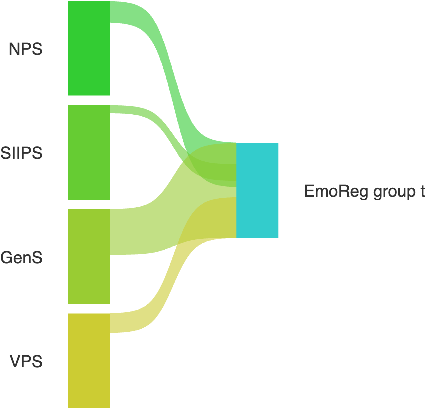

# `statistic_image.riverplot` — Sankey-style flow diagram between image sets

[← back to `statistic_image` methods](../statistic_image_methods.md) ·
[Object methods index](../Object_methods.md)

Render a riverplot (Sankey diagram) showing relationships among the
images in one or two `fmri_data` / `statistic_image` objects. With one
input, plots associations among images within the object. With a second
`'layer2'` argument, plots flow from layer-1 images to layer-2 images
(useful for showing how subject-level patterns map onto group-level
constructs, or how individual signatures map onto network components).

## Quick example

Show how four CANlab signature maps load on the emotion-regulation group t-map:

```matlab
imgs = load_image_set('emotionreg');
layer1 = load_image_set('npsplus'); layer1 = get_wh_image(layer1, 1:4);
layer2 = ttest(imgs); layer2 = threshold(layer2, .005, 'unc');
layer2 = fmri_data(layer2);
layer1.image_names = char({'NPS','SIIPS','GenS','VPS'});
layer2.image_names = char({'EmoReg group t'});
riverplot(layer1, 'layer2', layer2);
```



## See also

- [`image_similarity_plot`](fmri_data_image_similarity_plot.md) — wedge / polar plot view of the same kind of data
- `riverplot_toolbox` — the underlying Sankey-rendering primitives
