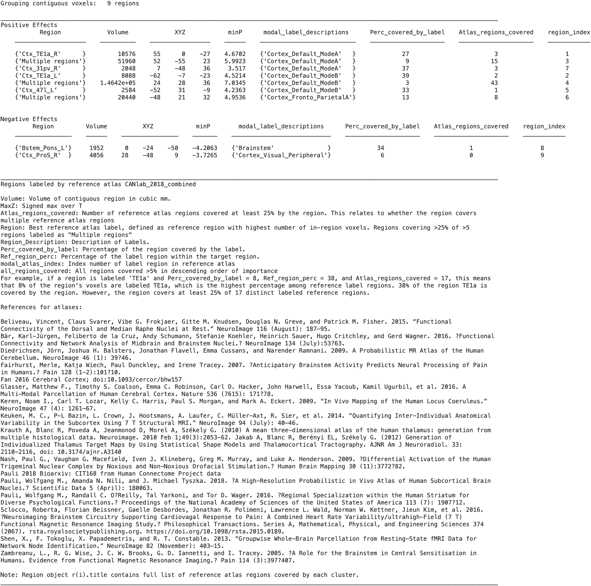

# `statistic_image.table` — atlas-labeled results table from a thresholded map

[← back to `statistic_image` methods](../statistic_image_methods.md) ·
[Object methods index](../Object_methods.md)

Print and return a results table for a thresholded `statistic_image`:
one row per contiguous positive- or negative-effect cluster, labelled
with the most-overlapping atlas region. Returns the labelled `region`
object and a MATLAB table for downstream use (e.g. publication tables or
filtering to specific regions).

## Quick example

```matlab
imgs = load_image_set('emotionreg');
t = ttest(imgs);
t = threshold(t, .005, 'unc', 'k', 10);
[r, results_table] = table(t);
```



## See also

- [`fmri_data.table`](fmri_data_table.md) — same logic on `fmri_data` / `image_vector`
- [`region.table`](region_table.md) — the underlying engine; useful when you already have a region object
- [`fmri_data.table_of_atlas_regions_covered`](fmri_data_table_of_atlas_regions_covered.md) — complementary view that lists atlas parcels covered by the map
