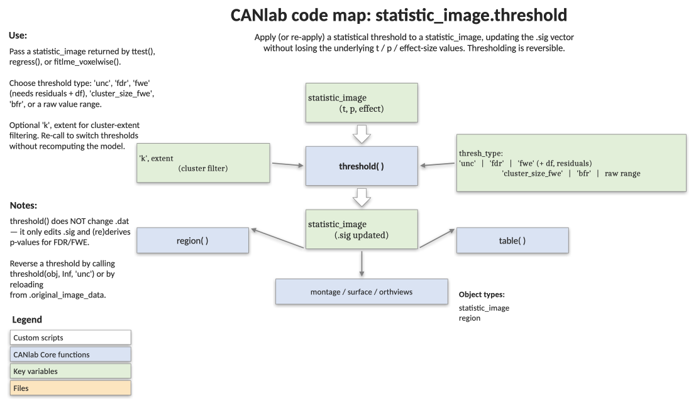

# `statistic_image.threshold` — apply (and re-apply) a statistical threshold

[← back to `statistic_image` methods](../statistic_image_methods.md) ·
[Object methods index](../Object_methods.md) ·
[Recasting objects](../recasting_objects.md)

Threshold a `statistic_image` based on p-value or raw-value criteria,
optionally with a cluster-extent constraint and/or a mask. Thresholding is
**reversible** — the underlying t/p/effect values are preserved, and only
the `.sig` indicator is updated, so you can re-threshold the same object
many times without re-running the test that produced it.

## Code map



[Editable PowerPoint version](../code_maps_pptx/statistic_image_threshold_codemap.pptx)

## Usage

```matlab
stats_image_obj = threshold(stats_image_obj, input_threshold, thresh_type, ...)
```

Common patterns:

```matlab
obj = threshold(obj, .001, 'unc', 'k', 100)         % p < .001 unc, k >= 100
obj = threshold(obj, .05,  'fdr', 'k', 10)          % q < .05 FDR, k >= 10
obj = threshold(obj, [-3 3], 'raw-outside')         % |stat| > 3
```

## Inputs

| Argument | Type | Description |
|---|---|---|
| `stats_image_obj` | `statistic_image` | The object to threshold. Must have `.p` and (for extent thresholding) `.volInfo` populated. |
| `input_threshold` | numeric | p-value (e.g. `.001`) or raw-value cutoffs (`[lo hi]`) interpreted according to `thresh_type`. |
| `thresh_type` | string | One of `'fdr'`, `'fwe'`, `'bfr'`, `'unc'`, `'extent'` / `'cluster_extent'`, `'raw-between'`, `'raw-outside'`. See below. |
| `'k', extent` | name-value | Optional. Cluster-extent threshold in voxels. Requires `volInfo`. |
| `'mask', mask` | name-value | Optional. Filename or `fmri_mask_image` / `fmri_data` / `image_vector` to mask the image before thresholding (e.g. to correct within an ROI). Resampled to the stats image space if needed. |
| `'df', df` | name-value | Optional. Degrees of freedom (used by `'fwe'`). |
| `'noverbose'` | flag | Suppress verbose printout. |
| (positional) `resid_image_obj` | `fmri_data` | Required as first `varargin` for `'extent'` / `'cluster_extent'` / `'fwe'` — residual images from the model used to estimate smoothness. |

### Threshold types

| `thresh_type` | What it does |
|---|---|
| `'fdr'` | FDR-correct based on the p-values stored in `.p`. |
| `'fwe'` | FWE correction via SPM Gaussian Random Fields. Requires residual images and `'df'`. Two-tailed by default — to get one-tailed behaviour, double `input_threshold` and interpret only one direction. |
| `'bfr'` (`'bonferroni'`) | Bonferroni FWE correction (`alpha / nVoxels`). |
| `'unc'` (`'uncorrected'`) | Plain p-value threshold. |
| `'extent'` / `'cluster_extent'` | Cluster-extent correction with SPM GRF at p < .05 corrected; primary height threshold = `input_threshold`. |
| `'raw-between'` | Keep voxels with `value > lo` and `value < hi` (where `input_threshold = [lo hi]`). |
| `'raw-outside'` | Keep voxels with `value < lo` or `value > hi`. |

## Outputs

| Field | Type | Description |
|---|---|---|
| `stats_image_obj` | `statistic_image` | Same object, with `.sig` updated, `.threshold` set per image, and `volInfo.cluster` re-derived for the surviving voxels. |

The `.dat`, `.p`, `.t`, and `.ste` fields are **not** zeroed out, so a
subsequent call to `threshold(obj, ...)` operates on the same underlying
data and supersedes the earlier threshold. `region(obj)` and `table(obj)`
respect the current `.sig` field.

## Notes

- Cluster-extent and FWE thresholding need residual images **for that
  specific effect**. If you pass an object containing multiple statistic
  images and one set of residuals, the result is questionable — split the
  object and threshold one image at a time.
- The FWE path doubles the input threshold internally to convert SPM's
  one-tailed default into the two-tailed convention used elsewhere in
  CANlab. Pass twice the alpha you want if you genuinely intend a
  one-tailed test.
- Masking changes the multiple-comparison correction — use it when you
  want corrections inside an ROI rather than over the whole brain.
- See [`statistic_image.multi_threshold`](statistic_image_methods.md) for
  layered thresholds (e.g. primary p < .001 with extent envelope at p < .05).

## Example: threshold and re-threshold a group t-map

```matlab
% Run a one-sample t-test on a sample dataset and threshold three ways
imgs = load_image_set('emotionreg');
t    = ttest(imgs);

% Voxelwise p < .001, cluster extent >= 10
t1 = threshold(t, .001, 'unc', 'k', 10);
montage(t1);

% q < .05 FDR with no extent constraint
t2 = threshold(t, .05, 'fdr');
orthviews(t2);

% FWE correction within an ROI, requires regression residuals
out = regress(imgs, .05, 'unc', 'residual');
df  = mean(out.df.dat);
out.t = apply_mask(out.t, fmri_data('RVM.nii'));
thr   = threshold(out.t, .05, 'fwe', out.resid, 'df', df);
```

## See also

- [`fmri_data.ttest`](fmri_data_ttest.md) — produce a `statistic_image` to threshold
- [`fmri_data.regress`](fmri_data_regress.md) — produce thresholded β / t / contrast maps
- [`fmri_data.table`](fmri_data_table.md) — tabulate clusters surviving a threshold
- [`statistic_image_methods`](../statistic_image_methods.md) — full method index, including `multi_threshold`
