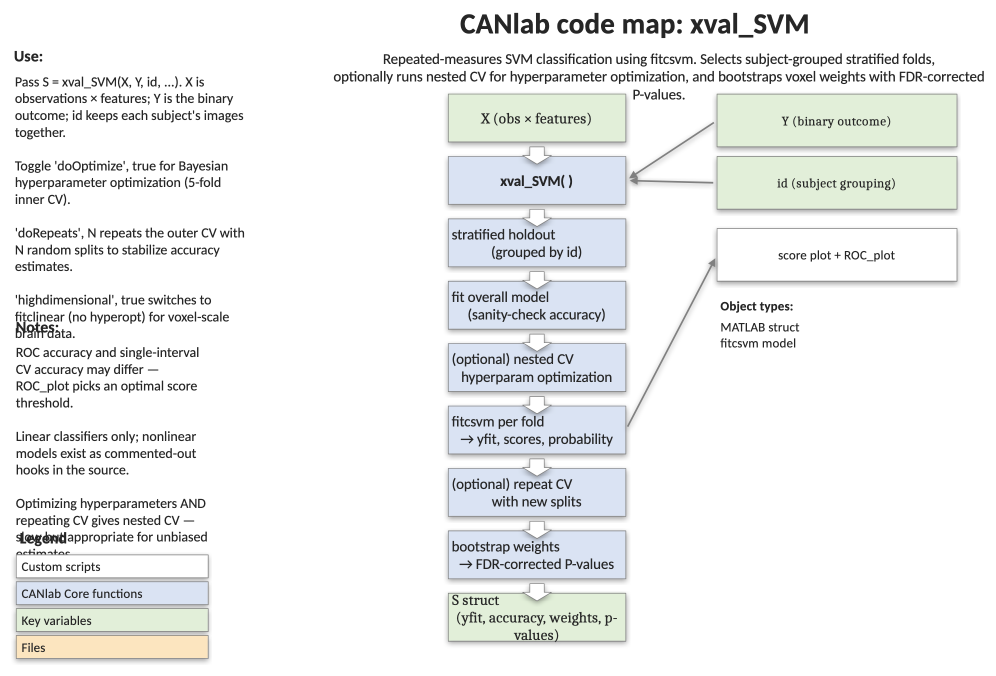

# `xval_SVM` — cross-validated SVM with hyperparameter optimisation, repeats, and bootstrapping

[Object methods index](../Object_methods.md) ·
[Toolbox folders](../toolbox_folders.md)

End-to-end SVM classification pipeline for binary outcomes, designed for
repeated-measures (within-person) designs. Selects stratified holdouts
that keep all images from the same id together, runs cross-validation
with sensible defaults, optionally does nested hyperparameter optimisation
and repeated random-split CV, and bootstraps feature weights for
FDR-corrected significance. The standard CANlab entry point for "I have a
feature matrix and want a defensible classifier with full performance
metrics."

## Code map



[Editable PowerPoint version](../code_maps_pptx/xval_SVM_codemap.pptx)

## Usage

```matlab
S = xval_SVM(X, Y, id, varargin)
```

## Inputs

| Argument | Type | Description |
|---|---|---|
| `X` | `[N × p]` numeric | Predictor matrix (observations × features). |
| `Y` | `[N × 1]` numeric | Outcome, effects-coded `1` / `-1`. |
| `id` | `[N × 1]` numeric | Grouping codes (e.g. subject id). All observations sharing an id stay together in train or test. Use `1:N` or `[]` for no grouping. |
| `'doplot'`, logical | flag | Create plots. Default `true`. Use `'noplot'` to suppress. |
| `'doverbose'`, logical | flag | Verbose output. Default `true`. Use `'noverbose'` to suppress. |
| `'dooptimize'`, logical | flag | Nested hyperparameter optimisation via Bayesian search. Default `true`. Use `'nooptimize'` to skip. |
| `'dorepeats'`, integer | param | Number of repeated cross-validations with different partitions. Default `10`. Use `'norepeats'` to skip. |
| `'dobootstrap'` / `'nobootstrap'` / `'nboot'`, integer | flag / param | Bootstrap feature weights for inference. Default on. `'nboot', N` sets number of bootstrap samples. |
| `'modeloptions'`, cell | param | Cell array of name/value pairs forwarded to `fitcsvm`. Default `{'KernelFunction', 'linear'}`. |
| `'nfolds'`, integer | param | Number of CV folds. Default `10`. |
| `'highdimensional', true` | flag | Use `fitclinear` instead of `fitcsvm` (better for high-dim data, e.g. voxelwise images). Not compatible with hyperparameter optimisation. |

## Outputs

`S` is returned as a `predictive_model`-compatible structure with (among others):

| Field | Description |
|---|---|
| `Y`, `yfit` | True and cross-validated predicted class labels (`±1`). |
| `id` | Grouping variable. |
| `w`, `b` | Final-model weights (Beta) and bias. |
| `SVMModel` | The full-data `ClassificationSVM` object (Beta, Bias, KernelParameters.Scale). |
| `nfolds`, `cvpartition`, `trIdx`, `teIdx` | CV bookkeeping. |
| `dist_from_hyperplane_xval` | Cross-validated signed distance to the decision boundary — useful as a continuous score. |
| `class_probability_xval` | Platt-scaled probability of class 1, cross-validated. |
| `crossval_accuracy`, `classification_d_singleinterval` | Single-interval accuracy and Cohen's d. |
| `crossval_accuracy_opt_hyperparams` | Accuracy with optimised hyperparameters (when `dooptimize`). |
| `Y_within_id`, `scores_within_id`, `scorediff` | Within-person reorganisation for paired/forced-choice tests. |
| `crossval_accuracy_within`, `classification_d_within` | Within-person (forced-choice) metrics. |
| `boot_w_mean`, `boot_w_ste`, `wZ`, `wP`, `wP_fdr_thr`, `boot_w_fdrsig`, `w_thresh_fdr` | Bootstrap inference on feature weights, including FDR-corrected significance. |
| `accfun` | Function handle for accuracy computation (single-interval). |

## Notes

- Hyperparameter optimisation uses Bayesian search with a 5-fold inner CV
  (not grouped by `id`) and the smooth best-estimate criterion. Needs
  reasonably large samples to be useful. Not currently compatible with
  `'highdimensional', true`.
- Single-interval accuracy from cross-val and from `ROC_plot` may differ:
  `ROC_plot` chooses a new threshold to maximise balanced accuracy, while
  cross-val uses threshold 0. Forced-choice accuracy is identical.
- Scores and Platt-scaled probabilities can disagree because the sigmoid
  scaling is fit per-fold. Disagreement grows when there is no true signal.
- Linear kernel only by default; the source has commented hooks for
  nonlinear kernels.
- If you optimise hyperparameters AND repeat cross-validation, you get
  nested cross-validation — accurate but potentially slow.
- For forced-choice paired classification on within-person data, use
  `S.scorediff` with `ttest`, `signtest`, or `roc_plot`.

## Example

```matlab
% Two observations per participant, real signal buried in noise
n = 50;                                      % participants
k = 120;                                     % features
true_sig = [repmat(randn(1, k), n, 1); repmat(randn(1, k), n, 1)];
noise = 10 * randn(2 * n, k);
X = true_sig + noise;
Y = [ones(n, 1); -ones(n, 1)];
id = [(1:n)'; (1:n)'];

% Quick cross-validated performance, no optimisation, no bootstrap
S = xval_SVM(X, Y, id, 'nooptimize', 'norepeats', 'nobootstrap');

% Forced-choice paired test: are within-person score differences > 0?
[h, p, ci, stats] = ttest(S.scorediff)

% Full pipeline: optimise, repeat, bootstrap
S = xval_SVM(X, Y, id);
```

## Other examples

```matlab
% High-dimensional data (e.g. voxelwise) — use fitclinear, no optimisation
S = xval_SVM(X, Y, id, 'highdimensional', true, 'nooptimize');

% Logistic learner with uniform priors
S = xval_SVM(X, Y, id, 'highdimensional', true, ...
    'modeloptions', {'Prior', 'uniform', 'Learner', 'logistic'});

% Silent run for batch use
S = xval_SVM(X, Y, id, 'nooptimize', 'norepeats', 'nobootstrap', ...
    'noverbose', 'noplot');
```

## See also

- [`xval_SVR`](xval_SVR.md) — support vector regression with the same scaffolding
- [`xval_classify`](xval_classify.md) — multi-class linear discriminant
- [`xval_select_holdout_set`](xval_select_holdout_set.md) — covariate-balanced holdout sets
- [`fmri_data.predict`](../fmri_data_methods.md) — top-level CV prediction on imaging objects
