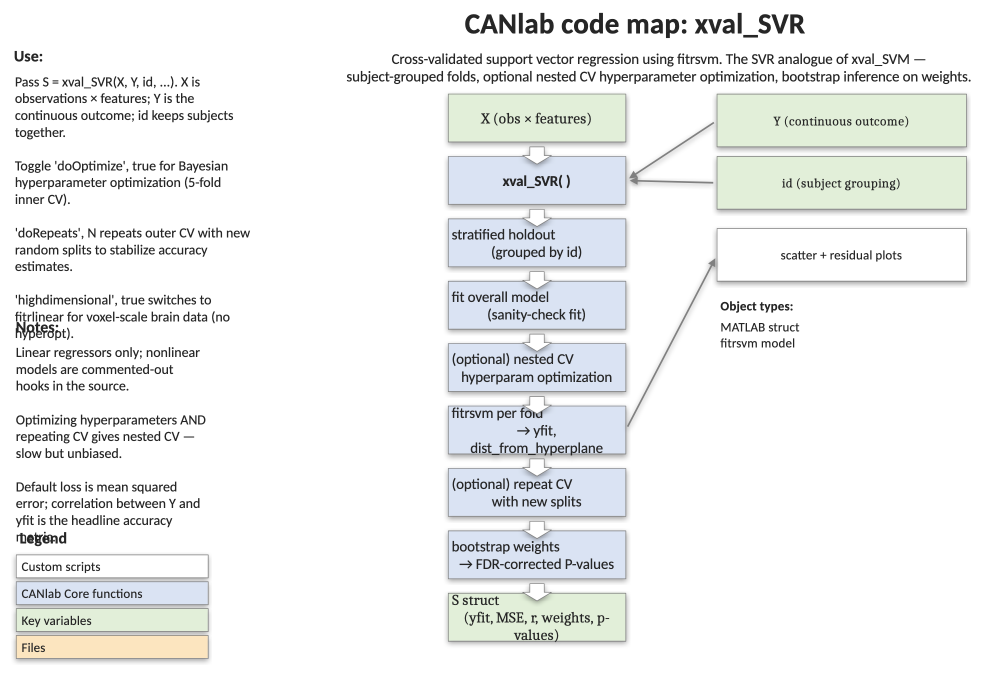

# `xval_SVR` — cross-validated support vector regression with hyperparameter optimisation, repeats, and bootstrapping

[Object methods index](../Object_methods.md) ·
[Toolbox folders](../toolbox_folders.md)

End-to-end SVR pipeline for continuous outcomes, with the same scaffolding
as `xval_SVM`: stratified holdouts that respect repeated-measures
groupings, optional nested hyperparameter optimisation, repeated random
splits, and bootstrap inference on feature weights. Use this when the
target is continuous (e.g. pain rating, age, behavioural score) and you
want a defensible, fully cross-validated linear regression.

## Code map



[Editable PowerPoint version](../code_maps_pptx/xval_SVR_codemap.pptx)

## Usage

```matlab
S = xval_SVR(X, Y, id, varargin)
```

## Inputs

| Argument | Type | Description |
|---|---|---|
| `X` | `[N × p]` numeric | Predictor matrix (observations × features). |
| `Y` | `[N × 1]` numeric | Continuous outcome to predict. |
| `id` | `[N × 1]` numeric | Grouping codes (e.g. subject id). All observations sharing an id are kept together in train or test. Use `1:N` or `[]` for no grouping. |
| `'doplot'`, logical | flag | Create plots. Default `true`. Use `'noplot'` to suppress. |
| `'doverbose'`, logical | flag | Verbose output. Default `true`. Use `'noverbose'` to suppress. |
| `'dooptimize'`, logical | flag | Nested hyperparameter optimisation via Bayesian search. Default `true`. Use `'nooptimize'` to skip. |
| `'doprepeats'`, integer | param | Number of repeated cross-validations with different partitions. Default `10`. Use `'norepeats'` to skip. |
| `'dobootstrap'` / `'nobootstrap'` / `'nboot'`, integer | flag / param | Bootstrap feature weights for inference. Default on. `'nboot', N` sets number of bootstrap samples. |
| `'modeloptions'`, cell | param | Cell array of name/value pairs forwarded to `fitrsvm`. Default `{'KernelFunction', 'linear'}`. |

## Outputs

`S` is a structure with (among others):

| Field | Description |
|---|---|
| `Y`, `yfit` | True and cross-validated predicted continuous outcomes. |
| `id` | Grouping variable. |
| `w`, `b` | Final-model weights and bias. |
| `SVRModel` | The full-data `RegressionSVM` object (Beta, Bias, KernelParameters.Scale). |
| `nfolds`, `cvpartition`, `trIdx`, `teIdx` | CV bookkeeping. |
| `dist_from_hyperplane_xval` | Cross-validated continuous score. |
| `class_probability_xval` | Platt-scaled probability (legacy field; see Notes). |
| `crossval_accuracy` | Cross-validated prediction r² (no hyperparam opt). |
| `prediction_outcome_r` | Simple prediction-outcome correlation (not for use as quantitative objective). |
| `regression_d_singleinterval` | Cohen's d effect size derived from r. |
| `crossval_accuracy_opt_hyperparams` | Accuracy with optimised hyperparameters (when `dooptimize`). |
| `Y_within_id`, `scores_within_id`, `scorediff` | Within-person reorganisation for paired tests. |
| `crossval_accuracy_within`, `classification_d_within` | Within-person metrics. |
| `boot_w_mean`, `boot_w_ste`, `wZ`, `wP`, `wP_fdr_thr`, `boot_w_fdrsig`, `w_thresh_fdr` | Bootstrap inference on feature weights, including FDR-corrected significance. |
| `accfun` | Function handle for accuracy computation. |

## Notes

- Linear `fitrsvm` only by default; the source has commented hooks for
  nonlinear kernels.
- Hyperparameter optimisation uses Bayesian search with a 5-fold inner CV
  (not grouped by `id`) and the smooth best-estimate criterion. Needs
  reasonably large samples to be useful.
- If you optimise hyperparameters AND repeat cross-validation, you get
  nested cross-validation — accurate but potentially slow.
- The `class_probability_xval` field is a holdover from the SVM
  scaffolding; for regression, the most useful continuous score is
  `S.yfit` (or `S.dist_from_hyperplane_xval`, which is the same up to a
  constant in the regression case).
- `prediction_outcome_r` is provided for reporting but should not be used
  as the optimisation objective — it is overly forgiving when predictions
  have the right rank but wrong scale. Use `crossval_accuracy` (prediction
  r²) for that. See Scheinost et al. 2019 for the rationale.

## Example

```matlab
% One observation per person, true linear signal + heavy noise
n = 50;                                       % participants
k = 120;                                      % features
Y = randn(n, 1);                              % True continuous outcome
X = Y * randn(1, k) + ones(n, 1) * randn(1, k) + 5 * randn(n, k);
id = (1:n)';                                  % One observation per id

% Quick cross-validated performance
S = xval_SVR(X, Y, id, 'nooptimize', 'norepeats', 'nobootstrap');

% Two observations per participant
id2 = [(1:n/2)'; (1:n/2)'];
S2 = xval_SVR(X, Y, id2, 'nooptimize', 'norepeats', 'nobootstrap');
```

## Other examples

```matlab
% Quick bootstrap test (small N — not for final inference)
S = xval_SVR(X, Y, id, 'nooptimize', 'norepeats', 'nboot', 100);

% Repeated cross-val only, 5 repeats
S = xval_SVR(X, Y, id, 'nooptimize', 'dorepeats', 5, 'nobootstrap');

% Nested hyperparameter optimisation only
S = xval_SVR(X, Y, id, 'norepeats', 'nobootstrap');

% Full pipeline: optimise, repeat, bootstrap
S = xval_SVR(X, Y, id);

% Silent run for batch use
S = xval_SVR(X, Y, id, 'nooptimize', 'norepeats', 'nobootstrap', ...
    'noverbose', 'noplot');
```

## See also

- [`xval_SVM`](xval_SVM.md) — binary SVM with the same scaffolding
- [`xval_classify`](xval_classify.md) — multi-class linear discriminant
- [`xval_select_holdout_set`](xval_select_holdout_set.md) — covariate-balanced holdout sets
- [`fmri_data.predict`](../fmri_data_methods.md) — top-level CV prediction on imaging objects
- [`fmri_data.regress`](fmri_data_regress.md) — voxelwise multiple regression (mass-univariate alternative)
