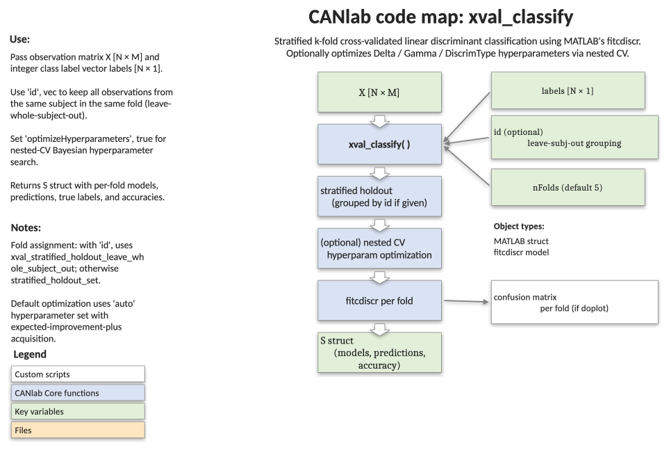

# `xval_classify` — k-fold cross-validated linear discriminant classification

[Object methods index](../Object_methods.md) ·
[Toolbox folders](../toolbox_folders.md)

Cross-validated linear discriminant analysis for a generic feature matrix
and integer class labels. Wraps MATLAB's `fitcdiscr`, supports
leave-whole-subject-out grouping for repeated-measures designs, optional
nested hyperparameter optimisation, and an aggregated confusion matrix.
Reach for this when you want a simple, well-understood multi-class
baseline classifier with proper CV bookkeeping.

## Code map



[Editable PowerPoint version](../code_maps_pptx/xval_classify_codemap.pptx)

## Usage

```matlab
S = xval_classify(X, labels, varargin)
```

## Inputs

| Argument | Type | Description |
|---|---|---|
| `X` | `[N × M]` numeric | Observations (rows) × features (columns). |
| `labels` | `[N × 1]` integer | Class labels, one per observation. |
| `'id'` | `[N × 1]` integer | Grouping variable (e.g. subject id). When supplied, all observations sharing an id are kept together in the same train or test fold via `xval_stratified_holdout_leave_whole_subject_out`. Default empty. |
| `'nFolds'` | positive integer | Number of CV folds. Default `5`. |
| `'optimizeHyperparameters'` | logical | Run nested CV hyperparameter optimisation inside each training set. Default `false`. |
| `'hyperparameterOptions'` | struct | Custom options for `fitcdiscr` hyperparameter optimisation. Default empty → use `'OptimizeHyperparameters', 'auto'` with `'AcquisitionFunctionName', 'expected-improvement-plus'`. |
| `'verbose'` | logical | Print progress and per-fold accuracy. Default `true`. |
| `'doplot'` | logical | Plot the aggregated confusion matrix at the end. Default `true`. |

## Outputs

`S` is a struct with the following fields:

| Field | Type | Description |
|---|---|---|
| `Y`, `y` | `[N × 1]` | True labels (same vector under two names for convenience). |
| `id` | `[N × 1]` | Grouping variable, or empty. |
| `nfolds` | scalar | Number of folds. |
| `trIdx`, `teIdx` | `{1 × nfolds}` cell of logical | Training and test masks per fold. |
| `models` | `{1 × nfolds}` cell | Trained `fitcdiscr` model per fold. |
| `predictions`, `trueLabels` | `{1 × nfolds}` cell | Predicted and true labels per fold. |
| `accuracy` | `[nfolds × 1]` | Per-fold accuracy (%). |
| `yfit` | `[N × 1]` | Out-of-fold predicted label for every observation. |
| `overallAccuracy` | scalar | Aggregated accuracy (%) of `yfit` vs. `y`. |

## Notes

- Folds come from `xval_stratified_holdout_leave_whole_subject_out` when
  `'id'` is supplied, otherwise from `stratified_holdout_set` on `labels`
  alone.
- The hyperparameters available for optimisation in `fitcdiscr` are
  `Delta`, `Gamma`, and `DiscrimType`:
    - `Delta` — threshold below which linear coefficients are zeroed (feature elimination).
    - `Gamma` — covariance regularisation, from none to fully diagonal.
    - `DiscrimType` — linear, quadratic, diagonal, or pseudoinverse covariance structure.
- The plot is the aggregated confusion matrix across folds (using
  `confusionchart`), with row- and column-normalised summaries.
- Per-fold confusion-matrix plotting is currently commented out in the
  source.

## Example

```matlab
% Synthetic 3-class problem with 100 observations and 10 features
rng(0)
N = 100;
X = randn(N, 10);
labels = [ones(40,1); 2*ones(30,1); 3*ones(30,1)];

% Add a little class signal into the first feature
X(labels == 2, 1) = X(labels == 2, 1) + 1.5;
X(labels == 3, 1) = X(labels == 3, 1) - 1.5;

% Repeated-measures: 20 subjects with 5 observations each
id = repelem((1:20)', 5);

% 5-fold leave-whole-subject-out CV
S = xval_classify(X, labels, 'id', id, 'nFolds', 5);

fprintf('Overall accuracy: %.1f%%\n', S.overallAccuracy);
```

## See also

- [`xval_SVM`](xval_SVM.md) — binary SVM with the same CV scaffolding
- [`xval_SVR`](xval_SVR.md) — support vector regression
- [`xval_select_holdout_set`](xval_select_holdout_set.md) — covariate-balanced holdout sets
- [`fmri_data.predict`](../fmri_data_methods.md) — top-level cross-validated prediction on imaging objects
