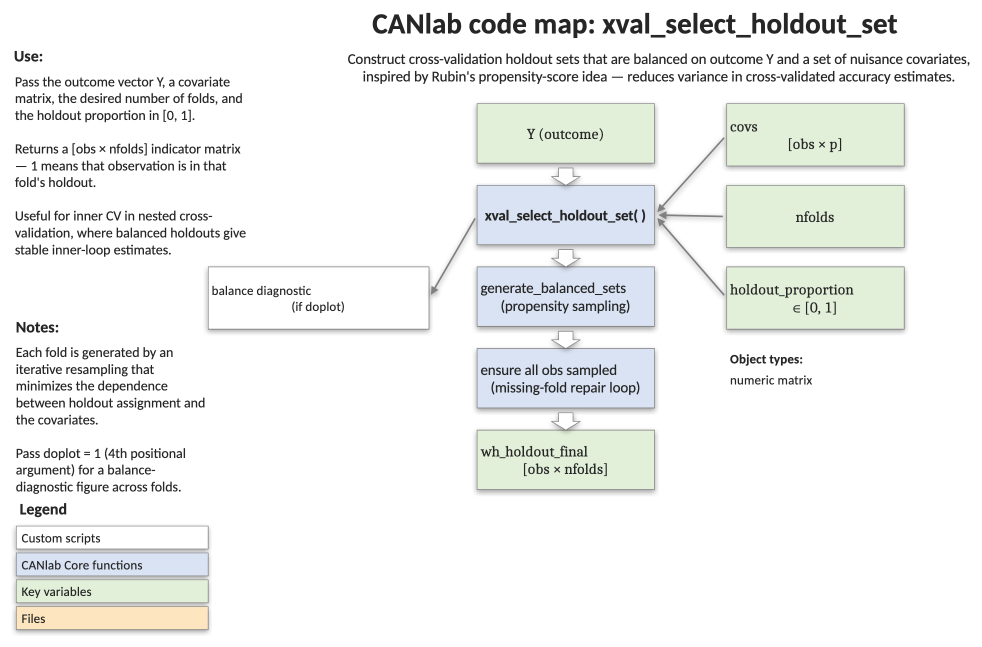

# `xval_select_holdout_set` — covariate-balanced holdout sets for cross-validation

[Object methods index](../Object_methods.md) ·
[Toolbox folders](../toolbox_folders.md)

Picks one or more holdout sets that are balanced on an outcome and a set
of covariates, so that each test fold looks similar to the rest of the
sample on the variables that matter. Inspired by Rubin's propensity-score
logic. Reduces the variance in cross-validated accuracy estimates,
particularly when holdout sets are large (as in inner-loop model
selection).

## Code map



[Editable PowerPoint version](../code_maps_pptx/xval_select_holdout_set_codemap.pptx)

## Usage

```matlab
wh_holdout_final = xval_select_holdout_set(Y, covs, nfolds, holdout_proportion, [doplot])
```

## Inputs

| Argument | Type | Description |
|---|---|---|
| `Y` | `[N × 1]` numeric | Outcome to balance on. |
| `covs` | `[N × p]` numeric | Covariates of no interest to balance on (may be empty). |
| `nfolds` | positive integer | Number of holdout sets desired. |
| `holdout_proportion` | scalar in (0, 1) | Fraction of the sample held out in each fold (e.g. `0.5` for 50/50 splits). |
| `doplot` | logical (optional) | If true, plot the beta-vs-t selection diagnostic and an example holdout's logistic fit. Default `false`. |

## Outputs

| Output | Type | Description |
|---|---|---|
| `wh_holdout_final` | `[N × nfolds]` logical | Each column marks the holdout observations for one fold (`true` = held out, `false` = training). |

## Notes

- For each candidate holdout set, the function fits a logistic regression
  predicting holdout membership from `[Y covs]` and records the slope on
  the outcome (and covariates implicitly). Sets with the smallest absolute
  betas — i.e. holdout assignment is closest to independent of `Y` and
  `covs` — are kept.
- `niter = nfolds * 10` candidate sets are generated; the most balanced
  10% are retained. The function then loops, replacing the worst-balanced
  sets with new ones until every observation appears in at least one
  holdout set.
- Training/test independence across folds is **not** explicitly optimised.
- Leave-one-out has minimum bias but high variance; k-fold with larger
  holdouts trades bias for stability. For model selection (inner CV),
  Shao 1998 (JASA) argues for relatively large holdout sets and small
  training sets — a use case this function is well suited to.
- Use the `doplot` flag while debugging to confirm the selected sets
  really are balanced on the outcome.

## Example

```matlab
% Synthetic outcome and covariates for 100 observations
N = 100;
Y = randn(N, 1);
covs = randn(N, 2);

% 20 balanced holdout sets, each holding out half the sample
wh_holdout = xval_select_holdout_set(Y, covs, 20, 0.5);

% Inspect: every observation should appear in at least one holdout set
all(sum(wh_holdout, 2) > 0)

% Visualise the selection process
wh_holdout = xval_select_holdout_set(Y, covs, 20, 0.5, true);
```

## See also

- [`xval_SVM`](xval_SVM.md) — repeated-measures SVM with stratified holdouts
- [`xval_SVR`](xval_SVR.md) — support vector regression with the same CV scaffolding
- [`xval_classify`](xval_classify.md) — discriminant classification with stratified or grouped CV
- [`fmri_data.predict`](../fmri_data_methods.md) — top-level cross-validated prediction on imaging objects
- [Toolbox folders](../toolbox_folders.md) — locating `Statistics_tools/Cross_validated_Regression`
