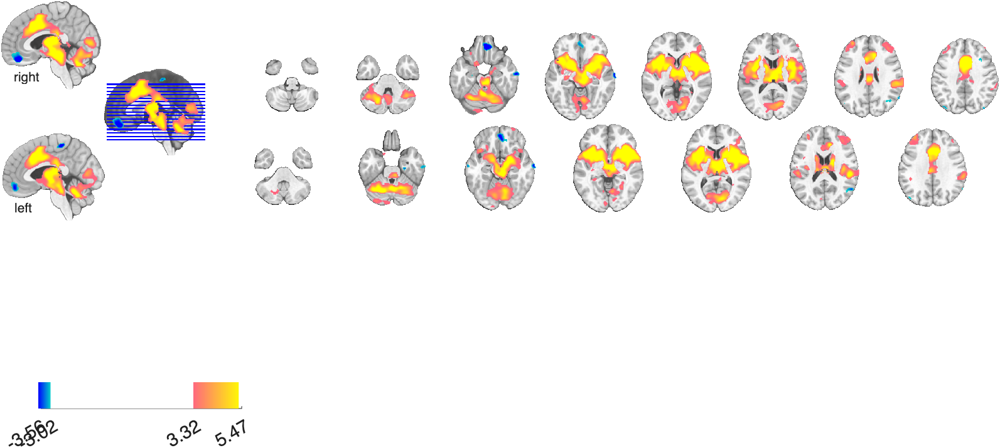
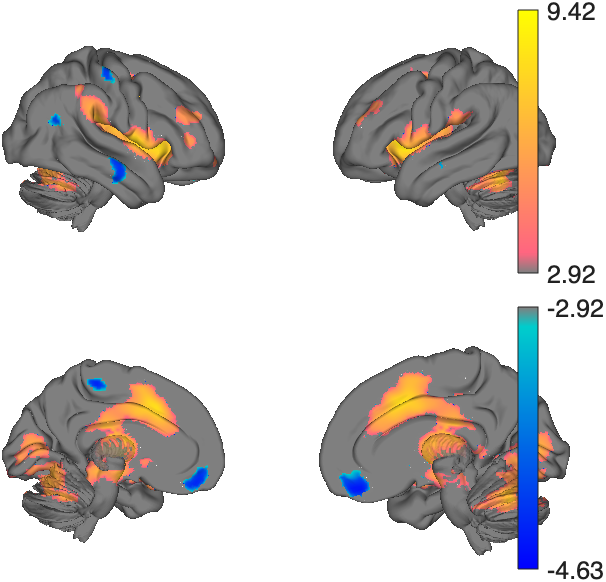
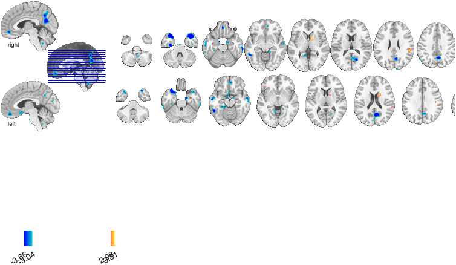
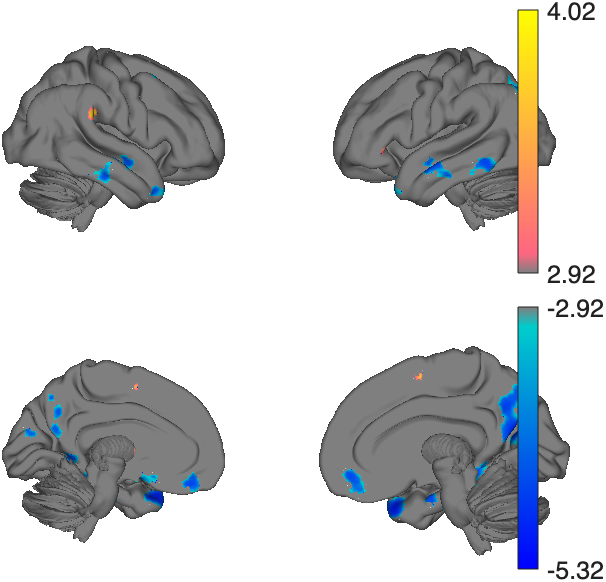
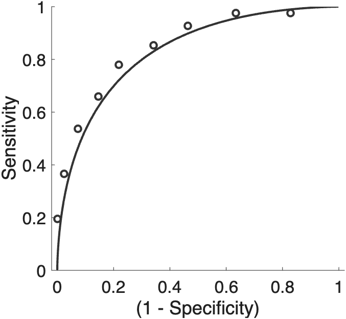
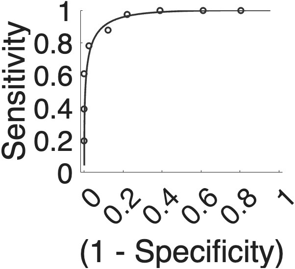
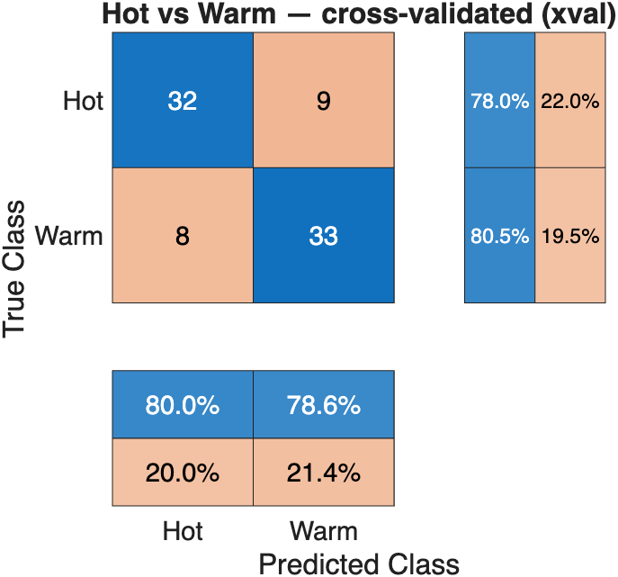
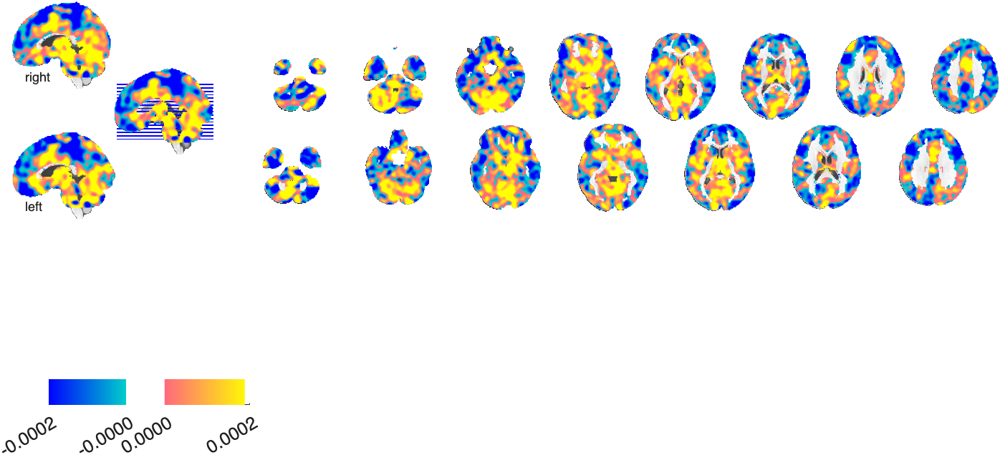
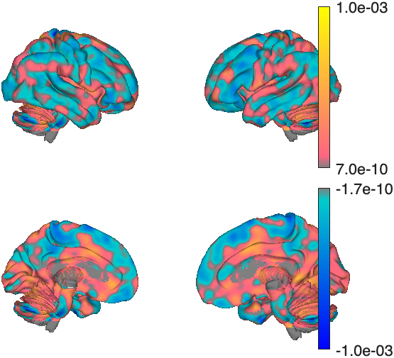

# Multivariate decoding — Part 1: classification basics with SVM

> **Multivariate decoding tutorial series**
> 1. **Classification basics with SVM** *(this part)* — train and cross-validate a linear SVM (Hot vs Warm); ROC, confusion matrix, effect sizes; apply to a held-out test set.
> 2. [Classification and regression](multivariate_decoding_part2_classification_and_regression.md) — the difference between the two, the one-line dataset loaders, the `xval_*` wrapper family, and `fmri_data.predict` end-to-end for both.
> 3. [The sklearn-style `predictive_model` API](multivariate_decoding_part3_predictive_model_api.md) — fit / predict / crossval / bootstrap / permutation, nested-CV tuning, calibration, stability selection.
> 4. [Cross-classification](multivariate_decoding_part4_cross_classification.md) — does a pain pattern decode social rejection? (Woo et al., 2014).
> 5. [Algorithms, tuning, and inference](multivariate_decoding_part5_algorithms_and_tuning.md) — compare SVM / SVR / lasso / ridge / GP, ECOC multiclass, grid search, stability selection.

A walkthrough of basic CANlab/SVM workflows for *decoding* fMRI condition
maps: training and evaluating a linear SVM, reading out cross-validated
scores, building ROC and confusion-matrix summaries, and laying the
groundwork for cross-classification across distinct affective domains.

> **Live Script version:** [`multivariate_decoding_part1_classification_with_SVM.mlx`](multivariate_decoding_part1_classification_with_SVM.mlx)
> &nbsp;·&nbsp; plain-text source (recommended for version control, opens in the
> Live Editor on R2025a+):
> [`multivariate_decoding_part1_classification_with_SVM.m`](multivariate_decoding_part1_classification_with_SVM.m)

## About the study (Woo et al., 2014)

This tutorial uses participant-level condition maps from the *DPSP*
romantic-rejection study (Woo et al., *Nat. Commun.* 2014). Sixty
participants who had recently experienced an unwanted romantic breakup
were scanned in two tasks on separate trials. In the **somatic-pain
task** they received painful **Heat (Hot)** or non-painful **Warmth**
on the volar forearm; in the **social-rejection task** they viewed
photographs of their **Ex-partner (Rejector)** or a **close Friend**,
recalling how they felt during the breakup or a positive shared
experience. The four single-subject contrast maps (Hot, Warm, Rejector,
Friend) let us pose two parallel **two-class classification** problems
(Hot vs. Warm; Rejector vs. Friend) and, by reusing the trained
classifiers across tasks, ask the **cross-classification** question that
motivated the paper: *do whole-brain or local multivariate patterns
generalize between physical pain and social rejection?* The headline
finding is that *both* whole-brain patterns and local patterns within
pain-processing regions (dACC, aINS, dpINS, S2) are *separately
modifiable* — each can be reliably decoded, but neither generalizes to
the other, suggesting distinct neural representations for pain and
rejection co-localized in similar gross anatomy.

- Local repo (Neuroimaging_Pattern_Masks):
  [`2015_Woo_NatureComms_Rejection`](https://github.com/canlab/Neuroimaging_Pattern_Masks/tree/master/Multivariate_signature_patterns/2015_Woo_NatureComms_Rejection)
- Paper (open access): [Woo et al., 2014, *Nat. Commun.* — doi:10.1038/ncomms6380](https://doi.org/10.1038/ncomms6380)
  · [local PDF](../../../Neuroimaging_Pattern_Masks/Multivariate_signature_patterns/2015_Woo_NatureComms_Rejection/Woo_2014_NatComms_dpSP_romantic_rejection.pdf)

> **Shortcut — one-line loaders.** Sections 1–3 below build the two
> classification inputs by hand (load four objects, gray-matter mask,
> concatenate, set `±1` labels, build a subject grouping vector) so you can
> see every step. If you just want the ready-to-classify objects, two
> keyword loaders do all of that for you:
> ```matlab
> hw_obj = load_image_set('DPSP_hotwarm', 'noverbose');        % Hot (+1) vs Warm (−1)
> rf_obj = load_image_set('DPSP_rejectorfriend', 'noverbose'); % Rejector (+1) vs Friend (−1)
> ```
> Each returns an `fmri_data` object already masked, with `.Y` set to `±1`
> and `subj_id` / `Condition` / `Orig_partition` in `.metadata_table`.
> Part 2 onward uses these loaders; Part 1 keeps the manual build for
> transparency.

## 1. Load the data

The sample data live in `CanlabCore/Sample_datasets/DPSP_pain_rejection_participant_maps/`
as four `fmri_data` objects — one per condition. Each object holds
first-level **condition maps** at the single-subject level (averaged
across runs). We define a condition map as **task − baseline**, where
the baseline is the *implicit* baseline captured by the first-level
GLM's intercept. So `single_subject_images_hot` stores a *Hot − Baseline*
map for each participant, and similarly for the other three conditions.
Because trials are jittered, the implicit baseline is estimable and
task − baseline images are stable. In many designs "baseline" effectively
means rest, but this study deliberately used an **18-s visuospatial
control task** instead — rest would have invited rumination about the
breakup, contaminating the comparison conditions.

```matlab
datadir = fullfile(fileparts(which('canlab_toolbox_setup')), ...
    'CanlabCore', 'Sample_datasets', 'DPSP_pain_rejection_participant_maps');

load(fullfile(datadir, 'DPSP_single_subject_images_hot.mat'));
load(fullfile(datadir, 'DPSP_single_subject_images_warm.mat'));
load(fullfile(datadir, 'DPSP_single_subject_images_rejector.mat'));
load(fullfile(datadir, 'DPSP_single_subject_images_friend.mat'));
```

Every object has **subjects in the same order** (one row per participant
in `.dat'`), so within-person operations like `Hot − Warm` reduce to
matrix subtraction on `.dat`. Each object also carries a
`metadata_table` field — a MATLAB `table` with one row per image. For
these data the columns are:

| column | meaning |
| --- | --- |
| `subj_id`         | participant identifier (one per row) |
| `Condition`       | condition label (`'Hot'`, `'Warm'`, `'Rejector'`, `'Friend'`) — handy when objects are concatenated for SVM |
| `Orig_partition`  | `'xval'` or `'test'` — assignment to the cross-validation set vs. final holdout set |
| `image_names`     | original filename (e.g., `con_0008.img`) |
| `orig_full_path_name` | original path on the lab filesystem |

```matlab
>> head(single_subject_images_hot.metadata_table)

    subj_id      Condition    Orig_partition
    _________    _________    ______________
    'dpsp002'    'Hot'        'xval'
    'dpsp003'    'Hot'        'xval'
    'dpsp004'    'Hot'        'xval'
    'dpsp005'    'Hot'        'test'
    'dpsp006'    'Hot'        'xval'
    ...
```

A **final-holdout** partition (here `'test'`, 18/59 participants) is set
aside so the model you ultimately ship can be evaluated *once* on data
that was never used to choose anything — model, threshold, or
hyperparameter. This is the cleanest form of out-of-sample accuracy you
can report, but it costs you participants in training; somewhere around
**n ≥ 60** is a reasonable floor for it to be meaningful. In this tutorial
we **cross-validate within the `'xval'` partition** (41/59 participants) to
estimate and tune the model, then **apply the trained model once to the
`'test'` partition** (§3, *Apply to the held-out test set*) to get a clean
out-of-sample accuracy. Keeping the two roles separate — `'xval'` for every
choice you make, `'test'` for the single final report — is the discipline
that keeps decoding accuracy honest.

## 1a. Apply a gray-matter mask (optional)

Most CANlab analyses run on whole-brain images by default. Restricting
to gray matter is a reasonable preprocessing step before pattern
analyses — it cuts the feature count, removes voxels with little
expected task signal, and makes diagnostic plots easier to read.
That said, **non-gray compartments are useful too**: white-matter and
CSF time courses are diagnostic of motion and physiological artifact,
they are used by many denoising / normalization procedures (e.g., aCompCor),
and including them at the visualization stage can flag unexpected
artifacts (signal from ventricles, edges, etc.). So masking is a
*choice*, not an obligation.

```matlab
gm_mask = fmri_data(which('gray_matter_mask.nii'));
single_subject_images_hot      = apply_mask(single_subject_images_hot,      gm_mask);
single_subject_images_warm     = apply_mask(single_subject_images_warm,     gm_mask);
single_subject_images_rejector = apply_mask(single_subject_images_rejector, gm_mask);
single_subject_images_friend   = apply_mask(single_subject_images_friend,   gm_mask);
```

After masking each object contains ~195k in-mask voxels (the original
328k include non-brain and non-gray voxels).

## 2. Basic group analyses on the contrasts

Before any classifier, look at the **univariate** picture. We form two
within-person contrasts —

- *Hot − Warm* (pain vs. control)
- *Rejector − Friend* (rejection vs. control)

— by subtracting condition maps subject-by-subject. Because every object
has subjects in the same order in `.dat`, this is a one-liner with
`image_vector.image_math`:

```matlab
hot_vs_warm        = image_math(single_subject_images_hot,      single_subject_images_warm,   'minus');
rejector_vs_friend = image_math(single_subject_images_rejector, single_subject_images_friend, 'minus');
```

Now run a one-sample group t-test on each contrast and threshold at
*p* < .005 uncorrected, *k* ≥ 10 voxels:

```matlab
t_hw = ttest(hot_vs_warm);
t_rf = ttest(rejector_vs_friend);

t_hw = threshold(t_hw, .005, 'unc', 'k', 10);
t_rf = threshold(t_rf, .005, 'unc', 'k', 10);
```

> **Why `create_figure` before each `montage` / `surface` call.** CANlab
> montage and surface methods register an `fmridisplay` object against
> the *current* figure. Without an explicit `create_figure` (which opens
> a fresh, named window and clears it), a second call can overplot the
> previous figure instead of opening a new one — fine on the command
> line, but ugly when the same script runs again in a Live Script. The
> `axis off` keeps the placeholder axes from drawing a frame behind the
> brain slices.

### Hot − Warm (pain contrast)

```matlab
create_figure('Hot − Warm montage'); axis off
montage(t_hw);

create_figure('Hot − Warm surfaces'); axis off
surface(t_hw, 'foursurfaces_hcp');
```




Robust bilateral activation in dorsal posterior insula / S2, mid-insula,
thalamus, anterior cingulate, and somatosensory regions — the canonical
heat-evoked pain network.

### Rejector − Friend (rejection contrast)

```matlab
create_figure('Rejector − Friend montage'); axis off
montage(t_rf);

create_figure('Rejector − Friend surfaces'); axis off
surface(t_rf, 'foursurfaces_hcp');
```




The rejection contrast is sparser at this threshold and is dominated by
medial-prefrontal, posterior cingulate / precuneus, and right
temporoparietal regions — areas commonly engaged by mentalizing about
others and negative self-referential affect — together with some
anterior-cingulate / insular overlap with the pain map. The interesting
question, which we turn to now, is whether the *multivariate* patterns
underlying these two contrasts are the *same* or merely *anatomically
adjacent*.

## 3. Basic SVMs

**Decoding** is an umbrella for two related supervised problems:
**classification** (predicting a categorical label, e.g. *Hot vs Warm*)
and **regression** (predicting a continuous outcome, e.g. pain rating).
We'll focus on classification, using
[`xval_SVM`](https://github.com/canlab/CanlabCore/blob/master/CanlabCore/Statistics_tools/Cross_validated_Regression/xval_SVM.m).
For other algorithms or kernels, `fmri_data.predict` exposes a broader
menu (`cv_svm`, `cv_lassopcr`, `cv_pcr`, `cv_pls`, …) with a consistent
interface.

### What an SVM does (in one paragraph)

A **linear support vector machine** finds a hyperplane

$$ f(\mathbf{x}) = \mathbf{w}^\top \mathbf{x} + b $$

that separates the two classes (here `Y = +1` for Hot, `Y = −1` for
Warm) while *maximising the margin* between the closest points on each
side. With soft-margin slack variables $\xi_i \ge 0$ (allowing some
training-set misclassification) the linear SVM solves

$$ \min_{\mathbf{w},b,\boldsymbol{\xi}} \; \tfrac{1}{2}\lVert\mathbf{w}\rVert^2 + C\sum_i \xi_i
\quad\text{s.t.}\quad y_i\,(\mathbf{w}^\top \mathbf{x}_i + b) \ge 1 - \xi_i,\; \xi_i \ge 0. $$

Predictions are made from the sign of $f(\mathbf{x})$; the signed value
$f(\mathbf{x})$ — the **distance from the hyperplane** — is a useful
*continuous* score (more on this below). The hyperparameter $C$ trades
off margin width vs. training-set errors; the default in `xval_SVM` is
the MATLAB `fitcsvm` / `fitclinear` default, optionally tuned via nested
cross-validation.

### Building the input: stacked Hot + Warm

To classify Hot vs Warm we concatenate the two condition objects, set
`.Y` to `+1` / `-1`, and build a **grouping vector** of subject IDs so
that **both** maps from the same participant land in the same fold of
cross-validation. Mixing within-person observations across train and
test sets is the most common source of data leakage in brain decoding
and yields wildly optimistic accuracy. CANlab provides
[`xval_stratified_holdout_leave_whole_subject_out`](https://github.com/canlab/CanlabCore/blob/master/CanlabCore/Statistics_tools/Cross_validated_Regression/xval_stratified_holdout_leave_whole_subject_out.m)
for this — it builds k-fold partitions that (a) keep all images from
the same `id` together and (b) stratify each fold on class membership
(or, for continuous outcomes, on quartiles of `Y`). `xval_SVM` calls
this routine under the hood whenever you pass an `id` vector.

```matlab
% Stack hot and warm
hw_obj = cat(single_subject_images_hot, single_subject_images_warm);
hw_obj = remove_empty(hw_obj);    % drop the all-zero voxels reintroduced by cat()

% Effects-coded class labels
n = size(single_subject_images_hot.dat, 2);
hw_obj.Y = [ones(n,1); -ones(n,1)];

% Grouping vector: integer subject id, same for both maps of each participant
hw_id_strings = [single_subject_images_hot.metadata_table.subj_id; ...
                 single_subject_images_warm.metadata_table.subj_id];
[~, ~, hw_id] = unique(hw_id_strings, 'stable');

% Cross-validation vs final-holdout split (carried in Orig_partition)
partition = [single_subject_images_hot.metadata_table.Orig_partition; ...
             single_subject_images_warm.metadata_table.Orig_partition];
is_xval = strcmp(partition, 'xval');     % 82 images (41 subjects × 2)
is_test = strcmp(partition, 'test');     % 36 images (18 subjects × 2)
```

### Train and cross-validate

`xval_SVM` expects an `[observations × features]` matrix `X`, a
`[observations × 1]` vector `Y` of `±1` outcomes, and an
`[observations × 1]` grouping vector `id`. With ~195k features per
image, we pass `'highdimensional', true` so it dispatches to
`fitclinear` (much faster than `fitcsvm` for wide data). For a quick
first pass we turn off hyperparameter optimization, repeats, and
bootstrap:

```matlab
% Cross-validate within the 'xval' partition only
X  = double(hw_obj.dat(:, is_xval)');   % images × voxels
Y  = hw_obj.Y(is_xval);                 % +1 / -1
id = hw_id(is_xval);                     % subject grouping

rng(2026);                  % reproducibility
S_hw = xval_SVM(X, Y, id, ...
    'highdimensional', true, ...
    'nooptimize', 'norepeats', 'nobootstrap');
```

`S_hw` is a `predictive_model` object. Its properties are organised into
categorised sub-structs (hyperparameters vs fitted state); the ones you'll
most often read:

| access path | what it is |
| --- | --- |
| `S_hw.Y`                                      | true class labels (`±1`) |
| `S_hw.fitted_values.yfit`                     | **cross-validated predicted** class labels (`±1`) |
| `S_hw.fitted_values.dist_from_hyperplane_xval`| cross-validated continuous SVM scores (signed distance to the hyperplane) — your "what the brain said" measure |
| `S_hw.error_metrics.crossval_accuracy.value`  | single-interval cross-validated accuracy (%) |
| `S_hw.error_metrics.d_singleinterval.value`   | single-interval classification effect size (Cohen's *d*) |
| `S_hw.error_metrics.d_within.value`           | within-person classification *d* (present when groups are paired) |
| `S_hw.weights.w`                              | model weights (one per voxel) from the final model fit to all `xval` data |
| `S_hw.cv_partition.trIdx` / `.teIdx`          | training / test indices per fold |
| `S_hw.ml_model`                               | the underlying `ClassificationLinear` / `ClassificationSVM` object |

> **Property layout note.** Earlier CANlab releases exposed these as flat
> fields (`S_hw.yfit`, `S_hw.dist_from_hyperplane_xval`, `S_hw.w`, …). Those
> flat aliases were removed when the object's properties were consolidated;
> each value now has exactly one canonical path (a top-level property or a
> categorised sub-struct field, with error metrics stored as
> `(value, descrip)` tuples — hence the `.value` suffix). See
> `docs/predictive_model_methods.md` for the full map.

For this run (cross-validated within the 41-subject `'xval'` partition) the
headline numbers are

| metric | value |
| --- | --- |
| cross-validated accuracy             | **≈79 %** (chance = 50 %; *P* < 10⁻⁶) |
| classification *d* (single-interval) | **≈1.36** |
| classification *d* (within-person)   | **≈1.29** |

### Reading the ROC plot

```matlab
create_figure('ROC');
ROC = roc_plot(S_hw.fitted_values.dist_from_hyperplane_xval, S_hw.Y > 0, 'threshold', 0);
set(gca, 'FontSize', 16);
```



The ROC sweeps the decision threshold across the cross-validated SVM
scores and traces sensitivity (true-positive rate for "Hot") against
1 − specificity (false-positive rate). The diagonal is chance. With
`'threshold', 0` we evaluate accuracy at the SVM's natural decision
boundary (the hyperplane itself); `roc_plot` also reports the
threshold-free **AUC** (here ≈ 0.87) and a Gaussian-model effect size
*d_a* (here ≈ 1.36). At the *a priori* threshold of 0 we get
*sensitivity* ≈ 78 %, *specificity* ≈ 80 %, and *PPV* ≈ 80 %.

#### Single-interval vs. forced-choice (`'twochoice'`)

`roc_plot` can score the same scores two different ways, and **both are
worth reporting** because they answer different questions:

- **Single-interval** (the default above). Each image is classified on its
  own: is this map's score above or below the threshold? This is the right
  metric when, at test time, observations arrive *one at a time* and you
  must commit to "Hot" or "Warm" for each in isolation — no knowledge of
  how many of each class there are, or which images belong together.

- **Forced-choice** / two-alternative (`'twochoice'`). Scores are compared
  *within a matched pair* — here each participant's Hot map vs. their own
  Warm map — and the higher-scoring one is labelled "Hot":
  ```matlab
  create_figure('ROC 2AFC');
  scores = S_hw.fitted_values.dist_from_hyperplane_xval;
  ROC2 = roc_plot(scores, S_hw.Y > 0, 'twochoice');
  ```
  ```
  ROC for two-choice classification of paired observations.
  Assumes pos and null outcome observations have the same subject order.
  Using a priori threshold of 0 for pairwise differences.

  ROC_PLOT Output: Two-alternative forced choice, A priori threshold
  Threshold: 0.00   Sens: 88%   Spec: 88%   PPV: 88%
  Nonparametric AUC: 0.98   Parametric d_a: 1.82   Accuracy: 88% +- 5.1% (SE), P = 0.000001
  ```
  

  Forced-choice builds in **more prior information**: it knows that for each
  participant there is *exactly one* Hot and *one* Warm image, and *which*
  two images belong to that participant. In effect **each person serves as
  their own control**, so between-subject differences in overall signal
  level cancel out. That makes it an *easier* problem, and forced-choice
  accuracy is **higher** than single-interval accuracy on the same scores
  (here **88 % vs. 79 %**, AUC 0.98 vs. 0.87). `'twochoice'` pairs the
  observations by assuming the positive and negative cases appear in the
  **same subject order** — which holds here because Hot and Warm were stacked
  subject-for-subject.

Report **single-interval** accuracy when the deployment really is
one-image-at-a-time and unpaired (e.g. screening an individual scan).
Report **forced-choice** accuracy when the scientific claim is about
discriminating two conditions *within* a person (the paired design here),
where it is the more powerful and appropriate test. Quoting both makes the
comparison-design dependence explicit rather than hidden in a single
number.

### Continuous scores → Cohen's *d* (often more sensitive than accuracy)

`dist_from_hyperplane_xval` is a continuous summary of how strongly
the trained brain pattern "votes" for class +1 on each held-out image.
Two useful effect sizes fall out of these scores:

- **Single-interval *d*** — treat the scores as a continuous response
  variable and compute the standardised mean difference between classes.
  This is `S_hw.error_metrics.d_singleinterval.value` (≈ **1.36**, and equals
  the Gaussian *d_a* reported by `roc_plot`).
- **Within-person *d*** — when you have paired observations per
  subject (as here), compute the *paired* score difference
  (`score_Hot − score_Warm`) for each participant and standardise it by the
  SD of that difference across subjects (a paired Cohen's *dz*). This is
  `S_hw.error_metrics.d_within.value` (≈ **1.29**).

Both are usually more sensitive than thresholded accuracy because they
exploit the continuous information in the scores rather than collapsing
each prediction into a 0/1 hit. Accuracy can flatline at chance for a
classifier that *would* discriminate well with a better threshold;
the *d*s will still register signal.

> **"Wait — the within-person *d* is *lower* than the single-interval *d*,
> but the forced-choice accuracy is *higher*?"** Yes, and it's correct, not a
> bug — just unintuitive. The two numbers answer different questions:
>
> - The within-person *dz* standardises the paired difference by **the SD of
>   that difference across subjects**, `mean(Δ)/SD(Δ)`. The single-interval
>   *d* standardises by the **pooled within-class SD** (which mixes between-
>   and within-subject variance). The exact relationship is
>   `dz / d_single = 1 / √(2(1−r))`, where *r* is the within-subject
>   correlation between a person's Hot and Warm scores. On these data
>   **r ≈ 0.39**, which is **below 0.5**, so `dz` lands *below* `d_single`
>   (the ratio is ≈ 0.91). Only when *r* > 0.5 (a strong subject "main effect")
>   does the within-person *d* exceed the single-interval *d*.
> - **Accuracy** rises for a different reason. Forced-choice accuracy ≈
>   `Φ(dz)` = Φ(1.29) ≈ 88 %, whereas single-interval accuracy ≈
>   `Φ(d_single/2)` = Φ(0.68) ≈ 75 %. The forced-choice task *compares two
>   observations* (cancelling each subject's baseline offset) instead of
>   thresholding one — the `/1` vs `/2` in those expressions — so its accuracy
>   is higher **even though** `dz < d_single`.
>
> Bottom line: a higher within-person *accuracy* does **not** require a higher
> within-person *effect size*; they are different scales. (And note `roc_plot`'s
> `'twochoice'` prints its *own* `d_a` ≈ 1.82, a third convention —
> `√2·Φ⁻¹(accuracy)` — so don't expect it to match `d_within`.)

### Confusion matrix

`confusion_matrix(S_hw)` will plot a chart with the underlying ±1 codes
as axis labels. To get nicer Hot/Warm labels (plus row and column
percentage summaries) we pull the raw counts with `'noplot'` and pass
them to MATLAB's `confusionchart` ourselves:

```matlab
[rawConf, normConf] = confusion_matrix(S_hw, 'noplot');
fig_cm = create_figure('Confusion matrix'); clf(fig_cm);
cm = confusionchart(fig_cm, rawConf, {'Warm','Hot'}, ...
    'Title', 'Hot vs Warm — cross-validated', ...
    'RowSummary', 'row-normalized', ...
    'ColumnSummary', 'column-normalized', ...
    'FontSize', 14);
```

The `clf(fig_cm)` removes the placeholder axes that `create_figure`
opened — `confusionchart` can't share an axes container, so without
this the call errors with *"Adding ConfusionMatrixChart to axes is not
supported. Turn hold off."*



Rows are *true* labels, columns are *predicted* labels, and the cells
along each row and column are summarised as row- and column-normalised
percentages. The classifier is slightly more sensitive to *Hot* than to *Warm*
at this decision threshold. Raw counts are in `rawConf`.

### Model weights: montage and surface

The trained SVM is a **brain map** — one weight per voxel — and the weight
pattern is what the classifier actually "looks at." `S_hw.weights.w` holds the
raw coefficient vector, but to view it in the brain you map it back into voxel
space. The `@predictive_model` method `weight_map_object` does this from any
reference image in the same space (here the training object), wraps it as a
`statistic_image`, and **caches it on the model** so `montage` / `surface`
need no further arguments:

```matlab
S_hw = weight_map_object(S_hw, hw_obj);   % attach the weight map (training space)

create_figure('SVM weights montage'); axis off
montage(S_hw);

create_figure('SVM weights surface'); axis off
surface(S_hw, 'foursurfaces_hcp');
```




This is the **unthresholded** pattern fit to the training data: positive
(warm-colored) weights push toward "Hot," negative toward "Warm," and you can
see the heat-evoked pain network (insula, mid-cingulate, thalamus, S2)
carrying positive weight. A raw weight map like this is fine for *seeing* what
the model uses, but the individual voxel weights are not yet inference — for
"which voxels are reliably non-zero," bootstrap the weights and threshold (see
[Part 3](multivariate_decoding_part3_predictive_model_api.md), §7–8). The same
two calls also work after training with `fmri_data.predict('newapi')` or any
`xval_*` wrapper, because all of them return a `predictive_model`. (Heads-up
for §7 onward: a strongly L2-regularised `linear_svm` produces near-identical
bootstrap weights, so its FDR map can be empty — Part 3 covers why and what to
do instead.)

### A one-call summary

`summary(S_hw)` prints how the model was built, what inference is available,
and the task-relevant performance metrics in one shot — a quick way to capture
the model's characteristics:

```matlab
summary(S_hw);
```

```
=== predictive_model summary ===
  Algorithm : linear_svm   (task: classification)
  Fit       : cross-validated
  Data      : 82 observations, 194676 features, 41 groups (within-person design)
  CV scheme : stratified_group_kfold, 10 folds, scorer=balanced_accuracy
  Inference : none yet (run bootstrap / permutation_test / calibrate)

  Performance (cross-validated, task=classification)
  --------------------------------------------
    Accuracy                 79.3%
    Balanced accuracy        79.0%
    Forced-choice accuracy   87.8%
    AUC                      0.865
    Sensitivity              0.780
    Specificity              0.805
    PPV                      0.800
    NPV                      0.786
    Effect size (d)          1.287
    N                        82
```

The `Inference` line fills in as you add `bootstrap` / `permutation_test` /
`calibrate`; `report_accuracy(S_hw)` prints just the performance block and
returns it as a struct for programmatic use.

### Apply to the held-out test set

Everything above used only the `'xval'` partition. The model `S_hw` ships
with a final classifier (`S_hw.ml_model`) trained on all `xval` images, so
we can now apply it **once** to the `'test'` participants — data that
played no part in fitting, scaling, or any choice we made. Because
`S_hw` is a `predictive_model`, `predict` runs the stored model on a new
`[images × voxels]` matrix:

```matlab
X_test = double(hw_obj.dat(:, is_test)');     % 36 held-out images × voxels
Y_test = hw_obj.Y(is_test);

[yhat_test, score_test] = predict(S_hw, X_test);   % labels and signed scores
test_acc = 100 * mean(yhat_test == Y_test);
fprintf('Held-out test accuracy: %.1f%%\n', test_acc);

create_figure('ROC test');
ROC_test = roc_plot(score_test(:, end), Y_test > 0, 'threshold', 0);            % single-interval
ROC_test_fc = roc_plot(score_test(:, end), Y_test > 0, 'twochoice', 'noplot');  % forced-choice
```

On this run the held-out test gives **≈ 64 %** single-interval and
**≈ 72 %** forced-choice accuracy (AUC ≈ 0.69) — below the ≈ 79 % / 88 %
cross-validated numbers, but with **wide confidence intervals** (only 18
test subjects: the single-interval result is not significant, *P* ≈ 0.13).
A gap of this size on a test set this small is most consistent with
**sampling variability**, not a problem with the cross-validation. The
checks to make:

- If the cross-validated and test numbers are similar (within their CIs),
  the cross-validation was honest and the model generalises to genuinely
  unseen participants — the reassuring outcome.
- If test accuracy is *dramatically* below cross-validation (e.g. CV in the
  high 80s, test near chance), suspect **leakage** into cross-validation —
  images from the same subject split across folds, or a preprocessing /
  feature-selection step fit on all data rather than per fold.

Because the test set here is small, treat it as a confirmation with a wide
error bar, not a precise point estimate; the forced-choice number is the
more powerful read on this paired design.

> **One-shot discipline.** Touch the test set exactly once, at the very
> end. If you peek at test accuracy and then go back and change the model,
> the threshold, or a hyperparameter, the test set has become part of your
> training loop and no longer gives an unbiased estimate. Do all of that on
> `'xval'` (with nested cross-validation for tuning — see the API tutorial).

---

## What's next

This is the end of *Part 1*. We have

- loaded and masked the four DPSP condition objects,
- computed two univariate group contrasts (*Hot − Warm*, *Rejector − Friend*) and visualised them at *p* < .005 uncorrected,
- trained and cross-validated a whole-brain linear SVM for *Hot vs Warm*,
- read out accuracy, AUC, classification *d*, and the confusion matrix.

[**Part 2**](multivariate_decoding_part2_classification_and_regression.md)
contrasts classification with **regression** and shows the one-line loaders
and `fmri_data.predict` for both;
[**Part 3**](multivariate_decoding_part3_predictive_model_api.md) opens up
the full sklearn-style `predictive_model` API (bootstrap, permutation,
nested-CV tuning, calibration, stability selection);
[**Part 4**](multivariate_decoding_part4_cross_classification.md) runs the
**cross-classification** test (does the Hot/Warm pattern discriminate
Rejector/Friend, and vice versa?); and
[**Part 5**](multivariate_decoding_part5_algorithms_and_tuning.md) compares
algorithms (SVM/SVR/lasso/ridge/GP), multiclass ECOC, and tuning.

## References

- Woo C-W, Koban L, Kross E, Lindquist MA, Banich MT, Ruzic L, Andrews-Hanna JR, Wager TD (2014). **Separate neural representations for physical pain and social rejection.** *Nature Communications* 5:5380. [doi:10.1038/ncomms6380](https://doi.org/10.1038/ncomms6380)
- CANlab object methods, walkthroughs, and tutorials: <https://canlab.github.io>
- `@predictive_model` API reference: [`docs/predictive_model_methods.md`](../../predictive_model_methods.md)
