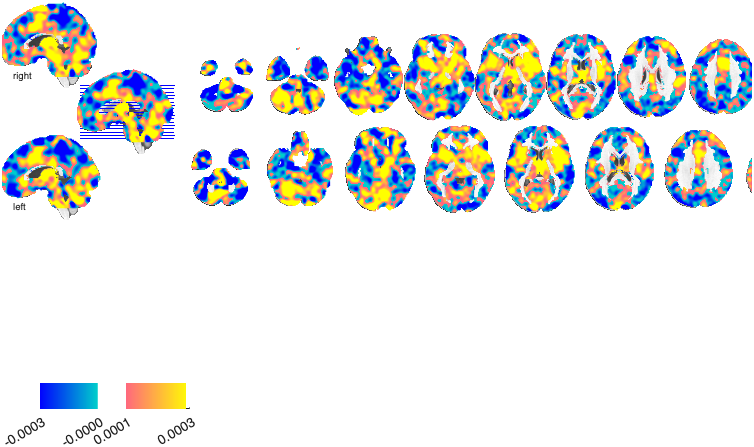
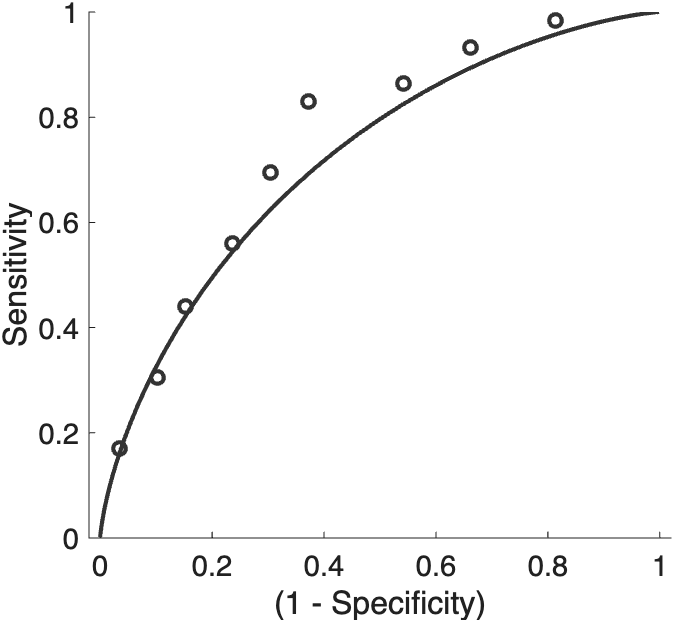
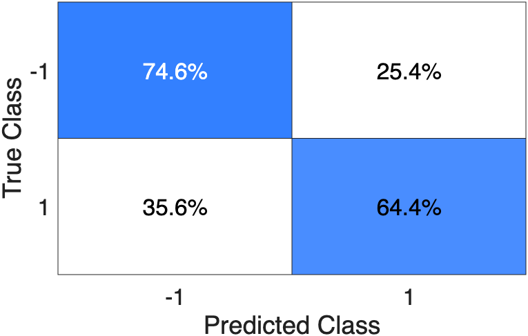
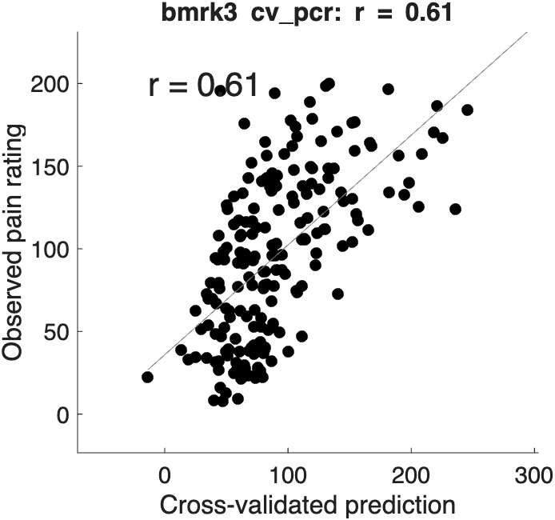
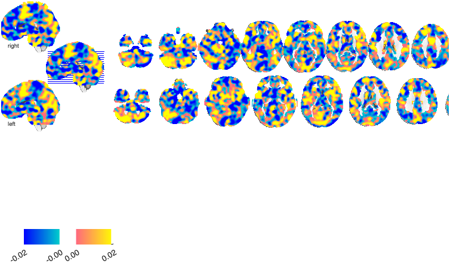
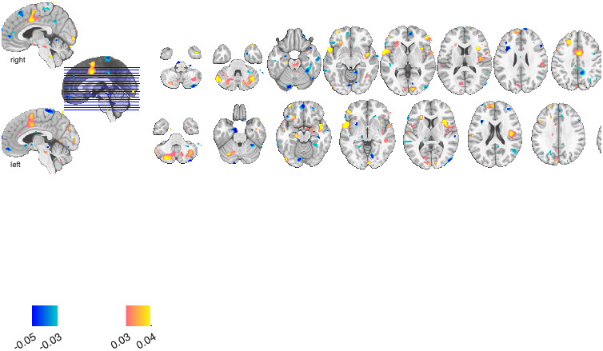

# Multivariate decoding — Part 2: classification and regression

> **Multivariate decoding tutorial series**
> 1. [Classification basics with SVM](multivariate_decoding_part1_classification_with_SVM.md) — train and cross-validate a linear SVM (Hot vs Warm); ROC, confusion matrix, effect sizes; apply to a held-out test set.
> 2. **Classification and regression** *(this part)* — the difference between the two, the one-line dataset loaders, the `xval_*` wrapper family, and `fmri_data.predict` end-to-end for both.
> 3. [The sklearn-style `predictive_model` API](multivariate_decoding_part3_predictive_model_api.md) — fit / predict / crossval / bootstrap / permutation, nested-CV tuning, calibration, stability selection.
> 4. [Cross-classification](multivariate_decoding_part4_cross_classification.md) — does a pain pattern decode social rejection? (Woo et al., 2014).
> 5. [Algorithms, tuning, and inference](multivariate_decoding_part5_algorithms_and_tuning.md) — compare SVM / SVR / lasso / ridge / GP, ECOC multiclass, grid search, stability selection.

Part 1 trained a linear SVM by hand. This part steps back to the two
questions decoding can answer — **classification** and **regression** —
shows how to run each in a couple of lines with `fmri_data.predict`, and
introduces the family of `xval_*` wrapper functions. It uses the **one-line
loaders** so we never rebuild an input object from scratch.

## 1. Classification vs. regression

Both are *supervised decoding*: learn a mapping from a brain image
**X** (`[images × voxels]`) to an outcome **Y**, cross-validate it, and
read out a brain pattern (weight map) plus an out-of-sample accuracy.
They differ only in what **Y** is:

| | **Classification** | **Regression** |
|---|---|---|
| Outcome `Y` | categorical (e.g. Hot vs Warm, `±1`) | continuous (e.g. pain rating, temperature) |
| Question | *which class?* | *how much?* |
| Read-out | accuracy, ROC/AUC, confusion matrix | prediction–outcome correlation *r*, predicted R², RMSE |
| Continuous score | distance from hyperplane / class probability | the predicted value itself |
| Typical algorithms | SVM, logistic, LDA, ECOC | PCR, LASSO-PCR, SVR, ridge, GP |

Everything else — cross-validation, weight maps, bootstrap inference,
visualization — is shared. If you can run one, you can run the other; you
mostly just swap the algorithm and the error metric.

## 2. One-line loaders for the sample data

Two keyword datasets give you a ready-to-decode `fmri_data` object with
`.Y` and a `metadata_table` already populated — no manual masking,
concatenation, or label-building:

```matlab
% Classification: 59 subjects × {Hot, Warm}, Y = +1 / -1
hw_obj = load_image_set('DPSP_hotwarm', 'noverbose');

% Regression: heat-evoked pain, continuous pain rating in .Y
bmrk3  = load_image_set('bmrk3', 'noverbose');
```

`hw_obj.metadata_table` carries `subj_id`, `Condition`, and
`Orig_partition` (`xval`/`test`); `bmrk3.metadata_table` carries
`subject_id`, `temperature`, and `rating` (`bmrk3.Y` is the pain rating).
Both have **multiple images per subject**, so we always pass a
subject-grouping vector to keep a participant's images together across
folds (the cardinal rule against leakage; see Part 1).

## 3. The `xval_*` wrapper family

CANlab ships a set of single-call cross-validation wrappers in
`Statistics_tools/Cross_validated_Regression/`. Each takes `(X, Y, id, …)`
and returns a `predictive_model` object. Use these when you want a
named, batteries-included entry point; use `fmri_data.predict`
(§4–5) when you want to pass an image object directly and pick the
algorithm by keyword; use the `predictive_model` methods (Part 3) when you
want full sklearn-style control.

| wrapper | task | engine |
|---|---|---|
| `xval_SVM` | classification | linear/kernel SVM (`fitcsvm`/`fitclinear`); optional Bayesian tuning + bootstrap |
| `xval_SVR` | regression | support-vector regression (`fitrsvm`) |
| `xval_discriminant_classifier` | classification | linear discriminant (`fitcdiscr`) |
| `xval_cross_classify` | classification | train on one dataset, test on another (Part 4) |
| `xval_regression_multisubject` | regression | core engine: `ols` / `ridge` / `lasso` / `robust` |
| `xval_regression_multisubject_featureselect` | regression | same, with per-fold feature selection |
| `xval_regression_multisubject_bootstrapweightmap` | regression | regression + voxelwise bootstrap weight map |
| `xval_lasso_brain` | regression | PCA-LASSO wrapper |
| `xval_ridge_brain` | regression | PCA-ridge wrapper |
| `xval_bestsubsets_brain` | regression | best-subsets selection |

A separate set of `xval_*` files are **CV utilities**, not model fitters —
most importantly
`xval_stratified_holdout_leave_whole_subject_out` (builds subject-grouped,
class-stratified folds; called under the hood by `xval_SVM`/`xval_SVR`) and
`xval_select_holdout_set` (final-holdout selection). Leave those to do
their job; you rarely call them directly.

## 4. Classification end-to-end with `fmri_data.predict`

`fmri_data.predict` is the most convenient entry point: pass the image
object, choose an algorithm by keyword, and (with `'newapi'`) get back a
`predictive_model` object you can visualize directly. Here we decode Hot
vs Warm with a linear SVM:

```matlab
hw_obj = load_image_set('DPSP_hotwarm', 'noverbose');
rng(2026);
[cverr, stats, optout, pm] = predict(hw_obj, ...
    'algorithm_name', 'cv_svm', 'nfolds', 5, 'newapi');

stats.acc                       % cross-validated accuracy (~70%)
```

The 4th output `pm` is a `predictive_model` carrying the cross-validated
predictions, the full-sample weight map, and (because `predict` had the
image object) a `weights.weight_obj` you can plot with **no extra
arguments**. The three standard read-outs come straight off `pm`:

```matlab
montage(pm);            % weight map (where the classifier reads signal)
rocplot(pm);            % ROC curve from the cross-validated scores
confusionchart(pm);     % cross-validated confusion matrix
```





Cross-validated accuracy is ≈ 70 % (AUC ≈ 0.75). `rocplot(pm)` returns the
full ROC struct (AUC, sensitivity, specificity, threshold); pass
`'twochoice'` for the forced-choice variant discussed in Part 1.

## 5. Regression end-to-end with `fmri_data.predict`

Exactly the same call, with a regression algorithm and a continuous `Y`.
We predict pain rating from the heat-evoked maps in `bmrk3`, using
subject-grouped folds:

```matlab
bmrk3 = load_image_set('bmrk3', 'noverbose');
[~, ~, sid] = unique(bmrk3.metadata_table.subject_id, 'stable');
folds = mod(sid, 5) + 1;                 % whole-subject 5-fold

[cverr, stats, optout, pm] = predict(bmrk3, ...
    'algorithm_name', 'cv_pcr', 'nfolds', folds, 'newapi');

r = corr(stats.yfit, bmrk3.Y);           % prediction–outcome correlation
fprintf('r = %.2f, RMSE = %.1f\n', r, sqrt(cverr));
```

For a binary `Y`, `predict` would default the error metric to
misclassification rate; for a *regression* algorithm the `'newapi'` path
automatically uses **MSE** instead (the cverr above), since
misclassification is meaningless on continuous predictions.

### Prediction–outcome correlation

The headline regression read-out is the **cross-validated
prediction–outcome correlation**: plot predicted vs. observed and report
*r* (here ≈ 0.61).

```matlab
create_figure('predicted vs observed');
plot_correlation_samefig(stats.yfit, bmrk3.Y);
xlabel('Cross-validated prediction'); ylabel('Observed pain rating');
```



The correlation answers *"does the prediction track the outcome?"* but not
*"how close is it, on the right scale?"* For that, report **predicted R²**
(= 1 − PRESS/SST, Wager & Lindquist Ch. 39.4) — the variance explained by
the *held-out* predictions, which (unlike an in-sample R² or the squared
correlation) can go negative when the model does worse than guessing the
mean. `crossval` computes it automatically; `report_accuracy` /
`summary` print the whole metric block:

```matlab
pm.error_metrics.predicted_r2.value        % 1 - PRESS/SST (out-of-sample)
report_accuracy(pm);                        % r, predicted R², RMSE, MAE, ...
summary(pm);                                % + provenance (CV scheme, etc.)
```

### Weight maps — unthresholded and bootstrap-thresholded

The unthresholded weight map shows the full pattern the model uses:

```matlab
montage(pm, bmrk3);                       % unthresholded weights
```



To ask *which voxels carry reliable signal*, bootstrap the weights
(resampling whole subjects) and threshold. `weight_map_object(pm, source)`
returns a `statistic_image` with the bootstrap p-values attached (and caches
it on `pm`), so you can threshold and montage it directly:

```matlab
pm = bootstrap(pm, double(bmrk3.dat'), bmrk3.Y, ...
               'nboot', 1000, 'groups', bmrk3.metadata_table.subject_id);

[~, si] = weight_map_object(pm, bmrk3);
si = threshold(si, .01, 'unc');           % bootstrap p < .01, uncorrected
create_figure('thresholded weights'); axis off; montage(si);
```



> **Bootstrap p has a floor.** The empirical bootstrap p bottoms out at
> `2/(nboot+1)` (here 0.002 with 1000 samples), so an FDR threshold across
> ~220k voxels can come back empty even when the pattern predicts well.
> That's a resolution limit, not absence of signal. To sharpen voxel-wise
> inference, use more bootstraps, threshold uncorrected (as above), or use
> **stability selection** (Part 3 / Part 5), which is the recommended
> inference for high-dimensional regularised models.

> **Weight map vs. the full prediction.** The `weights.w` map (and the
> `statistic_image` above) is the **slope only** — no intercept. To *predict*
> from the model, use `predict(pm, Xnew)`, which applies `w·x + b` (weights and
> intercept) — in-sample, on a test set, and in every CV fold — plus any
> feature mask / standardization. Don't score new images with a hand-rolled
> `Xnew*w`; if you must, add `pm.ml_model.Bias` (SVM/`fitclinear`) or
> `pm.ml_model.intercept` (PCR/lassoPCR).

## 6. Which to use, and what's next

- **Quick, object-in:** `fmri_data.predict(obj, 'algorithm_name', …,
  'newapi')` — pass the image, pick the algorithm, visualize the `pm`.
- **Named wrapper:** `xval_SVM` / `xval_SVR` / `xval_lasso_brain` / … when
  you want a single batteries-included call (Part 1, Part 5).
- **Full control:** the `predictive_model` methods — `fit`, `predict`,
  `crossval`, `bootstrap`, `permutation_test`, `grid_search`,
  `calibrate`, `stability_selection` — covered in **Part 3**, which also
  shows the nested cross-validation used to tune hyperparameters and a code
  map of the whole API.

## References

- Woo C-W et al. (2014). *Separate neural representations for physical pain and social rejection.* **Nat. Commun.** 5:5380. [doi:10.1038/ncomms6380](https://doi.org/10.1038/ncomms6380)
- CANlab object methods, walkthroughs, and tutorials: <https://canlab.github.io>
- `@predictive_model` API reference: [`docs/predictive_model_methods.md`](../../predictive_model_methods.md)
