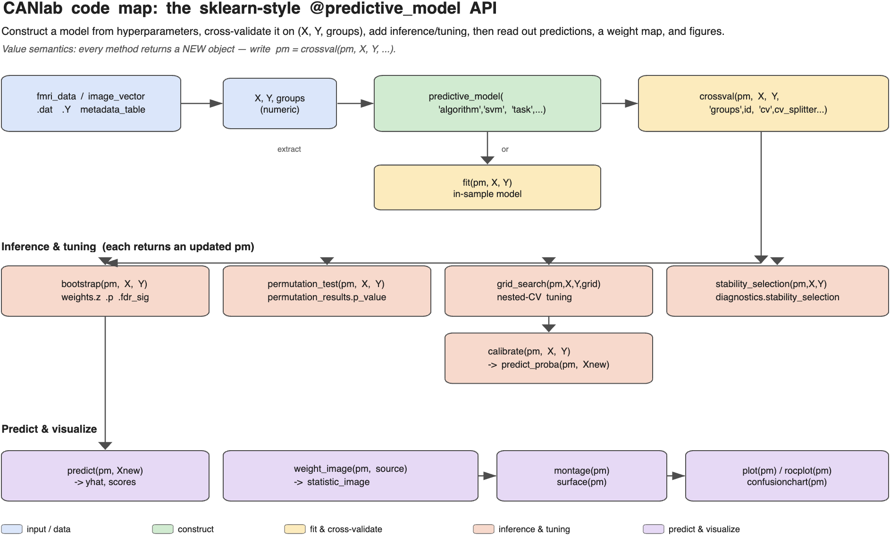
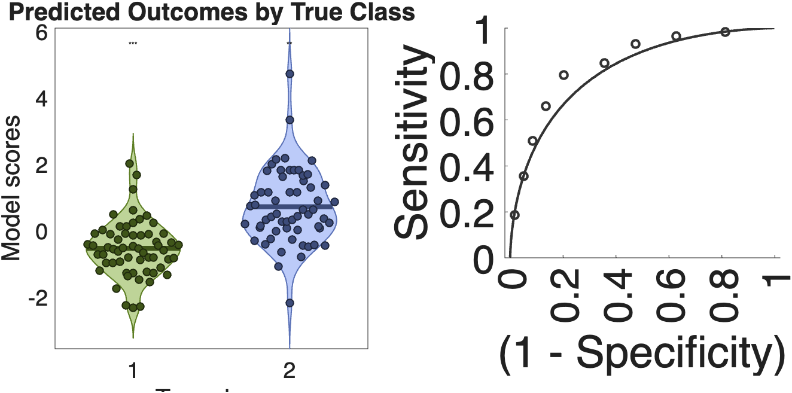
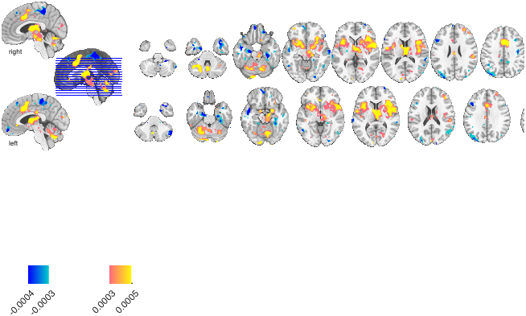
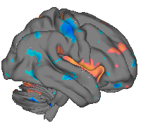
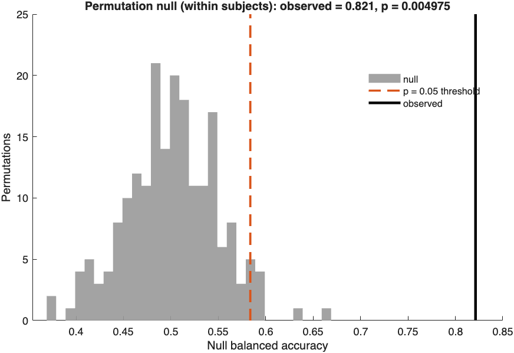
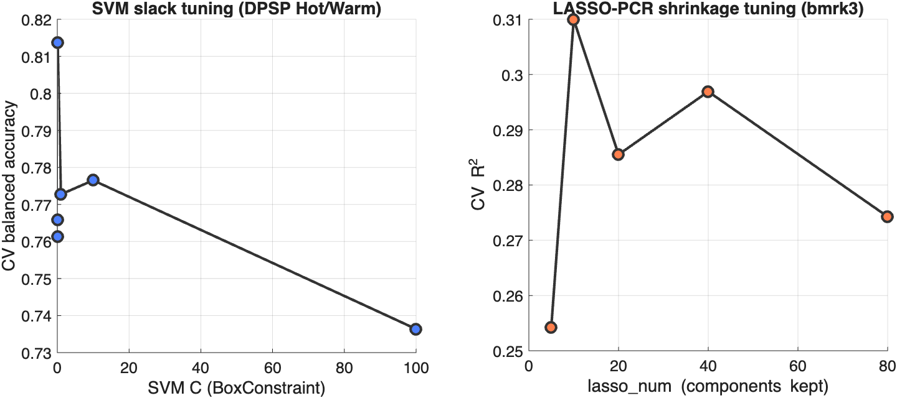
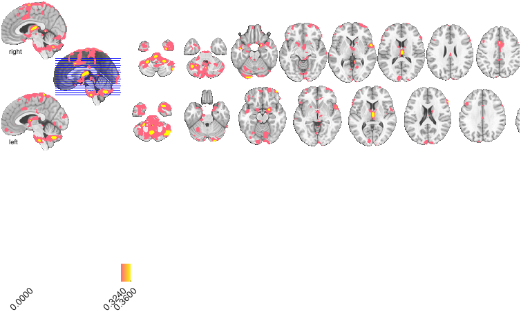

# Multivariate decoding — Part 3: the sklearn-style `predictive_model` API

> **Multivariate decoding tutorial series**
> 1. [Classification basics with SVM](multivariate_decoding_part1_classification_with_SVM.md) — train and cross-validate a linear SVM (Hot vs Warm); ROC, confusion matrix, effect sizes; apply to a held-out test set.
> 2. [Classification and regression](multivariate_decoding_part2_classification_and_regression.md) — the difference between the two, the one-line dataset loaders, the `xval_*` wrapper family, and `fmri_data.predict` end-to-end for both.
> 3. **The sklearn-style `predictive_model` API** *(this part)* — fit / predict / crossval / bootstrap / permutation, nested-CV tuning, calibration, stability selection.
> 4. [Cross-classification](multivariate_decoding_part4_cross_classification.md) — does a pain pattern decode social rejection? (Woo et al., 2014).
> 5. [Algorithms, tuning, and inference](multivariate_decoding_part5_algorithms_and_tuning.md) — compare SVM / SVR / lasso / ridge / GP, ECOC multiclass, grid search, stability selection.

> All of Part 1's workflow now in the new sklearn-style
> `@predictive_model` API: construct → fit → cross-validate →
> bootstrap → threshold → visualise, plus calibration, permutation
> testing, hyperparameter search, and feature selection. Same DPSP
> Hot-vs-Warm dataset.

## What's new vs Parts 1–2

Part 1 used `xval_SVM(X, Y, id, ...)` — a single-function wrapper — and
Part 2 used `fmri_data.predict`. Both return a `predictive_model` already
populated with cv predictions, weights, and optionally bootstrap/permutation
results. This part takes the same workflow apart into composable methods on
the `@predictive_model` class, so each step is independently inspectable and
re-runnable.

```
% Part 1                                  % Part 2
S = xval_SVM(X, Y, id, ...);              pm = predictive_model('algorithm','svm','task','classification');
                                          pm = crossval(pm, X, Y, 'cv', cv_splitter.stratified_group_kfold(5), 'groups', id);
                                          pm = bootstrap(pm, X, Y, 'nboot', 1000, 'groups', id);
                                          pm = permutation_test(pm, X, Y, 'nperm', 1000, 'groups', id);
                                          plot(pm);                 % scores-by-class + ROC
                                          montage(pm, hw_obj, 'use', 'thresh_fdr', 'regions');
```

Both return the same `@predictive_model` object; the new API just
gives you more control over each step.

## The API at a glance

The whole API is one object and a handful of verbs. Construct a model from
hyperparameters, cross-validate it on `(X, Y, groups)`, optionally add
inference/tuning, then read out predictions, a weight map, and figures.
Every method returns a **new** object (value semantics), so you chain with
`pm = method(pm, ...)`.



*(Generated by [`make_predictive_model_codemap.m`](make_predictive_model_codemap.m), in the CANlab code-map style.)*

## 1. Load DPSP (one line each)

```matlab
hw_obj = load_image_set('DPSP_hotwarm');         % Hot (+1) vs Warm  (-1)
rf_obj = load_image_set('DPSP_rejectorfriend');  % Rejector (+1) vs Friend (-1)
```

Both keywords (a) apply the gray-matter mask, (b) `cat()` + `remove_empty`,
(c) set `±1` effects-coded labels in `.Y`, and (d) attach
`subj_id` to `.metadata_table`. The objects can be passed directly
into `fmri_data.predict` or into the new predictive_model API.

```matlab
X  = double(hw_obj.dat');
Y  = hw_obj.Y;
id = hw_obj.metadata_table.subj_id;   % cell of subject-id strings — used as-is
```

The grouping vector may be numeric or a cell array of id strings; the
splitter normalises it for you (a `grp2idx(...)` is no longer required).

## 2. Construct a predictive_model

`predictive_model` is now a thin **value-class** wrapper around the
MATLAB Statistics & ML Toolbox model objects. Construction sets
hyperparameters only — **no data has been touched yet**; you're just
declaring *what kind of model* you want before handing it data with `fit` /
`crossval`.

```matlab
pm = predictive_model( ...
    'algorithm',     'svm', ...                       % which learner (registry name)
    'task',          'classification', ...            % classification | regression
    'modeloptions',  {'KernelFunction', 'linear'}, ... % name/value pairs passed to the fitter
    'random_state',  2026);                            % rng seed for reproducibility
```

**The two options that matter most are `algorithm` and `task`:**

- **`algorithm`** picks the learner (see the registry below). It largely
  *implies* the task — `svm` is a classifier, `svr`/`pcr` are regressors.
- **`task`** tells the object whether you're predicting a **category**
  (`'classification'`) or a **continuous value** (`'regression'`). This sets
  the default scorer, how `Y` is interpreted, and what `predict`/`plot`
  return.

**What if I don't set `task` (or other properties)?** Most hyperparameters have
sensible defaults that are filled in at `fit`/`crossval` time:

| Property | If you omit it… |
|---|---|
| `task` | **inferred from `Y`**: ≤ 2 unique values → `classification`, else `regression`. Set it explicitly when the inference would be wrong — e.g. a *regression* target that happens to take few values, or to be safe with a binary-coded outcome. |
| `scorer` | defaults by task: **`balanced_accuracy`** (classification), **`r2`** (regression). |
| `cv` | defaults to **`stratified_kfold(5)`** (classification) / `kfold(5)` (regression). ⚠️ **Not group-aware** — for repeated-measures / within-subject data you must pass a grouped splitter (`stratified_group_kfold`) and `'groups'`, or folds will split a subject across train and test (leakage). |
| `modeloptions` | the fitter's own defaults (e.g. `fitcsvm`'s box constraint). |
| `random_state` | unset → MATLAB's current rng; set it for reproducible folds/bootstraps. |

So `predictive_model('algorithm','svm')` will run, inferring
`task='classification'` and scoring with balanced accuracy — but being explicit
(`'task'`, and a grouped `cv`) is the safe habit.

**Scoring options** (the `'scoring'` value, set here or at `crossval`):

- **Classification:** `accuracy`, `balanced_accuracy` *(default)*, `f1`,
  `roc_auc`, `log_loss`.
- **Regression:** `r2` *(default)*, `pearson_r`, `mse`, `rmse`, `mae`.

See §4's "Scoring options" for what each measures and which to prefer.

Registry of algorithms (see `predictive_model.algorithm_registry()`):

**Classification**

| Name              | Underlying fitter | Notes                                  |
|-------------------|-------------------|----------------------------------------|
| `svm`             | `fitcsvm`         | kernel SVM (linear default); the workhorse |
| `linear_svm`      | `fitclinear`      | fast linear SVM for wide (high-dim) data |
| `logistic`        | `fitclinear`      | L2-regularised logistic regression     |
| `lda`             | `fitcdiscr`       | linear discriminant analysis           |
| `knn`             | `fitcknn`         | k-nearest neighbours                   |
| `naive_bayes`     | `fitcnb`          | Gaussian naïve Bayes                   |
| `tree_classifier` | `fitctree`        | single decision tree                   |
| `rf_classifier`   | `fitcensemble`    | bagged trees (random forest)           |
| `nnet_classifier` | `fitcnet`         | feed-forward neural net                |
| `ecoc`            | `fitcecoc`        | **multiclass** (>2 classes) via error-correcting output codes |

**Regression**

| Name              | Underlying fitter | Notes                                  |
|-------------------|-------------------|----------------------------------------|
| `svr`             | `fitrsvm`         | kernel support-vector regression       |
| `linear_svr`      | `fitrlinear`      | fast linear SVR for wide data          |
| `lasso`           | `fitrlinear`      | L1-regularised (sparse) linear regression |
| `ridge`           | `fitrlinear`      | L2-regularised linear regression       |
| `tree_regressor`  | `fitrtree`        | single regression tree                 |
| `rf_regressor`    | `fitrensemble`    | bagged trees                           |
| `nnet_regressor`  | `fitrnet`         | feed-forward neural net                |
| `gp`              | `fitrgp`          | Gaussian-process regression (reduce dims first; see Part 5) |

**Special PCA-based estimators** (not MATLAB single-fitter wrappers — handled
directly by `fit`, faithful to the legacy `fmri_data.predict` routines):

| Name        | What it does                                                              |
|-------------|---------------------------------------------------------------------------|
| `pcr`       | principal-components regression: PCA → drop last component → OLS on scores. Reproduces legacy `cv_pcr`. |
| `lassopcr`  | PCA → LASSO selection of components → relaxed-OLS refit on the survivors. Reproduces legacy `cv_lassopcr`; takes `lasso_num` / `estimateparam` shrinkage options. |

`predictive_model.algorithm_registry()` returns the registry struct for the
MATLAB-fitter algorithms; `pcr` and `lassopcr` are valid `'algorithm'` values
too (they are special-cased in `fit`). All of the above can be passed as
`'algorithm'` at construction, or reached through `fmri_data.predict` (e.g.
`'cv_svm'`, `'cv_pcr'`, `'cv_lassopcr'`) and the `xval_*` wrappers.

### Which algorithm should I use? (and the dataset-width trap)

For a first pass on whole-brain fMRI, a **linear** model is almost always the
right starting point: with tens of thousands of voxels and tens to low-hundreds
of images, you are firmly in the *p ≫ n* regime where flexible nonlinear
learners overfit and linear decision boundaries are both adequate and
interpretable (the weights map back to a brain image). So start with
`linear_svm` / `svm` for classification, `pcr` / `lassopcr` / `linear_svr` for
regression; reach for trees, random forests, kNN, GP, or neural nets only when
you have many observations relative to features (e.g. after heavy
dimensionality reduction, or on parcel/ROI summaries) and have a specific
reason to expect nonlinearity.

**`svm` (`fitcsvm`) vs `linear_svm` (`fitclinear`) — and when a dataset is "too
wide" for `fitcsvm`:**

| | `svm` → `fitcsvm` | `linear_svm` → `fitclinear` |
|---|---|---|
| Solver | dual QP via SMO/ISDA; forms an *n × n* kernel (Gram) matrix | primal large-scale solvers (dual coordinate descent / SGD / (L)BFGS) |
| Kernels | linear **or nonlinear** (RBF, polynomial) | **linear only** |
| Scales with | the **number of observations** *n* (kernel matrix) | the **number of features** *p* — built for high-dimensional data |
| Best when | small/moderate *n*; you want a nonlinear kernel; few features | wide data (*p* in the thousands–hundreds of thousands), e.g. whole-brain voxels |

Because `fitcsvm` works through the kernel and is not optimized for very
wide inputs, it gets **slow and memory-hungry as the feature count grows** into
the tens of thousands — exactly the whole-brain voxel case. `fitclinear` is
purpose-built for that regime and is typically **orders of magnitude faster**
with essentially the same linear decision boundary. Rule of thumb: **once you're
past a few thousand features, prefer `linear_svm`** (this is what
`xval_SVM(..., 'highdimensional', true)` switches to under the hood). Keep
`svm` for smaller feature counts (ROI/parcel data) or when you genuinely want a
nonlinear kernel. The algorithmic difference is *solver and kernel support*,
not the underlying max-margin idea — on linearly separable wide data they find
very similar patterns.

(Part 5 walks through the other registry algorithms — SVR, lasso, ridge, GP,
ECOC — explaining what each is and the data it suits.)

## 3. fit / predict / score (the sklearn triad)

These three verbs are the foundation; everything else (`crossval`, `bootstrap`,
…) is built on them. Borrowed straight from scikit-learn:

- **`fit(pm, X, Y)`** — *train.* Learn the model on data `X` (`[n × p]`) and
  outcome `Y` (`[n × 1]`). Returns a fitted `pm` whose `ml_model`, `weights.w`,
  and intercept are populated. Use it when you want a single model on all the
  data (e.g. the final "ship-it" pattern, or before applying to a separate test
  set).
- **`predict(pm, Xnew)`** — *apply.* Run the fitted model on new rows; returns
  predicted labels/values and continuous scores. Use it to score a held-out or
  independent dataset. **It applies the full decision function** — weights *and*
  intercept — plus the omitted-features mask and any standardization recorded at
  fit time, so you don't reproduce those by hand (see the note below).
- **`score(pm, X, Y)`** — *evaluate.* Predict on `X` and compare to the true
  `Y` with the model's scorer (balanced accuracy by default). A convenience for
  "how good is it on this data" in one call.

`fit`/`predict`/`score` are the in-sample / apply-to-new-data primitives;
`crossval` (next) wraps them to estimate **out-of-sample** performance honestly.

```matlab
pm = fit(pm, X, Y, 'id', id);

[yhat, scores] = predict(pm, X);             % yhat ∈ {-1,+1}, scores = decision values
acc = score(pm, X, Y);                       % balanced_accuracy by default
```

> **The bias term (intercept) is always applied.** `predict` returns
> `w·x + b` — in-sample, on a test set, and within every cross-validation fold
> (each fold uses *its own* training intercept). You can confirm it:
> `predict`'s SVM score equals `X*pm.weights.w + pm.ml_model.Bias` (for PCR/
> lassoPCR, `+ pm.ml_model.intercept`). The natural decision threshold is 0 on
> that bias-inclusive score.
>
> **But the weight map is slope-only.** `pm.weights.w` — and the
> `statistic_image` from `weight_map_object` — is just the coefficient vector,
> **no intercept**. That's correct for a weight *map* (a direction in voxel
> space; the bias is a scalar, not a brain image). If you ever apply the pattern
> to new images **by hand** (`Xnew*w`, a dot-product pattern expression,
> `apply_mask` / `image_similarity`), you'll be missing the offset and your
> score won't sit at the model's threshold. Add the intercept yourself
> (`pm.ml_model.Bias` for SVM/`fitclinear`, `pm.ml_model.intercept` for PCR/
> lassoPCR) — or, simplest, just call `predict(pm, Xnew)`, which handles all of
> it.

After `fit`:
- `pm.fit_type` is `'insample'`
- `pm.ml_model` is the underlying `ClassificationSVM`
- `pm.weights.w` is the linear-kernel coefficient vector

A pre-fit data-quality pass is automatic — `predictive_model.detect_bad_data`
flags NaN/Inf cases and all-NaN / zero-variance / Inf features.
Bad rows/cols are dropped before training and recorded in
`pm.omitted_cases` and `pm.omitted_features` so `predict()` can
re-apply the same mask to new data.

## 4. Cross-validation — the sklearn-style splitter API

**Why cross-validate.** An in-sample fit tells you how well the model
*memorised* the training data, which is optimistic and uninformative. Cross-
validation estimates how well it **generalises to new observations**: split the
data into *k* folds; for each fold, train on the other *k−1* and predict the
held-out one; concatenate the held-out predictions (so every observation is
predicted exactly once, by a model that never saw it) and score them.

**How a `cv_splitter` works, conceptually.** A splitter is a small object that
*only decides which rows go in which fold* — it knows nothing about the model.
You hand `crossval` a splitter; internally it calls `splitter.split(X, Y,
groups)`, which returns, for each fold, the train and test row indices
(`trIdx` / `teIdx`). `crossval` then loops: `m = fit(clone(pm), X(tr),
Y(tr)); predict(m, X(te))`. Separating *how to split* from *what to fit* is
what lets you swap fold schemes without touching the model code.

The flavours differ in **what constraint they put on the split**:

- **stratified** — keep each fold's class proportions like the whole sample's
  (so a fold isn't accidentally 90% one class). Classification only.
- **group** — keep all rows sharing a `group` id (e.g. a subject) **together**
  in the same fold. Essential for repeated-measures data: if a subject's images
  land in both train and test, the model can exploit subject identity and the
  accuracy is inflated (leakage).
- **stratified + group** — both at once. **This is the right default for paired
  brain designs** like DPSP (each subject contributes both classes).

```matlab
pm = crossval(pm, X, Y, ...
    'cv',      cv_splitter.stratified_group_kfold(5), ...   % the splitter
    'groups',  id, ...                                      % subject id per row
    'scoring', 'balanced_accuracy');
```

You can also use a splitter directly to see what it does:

```matlab
cv  = cv_splitter.stratified_group_kfold(5);
sp  = cv.split(X, Y, grp2idx(id));   % struct array, one per fold
sp(1).trIdx, sp(1).teIdx             % the train / test indices of fold 1
```

> ⚠️ **The default splitter is not group-aware.** If you omit `'cv'`, `crossval`
> uses `stratified_kfold(5)`, which can split one subject across folds. For any
> repeated-measures / within-subject data, pass `stratified_group_kfold` (or
> `group_kfold`) and `'groups'` explicitly.

Splitter factories (`cv_splitter.X(...)`):

| Name                       | Use case                                            |
|----------------------------|-----------------------------------------------------|
| `kfold(k)`                 | plain k-fold                                        |
| `stratified_kfold(k)`      | preserves class proportions per fold                |
| `group_kfold(k)`           | no group spans train/test                           |
| `stratified_group_kfold(k)`| both (recommended for paired classifier designs)    |
| `leave_one_group_out()`    | one fold per group                                  |
| `repeated_kfold(k, n)`     | k folds × n random repeats                          |
| `shuffle_split(n, size)`   | random train/test splits                            |
| `holdout(size)`            | single random split                                 |
| `custom_partition(ids)`    | user-supplied integer fold assignments              |

After `crossval`:
- `pm.fit_type` is `'crossval'`
- `pm.fitted_values.yfit` is the held-out predictions (full length)
- `pm.error_metrics.balanced_accuracy.value` is the mean across folds
- `pm.error_metrics.balanced_accuracy_per_fold.value` is the per-fold vector
- `pm.fold_models{f}` is the trained model from fold f
- `pm.ml_model` is the model re-trained on the FULL dataset (the
  "ship-it" version)

### Scoring options

The `'scoring'` value sets the single number `crossval` **optimises and
reports** as `pm.error_metrics.<scorer>.value` (the mean across folds, with a
`<scorer>_per_fold` companion). But you are not limited to that one number:
after `crossval`, the held-out predictions are stored and you can read out
*any* metric without re-running anything.

**How the cross-validated predictions are retrieved.** Two things are kept:

- `pm.fitted_values.yfit` — the held-out **hard predictions** (class labels
  for classification, predicted values for regression).
- `pm.fitted_values.dist_from_hyperplane_xval` (alias `.scores`) — the
  held-out **continuous decision scores** (signed distance to the hyperplane,
  or the predicted value for regression). These are what ROC/AUC and the
  effect sizes are computed from.

The easiest way to see the full, task-appropriate metric panel is
`report_accuracy(pm)` (struct + printed table) or `summary(pm)` (that panel
plus provenance). For classification, `report_accuracy` pulls **AUC,
sensitivity, specificity, PPV, NPV** straight from the cross-validated ROC, on
top of accuracy / balanced accuracy / forced-choice accuracy. For regression
it reports *r*, predicted R², out-of-sample R², RMSE / MAE / MSE.

**Which metric to optimise / report.** For classification:

- **`balanced_accuracy`** — the safe default; the mean of sensitivity and
  specificity, so it is not fooled by class imbalance the way raw `accuracy`
  is. Recommended as the headline number.
- **sensitivity + specificity** — report these *as a pair* (true-positive and
  true-negative rates). They expose *where* the model errs, which a single
  accuracy number hides. Read them from `report_accuracy` / `rocplot`.
- **`roc_auc`** — threshold-free; integrates performance over all decision
  thresholds. Best when you care about *ranking* cases rather than a fixed
  cutoff.
- **PPV** (precision) and **`f1`** — PPV is "of the cases called positive, how
  many are?", which depends on base rate and matters whenever positives are
  rare or acting on a positive is costly. `f1` is the harmonic mean of PPV and
  sensitivity (recall) — a useful single number when you want both high.

For regression, `r2` (here the per-fold R²) or `pearson_r` to optimise, and
report **predicted R²** (`pm.error_metrics.predicted_r2`) as the honest
out-of-sample variance-explained (see Part 2).

| Name | Task | Needs the model's continuous score? | Higher is better? |
|---|---|---|---|
| `accuracy`, `balanced_accuracy`, `f1` | classification | no — computed from hard labels (`yfit`) | yes |
| `roc_auc`, `log_loss` | classification | **yes** — needs the decision value / probability | `roc_auc` yes, `log_loss` no |
| `r2`, `pearson_r` | regression | n/a — a regression prediction *is* a continuous value | yes |
| `mse`, `rmse`, `mae` | regression | n/a | no |

The "needs the continuous score?" column only distinguishes **classification**
metrics: some (accuracy, balanced accuracy, F1) only need the predicted *label*,
while `roc_auc` / `log_loss` need the underlying continuous decision value to
sweep thresholds. For **regression** the distinction does not apply — the
prediction is already a continuous number — so the column is *n/a* there (the
earlier "no" was misleading).

> **Tip:** `'groups'` accepts a numeric vector OR a cell array of
> subject-id strings (e.g. `hw_obj.metadata_table.subj_id`) directly —
> the splitter normalises non-numeric labels for you, so the `grp2idx`
> call above is optional.

### Repeated cross-validation

A single k-fold split is one random partition; its score wobbles with the
luck of the fold assignment. **Repeated k-fold** runs the whole k-fold
cross-validation `n` times with different random partitions and averages,
giving a more stable estimate and a sense of its run-to-run variability:

```matlab
pm = crossval(pm, X, Y, ...
    'cv',      cv_splitter.repeated_kfold(5, 10), ...   % 5 folds × 10 repeats
    'groups',  id, ...
    'scoring', 'balanced_accuracy');

pm.error_metrics.balanced_accuracy.value          % mean over all folds × repeats
std(pm.error_metrics.balanced_accuracy_per_fold.value)   % spread across folds
```

Repeats cost compute linearly (10× the folds = 10× the fits), so use a modest
`n` (5–10) for wide neuroimaging data. The payoff is a headline number that
does not swing when you change the random seed — worth it before you report or
compare models. For paired designs keep using the grouped/stratified splitter
inside the repeats (`repeated_kfold` honours `groups`).

## 5. Visualise cross-validated performance

The new top-level visualisation methods read straight from the
cross-validated `pm` — no manual extraction:

```matlab
plot(pm);                 % classification: scores-by-class violin + ROC panel
rocplot(pm);              % ROC curve alone; returns AUC / sens / spec struct
confusionchart(pm);       % row-normalized confusion chart
```

`plot(pm)` dispatches on `pm.task` (scatter for regression, the
two-panel violin+ROC for classification). `rocplot` wraps CANlab's
`roc_plot` on the cross-validated decision values; `confusionchart`
wraps MATLAB's confusion chart on `pm.fitted_values.yfit`.



### A one-call summary

`summary(pm)` prints how the model was built, what inference is available, and
the task-relevant performance block in one call — handy to drop after any
`crossval` (and again after `bootstrap` / `permutation_test`, which add lines
to the *Inference* row):

```matlab
summary(pm);
```

```
=== predictive_model summary ===
  Algorithm : svm   (task: classification)
  Fit       : cross-validated
  Data      : 118 observations, 194676 features, 59 groups (within-person design)
  CV scheme : stratified_group_kfold, 5 folds, scorer=balanced_accuracy
  Inference : none yet (run bootstrap / permutation_test / calibrate)

  Performance (cross-validated, task=classification)
  --------------------------------------------
    Accuracy                 79.7%
    Balanced accuracy        79.8%
    Forced-choice accuracy   88.1%
    AUC                      0.863
    Sensitivity              0.847
    Specificity              0.746
    PPV                      0.769
    NPV                      0.830
    Effect size (d)          1.206
    N                        118
```

`report_accuracy(pm)` prints just the performance block (and returns it as a
struct); `summary(pm)` returns `{provenance, accuracy}` when you capture its
output.

## 6. Visualise the weight map (pre-thresholding)

The recommended first step is to **attach** the weight map to the model with
`weight_map_object`, which returns the updated `pm` carrying a full
`@statistic_image` weight object at `pm.weights.weight_obj`:

```matlab
pm = weight_map_object(pm, hw_obj);   % pm now carries the weight map object
montage(pm);                          % no source needed — uses the cached map
surface(pm);                          % cortical-surface rendering
```

`weight_map_object(pm, source)` maps `pm.weights.w` back into the source
fmri_data's voxel space (using its `volInfo` + `removed_voxels`), wraps it as
a `@statistic_image`, and **caches it on `pm.weights.weight_obj`**, returning
the updated `pm` (the `@statistic_image` is also available as a second output,
`[pm, si] = weight_map_object(...)`). Because the map now lives on `pm`,
`montage(pm)` / `surface(pm)` — and `plot(pm)` — work with no source argument,
and the object travels with the model if you save it. Voxels the model dropped
at fit time (in `omitted_features`) become zeros.

If you don't need to keep the map on the model, the one-line delegates build it
on the fly from a source image instead: `montage(pm, hw_obj)` /
`surface(pm, hw_obj)`.


## 7. Bootstrap inference — and a word about its limit

```matlab
pm = bootstrap(pm, X, Y, 'nboot', 1000, 'groups', id);
```

Subjects (not observations) are resampled with replacement when
`groups` is provided. After bootstrap:

| Field                  | What                                               |
|------------------------|----------------------------------------------------|
| `pm.weights.boot_w`    | `[p × nboot]` bootstrap weight samples             |
| `pm.weights.boot_w_mean`/`_ste` | mean and SD of those samples              |
| `pm.weights.z`         | mean / SE_floored                                  |
| `pm.weights.p`         | **continuity-corrected empirical two-tailed p**    |
|                        | bounded in `[2/(nboot+1), 1]`                      |
| `pm.weights.p_wald`    | Wald-style `2*(1-normcdf(|z|))` (legacy formula)   |
| `pm.weights.fdr_thr`   | FDR(p, .05) on the empirical p                     |
| `pm.weights.fdr_sig`   | logical mask, p ≤ fdr_thr                          |
| `pm.weights.thresh_fdr`| `pm.weights.w` masked by `fdr_sig`                 |

**Caveat — read this if your bootstrap results look "everything significant" or "nothing significant":**
L2-regularised linear SVM (the `linear_svm` algorithm and the
`'highdimensional', true` path in xval_SVM) gives bootstrap
weights that are *nearly numerically identical across resamples* —
the regularisation drives the optimiser to almost the same solution
regardless of which 118 subjects (with replacement) you fit on. As
a consequence:

- The Wald z statistic blows up (numerator ≈ small, denominator ≈
  numerical zero), and the legacy `2*(1-normcdf(|z|))` p collapses to
  `eps`, so naïve FDR flags ~every voxel as "significant".
- The empirical bootstrap p we now use floors at `2/(nboot+1)` —
  honest, but it means for `linear_svm` with default Lambda, *every
  voxel hits the floor* and the FDR threshold collapses.

This is a real limit of bootstrap inference on a strongly
regularised model. To get finer-grained voxel-wise inference:

1. **Reduce regularisation** — pass `'Lambda', 1e-6` in
   `modeloptions` so the model has room to vary across bootstraps.
2. **Drop to a kernel SVM** — `'algorithm', 'svm'` (the default,
   non-`highdimensional` path) uses `fitcsvm`'s dual formulation,
   which produces more variable weights at the cost of slower
   fitting on wide data.
3. **Use a permutation test on a univariate statistic** —
   `permutation_test(pm, X, Y)` on the cross-validated overall score
   is a clean alternative for asking "is the *model* significantly
   better than chance?" rather than "which voxels are significantly
   non-zero?".
4. **Stability selection** — count how often each voxel lands in the
   top-k by `|weight|` across bootstrap resamples. This is now a
   first-class method, `stability_selection(pm, X, Y, ...)` (see
   §12), and is the recommended inference for high-dimensional
   regularised models where the bootstrap z/p collapses.

## 8. Visualise the thresholded weight map

After bootstrap, the canonical "what does the classifier rely on"
map is `pm.weights.w` masked by `pm.weights.fdr_sig`:

```matlab
montage(pm, hw_obj, 'use', 'thresh_fdr');            % delegate
% or build the image yourself:
[~, si_thr] = weight_map_object(pm, hw_obj, 'use', 'thresh_fdr');
montage(si_thr);
```

Or, since `weight_map_object` attaches `si.p` and `si.sig`, re-threshold
with the statistic_image methods and outline contiguous clusters:

```matlab
montage(pm, hw_obj, 'use', 'thresh_fdr', 'regions');  % delegate -> region montage
% equivalently:
[~, si] = weight_map_object(pm, hw_obj);
si = threshold(si, .01, 'unc');                       % see §7 caveat on FDR
create_figure('thresholded weights'); axis off; montage(si);
create_figure('thresholded weights surface'); axis off; surface(si, 'foursurfaces_hcp');
```




(Thresholded at uncorrected bootstrap *p* < .01 here, because for a strongly
regularised model the FDR threshold can be empty — see the §7 caveat. Use the
`'regions'` montage to outline only contiguous suprathreshold clusters.)

## 9. Permutation test — is the model itself significant?

```matlab
pm = permutation_test(pm, X, Y, 'nperm', 1000, 'groups', id);
disp(pm.permutation_results.p_value);
disp(pm.permutation_results.permutation);          % which scheme was used
disp(pm.permutation_results.permutation_descrip);  % one-line explanation
```

Visualise the null with `plot_permutation`: the histogram is the
cross-validated score under the (correctly shuffled) null, the **dashed** line
is the α = 0.05 critical value the model must beat, and the **solid** line is
the observed score:

```matlab
create_figure('permutation null');
plot_permutation(pm);          % 'alpha', 0.01 to move the dashed line
```



The observed balanced accuracy sits far into the right tail (well past the
dashed threshold), so the model decodes Hot vs Warm well above chance. The same
histogram is drawn automatically by `plot(pm)` whenever permutation results are
present.

> **Figure for illustration only:** it uses `'nperm', 200` so it runs quickly.
> The smallest p-value resolvable with *n* permutations is `1/(n+1)`, so 200
> perms bottoms out at *p* ≈ 0.005. For a publication-quality figure use
> **≥ 5,000 permutations**.

### Permutation schemes

| `'permutation'` value | What it does | When to use |
|---|---|---|
| `'auto'` *(default)* | Detect from data: no groups → `free`; groups + Y constant per group → `between_subjects`; groups + Y varies per group → `within_subjects` | Safe default; the resolved scheme is stored on the output |
| `'within_subjects'` *(paired-design gold standard)* | Permute Y INDEPENDENTLY within each subject's observations | Each subject contributes both classes (DPSP Hot+Warm, drug A vs B within-subject, etc.). Preserves subject-level pattern; breaks only the class-vs-brain mapping |
| `'between_subjects'` | Reassign each subject's Y to another subject's at random | Each subject contributes ONE class (patient vs control). Errors with a warning if Y varies within a subject |
| `'free'` | Observation-level shuffle of Y, ignoring groups | Truly independent observations only. **Inflates false positives** for grouped data |

The output stores which scheme was actually used in
`pm.permutation_results.permutation` and a one-line explanation in
`pm.permutation_results.permutation_descrip`, so you always know
what null you tested against.

**Why within-subject is the gold standard for paired designs:**
the null is "there's no Hot-vs-Warm signal in the brain for *each*
subject." Within-subject shuffling preserves the subject-level
brain pattern (no subject confound), the class balance (still 59
Hot + 59 Warm globally), and the within-subject correlation
structure; the only thing it breaks is the actual Hot/Warm
assignment for each subject's two observations. That's exactly
the thing the classifier is supposed to be exploiting, so it's
the right thing to randomize.

## 10. Calibrated probabilities

SVM decision values are not probabilities. To get well-calibrated
probabilities, fit a Platt sigmoid on the cross-validated decision
values:

```matlab
pm = calibrate(pm, X, Y);                    % Platt scaling (default)
P  = predict_proba(pm, X_new);               % calibrated class-1 probs in [0,1]
```

`calibrate(..., 'method', 'isotonic')` uses isotonic regression
(pool-adjacent-violators) instead of a parametric sigmoid.

## 11. Hyperparameter search

```matlab
pg = struct();
pg.BoxConstraint = [0.1 1 10 100];
pg.KernelScale   = [0.5 1 2 5];

pm = grid_search(pm, X, Y, pg, 'groups', id);

pm.diagnostics.grid_search.best_params
pm.diagnostics.grid_search.best_score
pm.diagnostics.grid_search.scores            % full grid
```

`grid_search` argmaxes (or argmins, for less-is-better scorers like
`mse`) the mean cv score across the Cartesian product of `pg`
values, then refits at the winner.

Each hyperparameter has a sweet spot. The **SVM slack/regularization**
`BoxConstraint` (C) trades margin width against training errors; the
**LASSO-PCR shrinkage** (`lasso_num`, the number of components kept before
the relaxed-OLS refit) trades model flexibility against overfitting. Both
show a clear interior optimum on these data:

```matlab
% SVM C sweep (DPSP Hot/Warm, balanced accuracy)
Cgrid = logspace(-3, 2, 6);
accC  = nan(size(Cgrid));
for i = 1:numel(Cgrid)
    pmc = crossval(predictive_model('algorithm','svm','task','classification', ...
              'modeloptions', {'BoxConstraint', Cgrid(i)}), X, Y, 'groups', id, ...
              'cv', cv_splitter.stratified_group_kfold(5), 'scoring', 'balanced_accuracy');
    accC(i) = pmc.error_metrics.balanced_accuracy.value;
end

% LASSO-PCR shrinkage sweep (bmrk3, predicted R^2)
bmrk3 = load_image_set('bmrk3', 'noverbose');
Xr = double(bmrk3.dat');  Yr = bmrk3.Y;  idr = bmrk3.metadata_table.subject_id;
lnum = [5 10 20 40 80];                   % # components kept before the OLS refit
r2L  = nan(size(lnum));
for i = 1:numel(lnum)
    pml = crossval(predictive_model('algorithm','lassopcr','task','regression', ...
              'modeloptions', {'lasso_num', lnum(i)}), Xr, Yr, 'groups', idr, ...
              'cv', cv_splitter.group_kfold(5), 'scoring', 'r2');
    r2L(i) = pml.error_metrics.predicted_r2.value;
end

figure;
subplot(1,2,1); semilogx(Cgrid, accC, 'o-', 'LineWidth', 2);
xlabel('SVM C (BoxConstraint)'); ylabel('CV balanced accuracy'); title('DPSP Hot/Warm');
subplot(1,2,2); plot(lnum, r2L, 'o-', 'LineWidth', 2);
xlabel('LASSO-PCR components kept'); ylabel('predicted R^2'); title('bmrk3 pain');
```



On DPSP the SVM peaks near **C = 0.1** (≈ 81 % balanced accuracy); on bmrk3
LASSO-PCR peaks near **10 components** (R² ≈ 0.31). Picking the best point
off a curve like this is fine *for choosing a hyperparameter*, but the
score *at that point* is **optimistically biased** — you selected it to be
high on the very folds you're reporting.

### Nested cross-validation (the honest estimate)

To report an unbiased accuracy *and* tune the hyperparameter, nest the
search: split into **outer** folds; within each outer training set run
`grid_search` (an **inner** CV) to choose the hyperparameter; fit at that
choice; predict the untouched outer test fold. The hyperparameter is
re-chosen per fold, so no test data ever informs the selection.

```matlab
[~,~,g] = unique(id,'stable');
outer   = cv_splitter.stratified_group_kfold(5);
sp      = outer.split(X, Y, g);

yhat = nan(numel(Y),1); chosenC = nan(numel(sp),1);
for k = 1:numel(sp)
    tr = sp(k).trIdx; te = sp(k).teIdx;
    pm = predictive_model('algorithm','svm','task','classification', ...
                          'cv', cv_splitter.stratified_group_kfold(4));   % inner CV
    pm = grid_search(pm, X(tr,:), Y(tr), struct('BoxConstraint',[0.01 0.1 1 10]), ...
                     'groups', g(tr), 'verbose', false);
    chosenC(k) = pm.diagnostics.grid_search.best_params{2};
    yhat(te)   = predict(pm, X(te,:));
end
nested_acc = 100 * mean(yhat == Y);
```

Here the nested estimate is **≈ 76 %** — *lower* than the ≈ 81 % you'd read
off the tuning curve, and the more honest number to report. The chosen C
also varies across folds (e.g. `[0.01 0.01 1 10 0.01]`), a useful reminder
that "the best C" is itself uncertain. The same pattern wraps any tunable
estimator: swap `'svm'`/`BoxConstraint` for `'lassopcr'`/`lasso_num` (or
`'ridge'`/`Lambda`) to nest the shrinkage search. Because a tuned
`predictive_model` is *still a predictive_model*, the inner `grid_search`
composes cleanly inside the outer loop.

## 12. Univariate feature selection

```matlab
pm = select_features(pm, X, Y, 'k', 1000);   % keep top-1000 by univariate p

pm.diagnostics.feature_selection.n_selected
pm.diagnostics.feature_selection.selected     % logical mask
```

The selection is unioned into `pm.omitted_features`, so subsequent
`predict()` calls on the full-width X automatically drop the
non-selected columns. **Important caveat:** when used in conjunction
with `crossval`, the selection is computed on the *whole* dataset
— this leaks held-out information into feature choice. For honest,
CV-respecting feature selection, wrap the screen as a custom step in
an `@pipeline` (whose `crossval` refits every step on each fold's
training rows only):

```matlab
fs = struct( ...
  'fit_transform', @(Xtr,Ytr) deal(Xtr, top_k_mask(Xtr, Ytr, 2000)), ...
  'transform',     @(mask, Xin) Xin(:, mask));            % apply learned mask
est  = predictive_model('algorithm','svm','task','classification');
pipe = pipeline({fs}, est);
pipe = crossval(pipe, X, Y, 'cv', cv_splitter.stratified_group_kfold(5), 'groups', id);
```

where `top_k_mask` returns a logical column mask of the 2000 most
Y-correlated voxels computed **on the training rows only**.

## 13. Stability selection — voxel inference when bootstrap z/p collapses

As §7 warned, a strongly regularised model gives near-identical
bootstrap weights, so the bootstrap z/p (and the FDR mask) become
useless. **Stability selection** asks a different, more robust
question: *on each bootstrap, which voxels land in the top-k by
`|weight|`, and how often does each voxel make that cut?* Voxels that
are reliably top-ranked across resamples are "stable" — the classifier
leans on them regardless of which subjects it sees.

```matlab
pm = stability_selection(pm, X, Y, ...
    'nboot',     200, ...      % bootstrap resamples
    'k',         2000, ...     % top-k voxels by |w| per bootstrap
    'threshold', 0.6, ...      % "stable" if selected in >= 60% of boots
    'groups',    id);          % resample whole subjects

ss = pm.diagnostics.stability_selection;
fprintf('%d stable voxels (of %d)\n', ss.n_stable, numel(ss.selection_freq));
```

After it runs, `ss` holds:

| Field | What |
|---|---|
| `ss.selection_count` | `[p × 1]` times each voxel was in the top-k |
| `ss.selection_freq`  | `[p × 1]` that count / `valid_boots`, in `[0,1]` |
| `ss.stable`          | logical mask, `selection_freq >= threshold` |
| `ss.n_stable`        | number of stable voxels |
| `ss.valid_boots`     | bootstraps that produced a usable weight vector |

The selection frequency is itself a brain map — drop it into a borrowed
image object's `.dat` to montage where the classifier is *stably* reading
signal:

```matlab
freq_obj = hw_obj;                       % borrow volInfo + removed_voxels
freq_obj.dat = ss.selection_freq;
montage(freq_obj);                       % selection-frequency map in [0,1]
```



Reference: Meinshausen & Bühlmann, *Stability Selection*, J. R. Stat.
Soc. B (2010).

## 14. End-to-end on the rejection task

The same pipeline on `DPSP_rejectorfriend`:

```matlab
rf_obj = load_image_set('DPSP_rejectorfriend');
X  = double(rf_obj.dat');
Y  = rf_obj.Y;
id = grp2idx(rf_obj.metadata_table.subj_id);

pm = predictive_model('algorithm','svm','task','classification', ...
                       'modeloptions', {'KernelFunction','linear'}, ...
                       'random_state', 2026);

pm = crossval(pm, X, Y, 'cv', cv_splitter.stratified_group_kfold(5), ...
              'groups', id, 'scoring', 'balanced_accuracy');

fprintf('Rejector-vs-Friend cv balanced accuracy: %.1f%%\n', ...
    100 * pm.error_metrics.balanced_accuracy.value);
```

## 15. Reproduce as a unit test

The full flow is also `CanlabCore/Unit_tests/predictive_model_unit_test.m`,
which runs the entire pipeline with small `nboot=25` / `nperm=10`
so the test completes in a few minutes. Use it as a sanity check
when extending the API.

```matlab
cd CanlabCore/Unit_tests
predictive_model_unit_test
```
