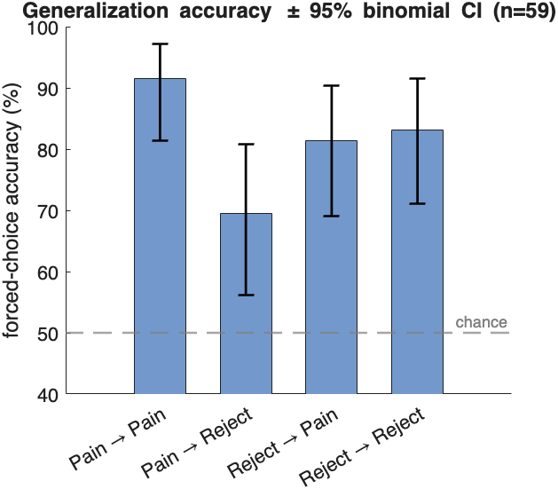

# Multivariate decoding — Part 4: cross-classification

> **Multivariate decoding tutorial series**
> 1. [Classification basics with SVM](multivariate_decoding_part1_classification_with_SVM.md) — train and cross-validate a linear SVM (Hot vs Warm); ROC, confusion matrix, effect sizes; apply to a held-out test set.
> 2. [Classification and regression](multivariate_decoding_part2_classification_and_regression.md) — the difference between the two, the one-line dataset loaders, the `xval_*` wrapper family, and `fmri_data.predict` end-to-end for both.
> 3. [The sklearn-style `predictive_model` API](multivariate_decoding_part3_predictive_model_api.md) — fit / predict / crossval / bootstrap / permutation, nested-CV tuning, calibration, stability selection.
> 4. **Cross-classification** *(this part)* — does a pain pattern decode social rejection? (Woo et al., 2014).
> 5. [Algorithms, tuning, and inference](multivariate_decoding_part5_algorithms_and_tuning.md) — compare SVM / SVR / lasso / ridge / GP, ECOC multiclass, grid search, stability selection.

> Train a classifier on one task and test it on another. Here we ask
> the Woo et al. (2014) question directly: does a brain pattern that
> separates **physical pain** (Hot vs Warm) also separate **social
> rejection** (Rejecter vs Friend), and vice versa? If a pain-trained
> pattern predicts rejection above chance, the two experiences share a
> representation; how *much* it generalises tells us how much.

Reference: Woo C-W, Koban L, Kross E, Lindquist MA, Banich MT,
Ruzic L, Andrews-Hanna JR, Wager TD (2014). *Separate neural
representations for physical pain and social rejection.* **Nature
Communications** 5:5380.

## 0. The idea in one paragraph

Cross-classification is the cleanest test of representational overlap.
A within-system cross-validated accuracy tells you the pattern exists;
a *cross-system* accuracy tells you whether the **same** pattern carries
across domains. Train on Hot/Warm, freeze the weights, apply them to the
Rejecter/Friend images, and score. If physical and social pain were
identical in the brain, cross-accuracy would match within-accuracy. If
they were unrelated, it would be at chance. The real answer — partial
transfer — is the headline finding.

## 1. Load both tasks (same voxel space)

```matlab
hw = load_image_set('DPSP_hotwarm');         % Hot (+1)      vs Warm   (-1)
rf = load_image_set('DPSP_rejectorfriend');  % Rejecter (+1) vs Friend (-1)

Xhw = double(hw.dat'); Yhw = hw.Y; idhw = hw.metadata_table.subj_id;
Xrf = double(rf.dat'); Yrf = rf.Y; idrf = rf.metadata_table.subj_id;
```

Both loaders apply the **same** gray-matter mask, so the two objects
already live in identical voxel space (here `194676` voxels). This is a
hard requirement for cross-classification — the weight vector trained on
one is only meaningful applied to the other if column *j* is the same
voxel in both. If you ever cross-classify objects from different
pipelines, `resample_space(test_obj, train_obj)` first.

```matlab
assert(size(hw.dat,1) == size(rf.dat,1), 'datasets must share voxel space');
```

## 2. Within-system baselines

First establish how well each task is decoded *within* itself — the
ceiling that cross-classification is compared against.

```matlab
cv = cv_splitter.stratified_group_kfold(5);

pm_hw = crossval(predictive_model('algorithm','svm','task','classification'), ...
                 Xhw, Yhw, 'groups', idhw, 'cv', cv);
pm_rf = crossval(predictive_model('algorithm','svm','task','classification'), ...
                 Xrf, Yrf, 'groups', idrf, 'cv', cv);

fprintf('Within Hot/Warm      : %.1f%% cv accuracy\n', pm_hw.error_metrics.crossval_accuracy.value);
fprintf('Within Rejecter/Friend: %.1f%% cv accuracy\n', pm_rf.error_metrics.crossval_accuracy.value);
```

On this dataset Hot/Warm decodes around **78%** and Rejecter/Friend
around **66%** (single-observation cv accuracy) — both well above the
50% chance line. (The within-subject *forced-choice* accuracy, reported
automatically in `crossval_accuracy_within`, is higher still: ~90% and
~83%.) These quick baselines use a separate CV per task; §3 onward re-derives
the within numbers under a **shared** fold structure so the diagonal and the
cross-condition off-diagonal in the §5 matrix are computed the same way and are
directly comparable.

## 3. Cross-classification with shared cross-validation folds

A first instinct is to fit a pain model on **all** subjects, freeze it, and
apply it to **all** rejection images. The test images were never in training,
so it isn't *leakage* in the usual sense — but it makes a **bad comparison**.
The within-system diagonal we just computed is cross-validated: each fold's
model is trained on ~47 subjects and tested on the held-out ~12. A full-sample
cross model is trained on all 59. So the off-diagonal would enjoy a
training-set-size advantage the diagonal never had, and — because the two
tasks are the **same people** — every test subject's *identity* would have
been seen in training. The two numbers wouldn't be on the same footing.

The fix is to **share one fold structure across both tasks**. For each fold,
train on condition A's *training* subjects, then apply that fold's model to the
held-out subjects' condition-A data (within) **and** their condition-B data
(cross). Every subject is scored exactly once, by a model that never saw any
of their data in *either* task — so the diagonal and off-diagonal use the same
folds, the same training-set sizes, and the same held-out subjects. Now they
are directly comparable.

```matlab
[~, ~, ghw] = unique(idhw, 'stable');                 % integer subject groups
cv = cv_splitter.stratified_group_kfold(5);
sp = cv.split(Xhw, Yhw, ghw);                          % folds defined on subjects

n = size(Xhw, 1);
sc_hw_within = nan(n,1); sc_pain2rej = nan(n,1);       % pain-trained scores
sc_rf_within = nan(n,1); sc_rej2pain = nan(n,1);       % reject-trained scores

for k = 1:numel(sp)
    tr = sp(k).trIdx; te = sp(k).teIdx;
    test_subj = unique(idhw(te));  tr_subj = unique(idhw(tr));
    rf_te = ismember(idrf, test_subj);                 % held-out subjects' rejection rows
    rf_tr = ismember(idrf, tr_subj);                   % training subjects' rejection rows

    % train on pain (training subjects) -> score held-out pain (within) + rejection (cross)
    mp = fit(predictive_model('algorithm','svm','task','classification'), Xhw(tr,:), Yhw(tr));
    [~, s] = predict(mp, Xhw(te,:));     sc_hw_within(te)    = s(:,end);
    [~, s] = predict(mp, Xrf(rf_te,:));  sc_pain2rej(rf_te)  = s(:,end);

    % train on rejection (same fold's training subjects) -> score rejection (within) + pain (cross)
    mr = fit(predictive_model('algorithm','svm','task','classification'), Xrf(rf_tr,:), Yrf(rf_tr));
    [~, s] = predict(mr, Xrf(rf_te,:));  sc_rf_within(rf_te) = s(:,end);
    [~, s] = predict(mr, Xhw(te,:));     sc_rej2pain(te)     = s(:,end);
end
```

We select the held-out subjects' rejection rows **by subject id**
(`ismember(idrf, test_subj)`), not by row number — robust even if the two
objects were ordered differently. Each `predict` call applies that fold's
model — weights *and* intercept — to the new images (§ "A note on the bias
term" below). `sc_pain2rej` is the cross-validated pain-pattern expression for
every rejection image; the question is whether it tracks the Rejecter/Friend
label.

> **When is the full-sample frozen pattern the right choice instead?** When the
> test set is a **genuinely independent sample** — different participants, a
> new study — there are no shared subjects to leak and no matched-fold
> comparison to make, so you train on all of dataset A and apply the frozen
> signature to dataset B (this is how published signatures like the NPS are
> deployed). Use shared-fold CV when A and B are the **same subjects** and you
> want the within- and cross-condition numbers to be comparable, as here.

### A note on the bias term (intercept)

`predict(pm, Xnew)` applies the model's **intercept** as well as its weights —
in-sample, on a held-out test set, and in every cross-validation fold (each
fold uses *its own* training intercept). So the *scores* it returns are the
full decision values `w·x + b`. Two consequences for cross-classification:

- The intercept `b` is calibrated to the **training** task's score
  distribution. The testing task usually has a different mean expression, so
  the decision *threshold* lands in the wrong place — which is exactly why we
  **never judge cross-classification by raw accuracy** (next paragraph).
- If you ever apply a pattern to new images **by hand** — `Xnew*w`, a
  dot-product pattern expression, `apply_mask` / `image_similarity` — note that
  `pm.weights.w` (and the `statistic_image` from `weight_map_object`) is the
  **slope only, no intercept**. That's correct for a weight *map* (a direction
  in voxel space; the bias is a scalar, not a brain image), but your hand-rolled
  score will be missing the offset and won't sit at the model's threshold. The
  intercept lives in `pm.ml_model.Bias` (SVM / `fitclinear`) or
  `pm.ml_model.intercept` (PCR / lassoPCR). Easiest is to just call
  `predict(pm, Xnew)`, which adds it for you.

## 4. Score it with AUC / forced-choice — NOT raw accuracy

This is the single most important methodological point. **Do not judge
cross-classification by raw accuracy at the model's native threshold.** As
above, the bias is calibrated to the training task, so the boundary lands in
the wrong place on the testing task and raw accuracy can look near-chance even
when the pattern clearly separates the two classes. What transfers is the
**ranking** of scores, so evaluate with:

- **Within-subject forced choice** — for each subject, is the score higher for
  their positive image than their negative one? Threshold- and bias-free, and
  the natural paired test for these designs.
- **AUC** (`roc_plot`) — threshold-free; the probability a random positive
  scores above a random negative.

Score the **cross-validated** scores from §3 (a compact, order-independent
forced-choice helper that also returns the per-subject hits, which we'll need
for confidence intervals):

```matlab
function [acc, hits] = forced_choice(scores, Y, id)
% Fraction of subjects whose +1 image scores above their -1 image.
    [~, ~, g] = unique(id(:), 'stable');
    u = unique(g); hits = nan(numel(u),1);
    for i = 1:numel(u)
        sp = scores(g==u(i) & Y== 1);
        sn = scores(g==u(i) & Y==-1);
        if ~isempty(sp) && ~isempty(sn), hits(i) = mean(sp) > mean(sn); end
    end
    acc = 100 * mean(hits, 'omitnan');
end
```

```matlab
within_pain       = forced_choice(sc_hw_within, Yhw, idhw);   % ~92%
cross_pain_to_rej = forced_choice(sc_pain2rej,  Yrf, idrf);   % ~70%
cross_rej_to_pain = forced_choice(sc_rej2pain,  Yhw, idhw);   % ~81%
within_reject     = forced_choice(sc_rf_within, Yrf, idrf);   % ~83%
```

## 5. Put the four numbers in one table

The interpretable object is the **2×2 generalisation matrix**: rows =
training task, columns = testing task, cells = within-subject forced-choice
accuracy. Because every cell now comes from the **same shared-fold
cross-validation** (§3), the diagonal and off-diagonal are directly
comparable — same folds, same training-set sizes, same held-out subjects.

```matlab
G = [ within_pain,        cross_pain_to_rej ; ...
      cross_rej_to_pain,  within_reject ];
T = array2table(G, 'RowNames', {'trainPain','trainReject'}, ...
                   'VariableNames', {'testPain','testReject'});
disp(T);
```

which on this dataset gives (forced-choice %, all cross-validated):

|              | test Pain             | test Reject           |
|--------------|-----------------------|-----------------------|
| train Pain   | **91.5** (within)     | 69.5 (cross)          |
| train Reject | 81.4 (cross)          | **83.1** (within)     |


Both off-diagonal cells are above the 50% chance line (shared representation)
yet below their within-system diagonal (dissociable representation) — the
*shared-but-separable* signature.

## 5b. Inference on the generalization error

A point estimate isn't enough — *how uncertain* is each accuracy, and is the
off-diagonal reliably above chance? Forced-choice accuracy is a **binomial**
proportion: each of the *n* = 59 subjects is one independent correct/incorrect
trial. So an exact (Clopper–Pearson) 95% confidence interval comes straight
from the per-subject hit counts:

```matlab
[~, hits_pr] = forced_choice(sc_pain2rej, Yrf, idrf);
hits_pr = hits_pr(~isnan(hits_pr));
[phat, ci] = binofit(sum(hits_pr), numel(hits_pr));      % exact binomial 95% CI
fprintf('Pain->Reject: %.1f%% (95%% CI %.1f–%.1f)\n', 100*phat, 100*ci);
```

Doing this for all four cells gives error bars you can read against the chance
line and against each other:



On these data Pain→Reject is **69.5% (95% CI ≈ 56–81%)** — above chance, but
with a wide interval whose upper end approaches the within-system diagonal, so
"shared but separable" is the honest read, *with* its uncertainty made
explicit.

Two complementary ways to put error bars on a cross-validated accuracy:

- **Binomial CI (above).** Treats the *n* subjects as independent trials; exact
  and cheap, and the right model for a forced-choice proportion. It captures
  sampling uncertainty over subjects but assumes one fixed fold split.
- **Repeated cross-validation.** Re-run the shared-fold scheme with several
  random fold assignments (`cv_splitter.repeated_kfold(5, n)`, or just loop a
  different `rng`) and take the mean ± SD across repeats. This additionally
  captures *fold-assignment* variability — useful when the estimate wobbles
  with the particular split. Report whichever matches the claim; for a clean
  paired design the binomial CI is usually sufficient.

## 6. Visualise where the two patterns agree and differ

The two weight maps are themselves the scientific object. Render them
side by side, then look at where they overlap (shared code) vs diverge
(domain-specific code):

```matlab
montage(pm_pain, hw);      % physical-pain pattern
montage(pm_rej,  rf);      % social-rejection pattern

% overlap of the (bootstrap-thresholded) patterns
pm_pain = bootstrap(pm_pain, Xhw, Yhw, 'nboot', 1000, 'groups', idhw);
pm_rej  = bootstrap(pm_rej,  Xrf, Yrf, 'nboot', 1000, 'groups', idrf);
[~, si_pain] = weight_map_object(pm_pain, hw, 'use', 'thresh_fdr');
[~, si_rej]  = weight_map_object(pm_rej,  rf, 'use', 'thresh_fdr');
```

Woo et al. found the maps overlap in some regions (e.g. dACC,
anterior insula — the "salience" network often labelled "pain matrix")
but each carries domain-specific information elsewhere, which is exactly
why cross-classification is *above chance but well below* within-system.

## 7. The one-call legacy wrapper

For the common case, `xval_cross_classify` packages this whole flow
(train both directions, score, build the generalisation matrix) and
returns a `@predictive_model` with the results under
`pm.cross_classify`:

```matlab
pm_cc = xval_cross_classify(Xhw, Yhw, Xrf, Yrf);   % see `help xval_cross_classify`
pm_cc.cross_classify
```

The new-API decomposition above is the same computation, exposed step by
step so you can swap the algorithm, the scoring metric, or the
thresholding without editing a 500-line function.

## 8. Take-aways

- **Cross-classification = representational-overlap test.** Train on A, apply
  to B.
- **Use shared cross-validation folds** when A and B are the same subjects, so
  the within- and cross-condition cells are comparable (matched folds,
  training sizes, and held-out subjects). Full-sample frozen patterns are for
  *independent* test samples.
- **Same voxel space is mandatory** — both DPSP loaders guarantee it;
  otherwise `resample_space` first.
- **Score with forced choice / AUC, never raw accuracy** — the bias term is
  calibrated to the training task and does not transfer.
- **Report uncertainty.** A binomial (or repeated-CV) confidence interval on
  each cell is the "inference on the generalization error."
- **The 2×2 matrix is the result.** Above-chance off-diagonal with a
  lower-than-diagonal value is the signature of *shared but dissociable*
  representations — the Woo et al. (2014) headline.

Continue to [**Part 5**](multivariate_decoding_part5_algorithms_and_tuning.md)
for multiclass classification (ECOC) and regression (SVR / lasso / ridge /
GP), with algorithm comparison, `grid_search` tuning, and
`stability_selection` inference.
