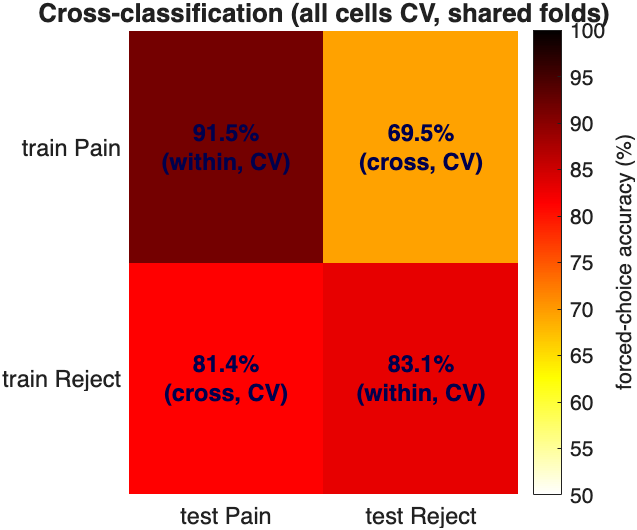

# Multivariate decoding — Part 4: cross-classification

> **Multivariate decoding tutorial series**
> 1. [Classification basics with SVM](multivariate_decoding_part1_classification_with_SVM.md) — train and cross-validate a linear SVM (Hot vs Warm); ROC, confusion matrix, effect sizes; apply to a held-out test set.
> 2. [Classification and regression](multivariate_decoding_part2_classification_and_regression.md) — the difference between the two, the one-line dataset loaders, the `xval_*` wrapper family, and `fmri_data.predict` end-to-end for both.
> 3. [The sklearn-style `predictive_model` API](multivariate_decoding_part3_predictive_model_api.md) — fit / predict / crossval / bootstrap / permutation, nested-CV tuning, calibration, stability selection.
> 4. **Cross-classification** *(this part)* — does a pain pattern decode social rejection? (Woo et al., 2014).
> 5. [Algorithms, tuning, and inference](multivariate_decoding_part5_algorithms_and_tuning.md) — compare SVM / SVR / lasso / ridge / GP, ECOC multiclass, grid search, stability selection.

> Train a classifier on one task and test it on another. Here we ask
> the Woo et al. (2014) question directly: does a brain pattern that
> separates **physical pain** (Hot vs Warm) also separate **social
> rejection** (Rejecter vs Friend), and vice versa? If a pain-trained
> pattern predicts rejection above chance, the two experiences share a
> representation; how *much* it generalises tells us how much.

Reference: Woo C-W, Koban L, Kross E, Lindquist MA, Banich MT,
Ruzic L, Andrews-Hanna JR, Wager TD (2014). *Separate neural
representations for physical pain and social rejection.* **Nature
Communications** 5:5380.

## 0. The idea in one paragraph

Cross-classification is the cleanest test of representational overlap.
A within-system cross-validated accuracy tells you the pattern exists;
a *cross-system* accuracy tells you whether the **same** pattern carries
across domains. Train on Hot/Warm, freeze the weights, apply them to the
Rejecter/Friend images, and score. If physical and social pain were
identical in the brain, cross-accuracy would match within-accuracy. If
they were unrelated, it would be at chance. The real answer — partial
transfer — is the headline finding.

## 1. Load both tasks (same voxel space)

```matlab
hw = load_image_set('DPSP_hotwarm');         % Hot (+1)      vs Warm   (-1)
rf = load_image_set('DPSP_rejectorfriend');  % Rejecter (+1) vs Friend (-1)

Xhw = double(hw.dat'); Yhw = hw.Y; idhw = hw.metadata_table.subj_id;
Xrf = double(rf.dat'); Yrf = rf.Y; idrf = rf.metadata_table.subj_id;
```

Both loaders apply the **same** gray-matter mask, so the two objects
already live in identical voxel space (here `194676` voxels). This is a
hard requirement for cross-classification — the weight vector trained on
one is only meaningful applied to the other if column *j* is the same
voxel in both. If you ever cross-classify objects from different
pipelines, `resample_space(test_obj, train_obj)` first.

```matlab
assert(size(hw.dat,1) == size(rf.dat,1), 'datasets must share voxel space');
```

## 2. Within-system baselines

First establish how well each task is decoded *within* itself — the
ceiling that cross-classification is compared against.

```matlab
cv = cv_splitter.stratified_group_kfold(5);

pm_hw = crossval(predictive_model('algorithm','svm','task','classification'), ...
                 Xhw, Yhw, 'groups', idhw, 'cv', cv);
pm_rf = crossval(predictive_model('algorithm','svm','task','classification'), ...
                 Xrf, Yrf, 'groups', idrf, 'cv', cv);

fprintf('Within Hot/Warm      : %.1f%% cv accuracy\n', pm_hw.error_metrics.crossval_accuracy.value);
fprintf('Within Rejecter/Friend: %.1f%% cv accuracy\n', pm_rf.error_metrics.crossval_accuracy.value);
```

On this dataset Hot/Warm decodes around **78%** and Rejecter/Friend
around **66%** (single-observation cv accuracy) — both well above the
50% chance line. (The within-subject *forced-choice* accuracy, reported
automatically in `crossval_accuracy_within`, is higher still: ~90% and
~83%.)

## 3. Cross-classification — train one, test the other

Because the two datasets share subjects and voxel space, there is **no
leakage** in fitting on all of one task and testing on all of the other:
the test images were never seen during training. So a plain full-sample
`fit` is the right training step here (no cross-validation needed across
datasets).

```matlab
% Train on Hot/Warm, freeze, apply to Rejecter/Friend
pm_pain = fit(predictive_model('algorithm','svm','task','classification'), Xhw, Yhw);
[yhat_rf, score_rf] = predict(pm_pain, Xrf);

% Train on Rejecter/Friend, freeze, apply to Hot/Warm
pm_rej = fit(predictive_model('algorithm','svm','task','classification'), Xrf, Yrf);
[yhat_hw, score_hw] = predict(pm_rej, Xhw);
```

`pm_pain.weights.w` is the physical-pain pattern; applying it to `Xrf`
gives a continuous "pain-pattern expression" score for every rejection
image. The question is whether that score tracks the Rejecter/Friend
label.

## 4. Score it with AUC / forced-choice — NOT raw accuracy

This is the single most important methodological point. **Do not judge
cross-classification by raw accuracy at the model's native threshold.**
The SVM's bias/intercept is calibrated to the *training* task's score
distribution; the *testing* task generally has a different mean
expression, so the decision boundary lands in the wrong place and raw
accuracy can look near-chance even when the pattern clearly separates the
two classes. What transfers is the **ranking** of scores, so evaluate
with:

- **AUC** (`roc_plot`) — threshold-free; the probability a random
  positive scores above a random negative.
- **Within-subject forced choice** — for each subject, is the score
  higher for their positive image than their negative one? Threshold- and
  bias-free, and the natural paired test for these designs.

```matlab
% Paired ("two-alternative forced choice") AUC of the pain pattern
% applied to rejection. NOTE: roc_plot's 'twochoice' pairs the positive
% and negative observations BY INDEX, so it assumes the +1 and -1 images
% are in the same subject order (true for the DPSP loaders). If your data
% isn't ordered that way, use the explicit forced_choice() helper below.
ROC = roc_plot(score_rf(:,end), Yrf == 1, 'twochoice');   % paired AUC
fprintf('Pain pattern -> rejection: paired AUC = %.3f\n', ROC.AUC);   % ~0.79
```

A compact, order-independent forced-choice helper (works for either
direction):

```matlab
function acc = forced_choice(scores, Y, id)
% Fraction of subjects whose +1 image scores above their -1 image.
    [~, ~, g] = unique(id(:), 'stable');
    u = unique(g); hit = nan(numel(u),1);
    for i = 1:numel(u)
        sp = scores(g==u(i) & Y== 1);
        sn = scores(g==u(i) & Y==-1);
        if ~isempty(sp) && ~isempty(sn), hit(i) = mean(sp) > mean(sn); end
    end
    acc = 100 * mean(hit, 'omitnan');
end
```

```matlab
fc_pain_on_rej = forced_choice(score_rf(:,end), Yrf, idrf);
fc_rej_on_pain = forced_choice(score_hw(:,end), Yhw, idhw);
fprintf('Pain pattern   -> rejection forced-choice: %.1f%%\n', fc_pain_on_rej);  % ~68%
fprintf('Reject pattern -> pain      forced-choice: %.1f%%\n', fc_rej_on_pain);  % ~81%
```

## 5. Put the four numbers in one table

The interpretable object is the **2×2 generalisation matrix**: rows =
training task, columns = testing task, cells = within-subject
forced-choice accuracy. The crucial subtlety: the **diagonal must be
cross-validated** (an in-sample fit tested on its own training data is a
meaningless 100%), while the **off-diagonal** uses the frozen full-sample
model applied to the *other* dataset (no leakage — those images were
never in training).

```matlab
% Diagonal: within-system, CROSS-VALIDATED. crossval auto-computes the
% within-subject forced-choice accuracy when 'groups' is supplied.
within_pain = pm_hw.error_metrics.crossval_accuracy_within.value;   % ~90%
within_rej  = pm_rf.error_metrics.crossval_accuracy_within.value;   % ~83%

% Off-diagonal: frozen model on the other task.
cross_pain_to_rej = forced_choice(score_rf(:,end), Yrf, idrf);      % ~68%
cross_rej_to_pain = forced_choice(score_hw(:,end), Yhw, idhw);      % ~81%

G = [ within_pain,        cross_pain_to_rej ; ...
      cross_rej_to_pain,  within_rej ];
T = array2table(G, 'RowNames', {'trainPain','trainReject'}, ...
                   'VariableNames', {'testPain','testReject'});
disp(T);
```

which on this dataset gives (forced-choice %):

|              | test Pain        | test Reject      |
|--------------|------------------|------------------|
| train Pain   | **89.8** (within, CV) | 67.8 (cross) |
| train Reject | 81.4 (cross)     | **83.1** (within, CV) |



Both off-diagonal cells are well above the 50% chance line (shared
representation) yet below their within-system diagonal (dissociable
representation) — the *shared-but-separable* signature.

## 6. Visualise where the two patterns agree and differ

The two weight maps are themselves the scientific object. Render them
side by side, then look at where they overlap (shared code) vs diverge
(domain-specific code):

```matlab
montage(pm_pain, hw);      % physical-pain pattern
montage(pm_rej,  rf);      % social-rejection pattern

% overlap of the (bootstrap-thresholded) patterns
pm_pain = bootstrap(pm_pain, Xhw, Yhw, 'nboot', 1000, 'groups', idhw);
pm_rej  = bootstrap(pm_rej,  Xrf, Yrf, 'nboot', 1000, 'groups', idrf);
[~, si_pain] = weight_map_object(pm_pain, hw, 'use', 'thresh_fdr');
[~, si_rej]  = weight_map_object(pm_rej,  rf, 'use', 'thresh_fdr');
```

Woo et al. found the maps overlap in some regions (e.g. dACC,
anterior insula — the "salience" network often labelled "pain matrix")
but each carries domain-specific information elsewhere, which is exactly
why cross-classification is *above chance but well below* within-system.

## 7. The one-call legacy wrapper

For the common case, `xval_cross_classify` packages this whole flow
(train both directions, score, build the generalisation matrix) and
returns a `@predictive_model` with the results under
`pm.cross_classify`:

```matlab
pm_cc = xval_cross_classify(Xhw, Yhw, Xrf, Yrf);   % see `help xval_cross_classify`
pm_cc.cross_classify
```

The new-API decomposition above is the same computation, exposed step by
step so you can swap the algorithm, the scoring metric, or the
thresholding without editing a 500-line function.

## 8. Take-aways

- **Cross-classification = representational-overlap test.** Train on A,
  freeze, test on B.
- **Same voxel space is mandatory** — both DPSP loaders guarantee it;
  otherwise `resample_space` first.
- **Score with AUC / forced choice, never raw accuracy** — the bias term
  does not transfer across datasets.
- **The 2×2 matrix is the result.** Above-chance off-diagonal with a
  lower-than-diagonal value is the signature of *shared but
  dissociable* representations — the Woo et al. (2014) headline.

Continue to [**Part 5**](multivariate_decoding_part5_algorithms_and_tuning.md)
for multiclass classification (ECOC) and regression (SVR / lasso / ridge /
GP), with algorithm comparison, `grid_search` tuning, and
`stability_selection` inference.
