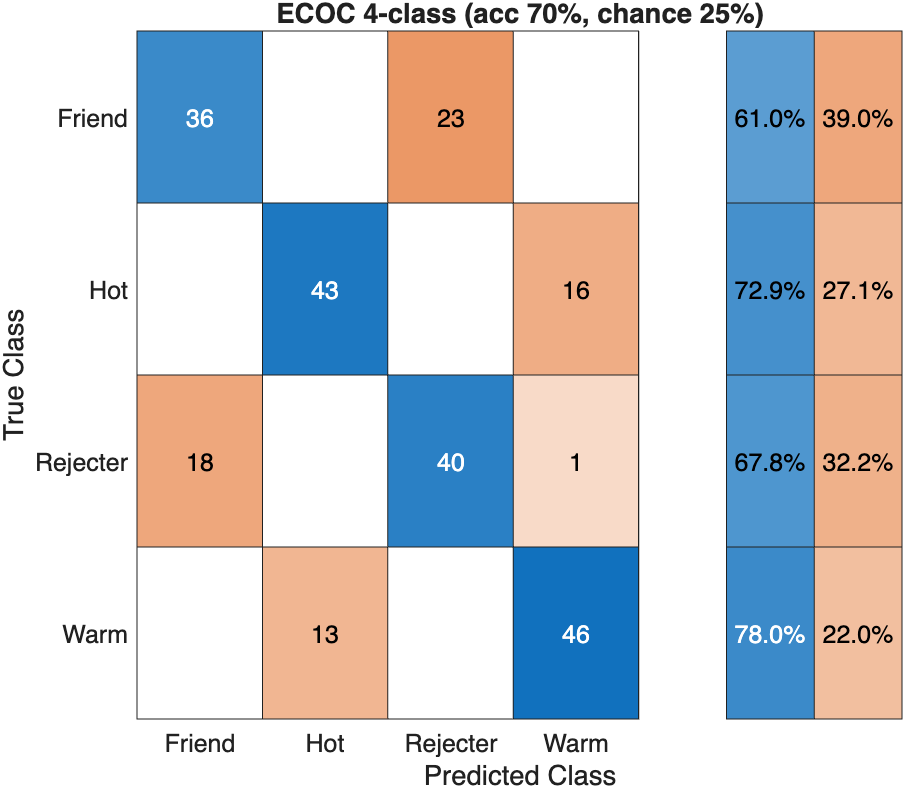
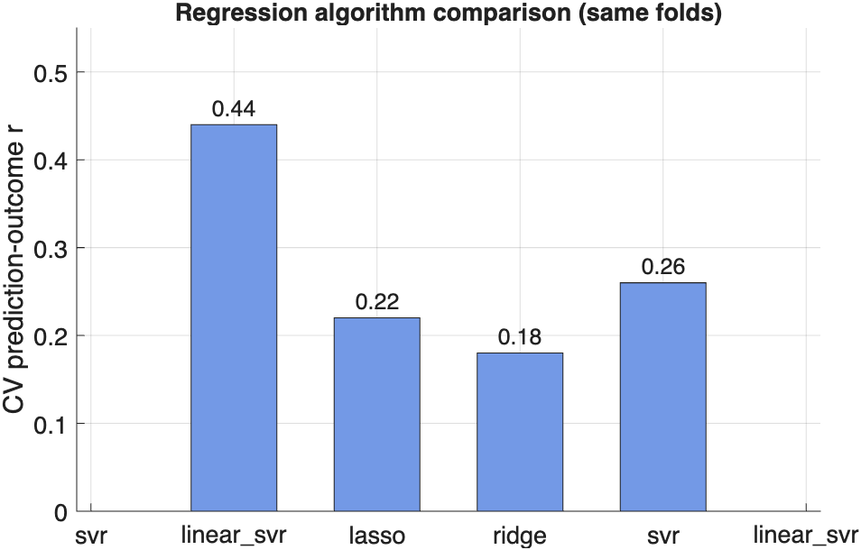

# Multivariate decoding — Part 5: algorithms, tuning, and inference

> **Multivariate decoding tutorial series**
> 1. [Classification basics with SVM](multivariate_decoding_part1_classification_with_SVM.md) — train and cross-validate a linear SVM (Hot vs Warm); ROC, confusion matrix, effect sizes; apply to a held-out test set.
> 2. [Classification and regression](multivariate_decoding_part2_classification_and_regression.md) — the difference between the two, the one-line dataset loaders, the `xval_*` wrapper family, and `fmri_data.predict` end-to-end for both.
> 3. [The sklearn-style `predictive_model` API](multivariate_decoding_part3_predictive_model_api.md) — fit / predict / crossval / bootstrap / permutation, nested-CV tuning, calibration, stability selection.
> 4. [Cross-classification](multivariate_decoding_part4_cross_classification.md) — does a pain pattern decode social rejection? (Woo et al., 2014).
> 5. **Algorithms, tuning, and inference** *(this part)* — compare SVM / SVR / lasso / ridge / GP, ECOC multiclass, grid search, stability selection.

> One dataset, many estimators. This part uses the `@predictive_model`
> registry to run **binary** and **multiclass (ECOC)** classification and
> **regression** (SVR, lasso, ridge, Gaussian process) on the DPSP data,
> compares cross-validated performance across algorithms, tunes
> hyperparameters with `grid_search`, and does high-dimensional feature
> inference with `stability_selection` — then closes with a decision
> guide for *when to use which*.

## 1. The algorithm registry

`fit` dispatches `obj.algorithm` through a one-row-per-algorithm
registry (`predictive_model.algorithm_registry()`). Switching estimators
is a one-word change; everything else (cv, scoring, bootstrap, plotting)
is identical.

| Name | Fitter | Task | Notes |
|---|---|---|---|
| `svm` | `fitcsvm` | classification | kernel SVM (linear default); dual form |
| `linear_svm` | `fitclinear` | classification | high-dim L2-SVM; fast on wide data |
| `logistic` | `fitclinear` | classification | logistic loss; gives probabilities |
| `lda` | `fitcdiscr` | classification | linear discriminant |
| `ecoc` | `fitcecoc` | classification | **multiclass** via error-correcting codes |
| `knn`, `naive_bayes`, `tree_classifier`, `rf_classifier`, `nnet_classifier` | various | classification | non-linear baselines |
| `svr` | `fitrsvm` | regression | kernel SVR |
| `linear_svr` | `fitrlinear` | regression | high-dim linear SVR |
| `lasso` | `fitrlinear` (L1) | regression | sparse |
| `ridge` | `fitrlinear` (L2) | regression | dense, stable |
| `pcr` | PCA + OLS | regression | principal-components regression; reproduces legacy `cv_pcr` / default `cv_lassopcr` |
| `lassopcr` | PCA + LASSO + relaxed-OLS | regression | shrinkage by `lasso_num` (path step) or `estimateparam` (nested-CV lambda), then OLS-refit on the non-zero components; reproduces legacy `cv_lassopcr` shrinkage |
| `gp` | `fitrgp` | regression | Gaussian process; needs few features |
| `tree_regressor`, `rf_regressor`, `nnet_regressor` | various | regression | non-linear baselines |

## 2. Setup

```matlab
hw = load_image_set('DPSP_hotwarm');         % binary: Hot (+1) vs Warm (-1)
rf = load_image_set('DPSP_rejectorfriend');

X  = double(hw.dat');  Y  = hw.Y;  id = hw.metadata_table.subj_id;
```

## 3. Binary classification — compare algorithms on identical folds

Cross-validate several classifiers over the **same** splitter so the
comparison is fold-matched (`predict_test_suite` does exactly this for
you, but here it's spelled out):

```matlab
cv   = cv_splitter.stratified_group_kfold(5);
algs = {'svm','linear_svm','logistic','lda'};

for a = algs
    pm = crossval(predictive_model('algorithm',a{1},'task','classification'), ...
                  X, Y, 'groups', id, 'cv', cv, 'scoring','balanced_accuracy');
    fprintf('%-12s cv bal-acc = %.3f\n', a{1}, pm.error_metrics.balanced_accuracy.value);
end
```

Or in one call:

```matlab
[cverr, yhat, pm_all, results] = predict_test_suite(hw, 'nfolds', id);
disp(results);    % table: algorithm, cv_score, cv_error, n_fdr_sig
```

## 4. Multiclass classification with ECOC

For >2 classes, `ecoc` (error-correcting output codes) reduces the
K-class problem to a set of binary SVMs and decodes their votes. Build a
4-class problem by stacking the two DPSP tasks — Hot, Warm, Rejecter,
Friend:

```matlab
Xall  = [double(hw.dat'); double(rf.dat')];
Ycls  = [ (hw.Y==1)*1 + (hw.Y==-1)*2 ; (rf.Y==1)*3 + (rf.Y==-1)*4 ];  % 1..4
idall = [hw.metadata_table.subj_id; rf.metadata_table.subj_id];

pm = predictive_model('algorithm','ecoc','task','classification');
pm = crossval(pm, Xall, Ycls, 'groups', idall, ...
              'cv', cv_splitter.group_kfold(5), 'scoring','accuracy');

fprintf('ECOC 4-class accuracy = %.1f%% (chance = 25%%)\n', ...
        100 * pm.error_metrics.accuracy.value);     % ~70%
confusionchart(pm);                                  % see which pairs confuse
```

On this dataset the 4-way accuracy is ~**70%** (chance 25%). The
confusion chart is the interesting part: Hot/Warm and Rejecter/Friend
each confuse *within* their own task far more than across, echoing the
Part 4 finding that the two domains are partly separable.



> **Note on scoring:** for multiclass use `accuracy` or
> `balanced_accuracy`. `roc_auc` and the within-person forced-choice
> stats are binary-only and are skipped automatically.

## 5. Regression — compare SVR / lasso / ridge / GP

DPSP ships **binary** labels, so here we treat the signed label as a
continuous target purely to *compare regression algorithms on the same
signal* — in a real study you would swap in a continuous outcome
(temperature, pain rating, …): `Y = hw.metadata_table.rating;`. The
mechanics are identical.

```matlab
cv = cv_splitter.group_kfold(5);
for a = {'svr','linear_svr','lasso','ridge'}
    pm = crossval(predictive_model('algorithm',a{1},'task','regression'), ...
                  X, Y, 'groups', id, 'cv', cv);
    fprintf('%-12s r = %.3f   R^2 = %.3f\n', a{1}, ...
        predictive_model.metric_value(pm.error_metrics,'prediction_outcome_r'), ...
        pm.error_metrics.r2.value);
end
```

Typical output (prediction–outcome correlation `r`, cross-validated
`R^2`):

| algorithm    | r     | R²     |
|--------------|-------|--------|
| `svr`        | 0.44  | 0.09   |
| `linear_svr` | 0.22  | −0.38  |
| `lasso`      | 0.18  | −0.67  |
| `ridge`      | 0.26  | −0.22  |



`r` (does the prediction *track* the outcome) and `R²` (does it track on
the *right scale*) can disagree — `svr` ranks well **and** is scaled
sensibly here; the penalized linear models rank weakly and a negative R²
means "worse than predicting the mean." This is exactly why you compare
several estimators rather than trusting one.

### Gaussian process needs dimensionality reduction

`fitrgp` builds an n×n kernel and does not scale to ~200k voxels.
Reduce first with a PCA step in an `@pipeline` (which refits the PCA
**per fold** — no leakage):

```matlab
est  = predictive_model('algorithm','gp','task','regression');
pipe = pipeline({ {'pca','k',30} }, est);          % PCA(30) -> GP
pipe = crossval(pipe, X, Y, 'groups', id, 'cv', cv);
fprintf('gp(PCA30)  R^2 = %.3f\n', pipe.error_metrics.r2.value);   % ~0.11
```

The same PCA-then-estimator pattern turns *any* sample-hungry or
feature-hungry learner (GP, kNN, kernel SVR) into something tractable on
wide neuroimaging data, and `weight_image(pipe, hw)` still back-projects
the weights to voxel space for linear estimators.

## 6. Hyperparameter tuning with `grid_search`

`grid_search` cross-validates the Cartesian product of a parameter grid
and refits at the winner. Because a tuned `predictive_model` is *still a
predictive_model*, you can wrap it in an outer `crossval` for proper
nested CV.

```matlab
g.BoxConstraint = [0.01 1 100];
pm = predictive_model('algorithm','svm','task','classification', ...
                      'cv', cv_splitter.stratified_group_kfold(5));
pm = grid_search(pm, X, Y, g, 'groups', id);

pm.diagnostics.grid_search.best_params       % e.g. {'BoxConstraint', 1}
pm.diagnostics.grid_search.best_score        % e.g. 0.805
pm.diagnostics.grid_search.scores            % full grid
```

On DPSP Hot/Warm the SVM is robust across two orders of magnitude of
`BoxConstraint`, peaking at the default `1` (~0.80 balanced accuracy) —
a useful sanity check that you're not leaving performance on the table,
and that the model isn't pathologically sensitive to C.

## 7. High-dimensional inference with `stability_selection`

For wide, regularised models the bootstrap z/p collapses (Part 3 §7).
`stability_selection` is the robust alternative: how often does each
voxel land in the top-k by `|weight|` across resamples?

```matlab
pm = stability_selection( ...
        predictive_model('algorithm','linear_svm','task','classification'), ...
        X, Y, 'nboot', 200, 'k', 2000, 'threshold', 0.6, 'groups', id);

ss = pm.diagnostics.stability_selection;
fprintf('%d stable voxels (selected in >= 60%% of bootstraps)\n', ss.n_stable);

% selection-frequency brain map
freq = hw; freq.dat = ss.selection_freq;
montage(freq);
```

Stable voxels are the ones the classifier relies on *regardless* of
which subjects it sees — a far more honest "where is the signal" map than
a bootstrap-z threshold on an L2 model.

## 8. When to use which — a decision guide

| Situation | Reach for |
|---|---|
| 2 classes, want a weight map | `svm` (kernel, default) or `linear_svm` for very wide data |
| 2 classes, want probabilities | `logistic`, or `svm` + `calibrate` |
| > 2 classes | `ecoc` |
| Continuous outcome, linear, interpretable map | `svr` (often the best ranker here), or `ridge` for a dense stable map |
| Continuous outcome, want sparsity | `lasso` |
| Small n, non-linear, few features (or PCA-reduced) | `gp` in a `pca` `@pipeline` |
| Hyperparameters matter | `grid_search` (wrap in outer `crossval` for nested CV) |
| Voxel-level inference on a wide regularised model | `stability_selection` (not bootstrap z/p) |
| Honest CV with any preprocessing (PCA, scaling, feature select) | `@pipeline` (refits every step per fold) |

### Rules of thumb

- **Start simple.** Linear `svm`/`svr` with default settings is a strong
  baseline and gives an interpretable weight map; only add capacity (RBF
  kernels, GP, ensembles) if a fold-matched comparison says it helps.
- **Compare on identical folds.** Always cross-validate competing
  algorithms over the *same* `cv_splitter` (or use `predict_test_suite`),
  or fold-to-fold noise will swamp the algorithm difference.
- **Match the metric to the question.** Ranking → `roc_auc` / `r` /
  forced-choice; calibrated scale → `R²` / accuracy at threshold.
- **Group by subject.** With multiple images per subject, always pass
  `'groups', subject_id` and a group-aware splitter, or held-out folds
  leak subject identity and inflate performance.

That completes the five-part multivariate-decoding walkthrough:
**Part 1** SVM classification basics, **Part 2** classification vs
regression, **Part 3** the composable sklearn-style `predictive_model`
API, **Part 4** cross-classification, and **Part 5** algorithms, tuning,
and inference.
