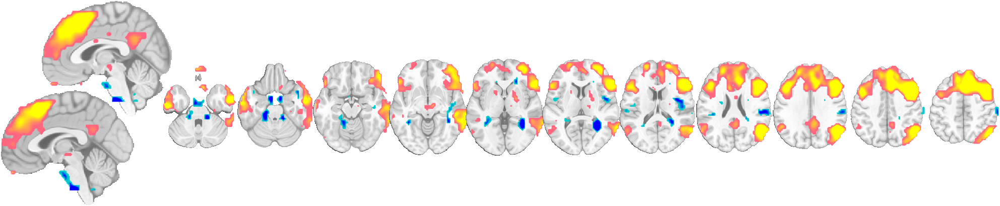
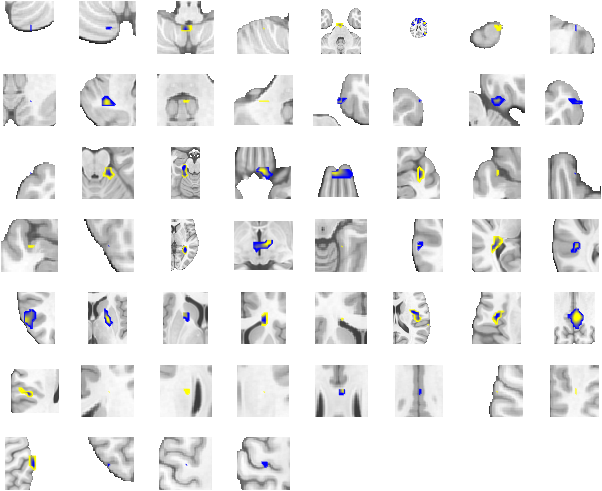
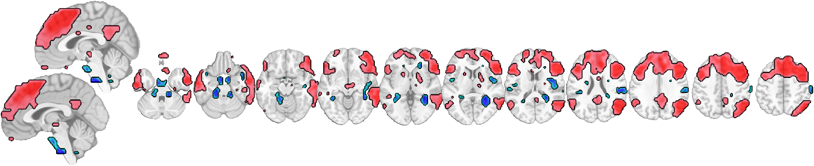
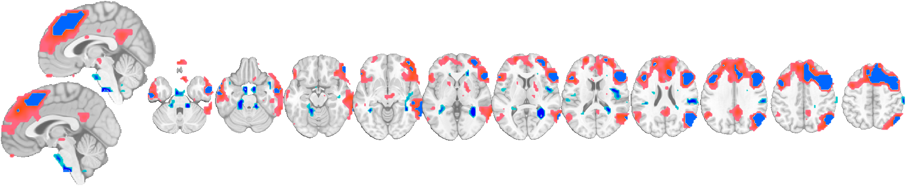
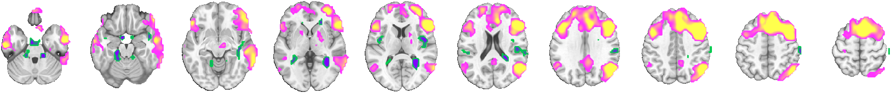

# 2. Montages and slices

[← Back to index](index.md) · Next: [3. Surfaces and 3‑D rendering →](03_surfaces.md)

Montages are the workhorse of CANlab visualization: a canonical array of slices that shows the **whole** result, not a hand-picked slice. This page covers the quick interactive look (`orthviews`), the prepackaged montage layouts, per-region "close-up" montages, and the main customization options.

Every example below starts from a thresholded statistic image. We use the bundled `emotionreg` sample dataset so the code runs anywhere:

```matlab
obj = load_image_set('emotionreg', 'noverbose');   % 30 first-level contrast images
t   = threshold(ttest(obj), .05, 'unc');           % voxelwise one-sample t-test
r   = region(t);                                   % contiguous blobs, for region methods
```

---

## 2.1 A quick interactive look: `orthviews`

`orthviews` opens the familiar three-plane (coronal / sagittal / axial) view with movable crosshairs. It is the fastest way to inspect a map interactively — click anywhere to move the crosshair.

```matlab
orthviews(t);
```


Positive values render in warm colors, negative in cool, with a colorbar in t units. `orthviews` works on `fmri_data`, `statistic_image`, `region`, and `atlas` objects. Useful options include `'unique'` / `'solid'` (each contiguous blob a distinct solid color — handy for masks and atlases) and `'largest_region'`.

---

## 2.2 Prepackaged montage layouts

The function `canlab_results_fmridisplay` builds a complete, publication-ready montage in one call. Pass a statistic image and a **montage type**:

```matlab
o = canlab_results_fmridisplay(t, 'compact2', 'noverbose');
```

**`compact2`** — a single row: midline sagittals plus a row of axial slices. The most compact "whole-picture" view.



**`full`** — the comprehensive layout: four cortical surfaces, a sagittal row, a coronal row, and two axial rows. This is what you publish when you want to show everything.

```matlab
o = canlab_results_fmridisplay(t, 'full', 'noverbose');
```


Other prepackaged types you can pass instead (see `help canlab_results_fmridisplay`):

| Type | What it shows |
|------|----------------|
| `'compact'` | Default. Midline sagittal + two axial rows. |
| `'compact2'` | Single row: sagittal + axials (shown above). |
| `'full'` | Slices in all 3 planes + 4 cortical surfaces (shown above). |
| `'full hcp'` | `full`, with HCP surfaces and subcortical volumes. |
| `'multirow'` | Several `compact2` rows stacked, to compare maps side by side. Call as `canlab_results_fmridisplay([], 'multirow', 2)` then add each map to a row. |
| `'regioncenters'` | One axis per region, each centered on a blob (see §2.3). |
| `'subcortex compact'` / `'subcortex 3d'` | Subcortical-focused layouts. |

> **Tip.** `montage(t)` (the object method) is a shortcut that routes to `canlab_results_fmridisplay` with the default `compact` layout. `montage(r)` does the same for a region object.

---

## 2.3 A close-up of every blob: `regioncenters`

To inspect each activation cluster individually, convert the map to a `region` object and use the `'regioncenters'` montage. Each contiguous blob gets **its own axis**, centered and zoomed on that region — ideal for reports where you want to see every cluster clearly.

```matlab
r = region(t);
montage(r, 'regioncenters', 'colormap', 'noverbose');
```



The `'colormap'` option colors each blob by its value (warm = positive, cool = negative). Add `r = autolabel_regions_using_atlas(r)` before plotting to label each region with its anatomical name (see [6. Atlases and regions](06_atlases_and_regions.md)).

---

## 2.4 Customizing blobs: color, outline, transparency

`canlab_results_fmridisplay` (and `addblobs`) accept color and style options. Here we render the map as solid-colored blobs with a black **outline** and partial **transparency** so the underlay shows through:

```matlab
o = canlab_results_fmridisplay(t, 'compact2', ...
        'color', [1 0 0], 'outline', 'linewidth', 2, 'trans', 'noverbose');
```



Common blob options:

| Option | Effect |
|--------|--------|
| `'color', [r g b]` | One solid color for all blobs. |
| `'maxcolor', [..]`, `'mincolor', [..]` | Endpoints of a single value→color ramp. |
| `'splitcolor', {…}` | Four colors: `{minneg maxneg minpos maxpos}` for a signed split map. |
| `'outline'`, `'linewidth', n` | Draw a blob outline instead of / on top of the fill. |
| `'trans'` / `'scaledtransparency'` | Transparent blobs; scaled by value with `'scaledtransparency'`. |
| `'cmaprange', [lo hi]` | Fix the value→color limits (see [4. Colors and colormaps](04_colormaps.md)). |

Color behavior is unified across montages and surfaces — a map scaled one way on a montage looks identical on a surface. That pipeline is the subject of [page 4](04_colormaps.md).

---

## 2.5 Overlaying multiple maps

Because an `fmridisplay` object is a persistent container, you can add several maps and remove them without redrawing the underlay. Here the full map is drawn in one color and a stricter-threshold subset in another:

```matlab
o = canlab_results_fmridisplay(t, 'compact2', 'color', [1 .3 0], 'noverbose');
tstrict = threshold(ttest(obj), .001, 'unc');
o = addblobs(o, region(tstrict), 'color', [0 .4 1], 'no_surface');
% ... later:  o = removeblobs(o);   % clear blobs, keep the montage
```



`addblobs` / `removeblobs` let you build one canonical set of slices and cycle different maps through it. The [controller page](05_controller.md) shows how to do this interactively, and how montage and surface views stay in sync.

---

## 2.6 Rolling your own slices: `fmridisplay.montage`

The prepackaged layouts pick their slices for you. When you need a specific set of slices — a particular orientation, a slice range, custom spacing — build an empty `fmridisplay` and call its `montage` method directly, then add your blobs. Here we lay out a **single row of axial slices** from z = −30 to z = 60 every 10 mm:

```matlab
o = fmridisplay;                                    % empty display container
o = montage(o, 'axial', 'slice_range', [-30 60], ...
            'spacing', 10, 'onerow');               % choose the slices
o = addblobs(o, region(t), 'nooutline');            % paint the map onto them
```



The montage method's slice controls:

| Option | Effect |
|--------|--------|
| `'axial'` / `'sagittal'` / `'coronal'` | Orientation of the slices. |
| `'slice_range', [lo hi]` | First/last slice coordinate (mm). |
| `'spacing', n` | Millimeters between slices. |
| `'wh_slice', [..]` or `'slices', [..]` | Give explicit slice coordinates instead of a range. |
| `'onerow'` | Force all slices into a single row. |

You can call `montage` more than once on the same object to stack rows of different orientations (a sagittal row above an axial row, say) — exactly how the prepackaged `full`/`compact` layouts are assembled internally. See `help fmridisplay.montage`.

---

[← Back to index](index.md) · Next: [3. Surfaces and 3‑D rendering →](03_surfaces.md)
