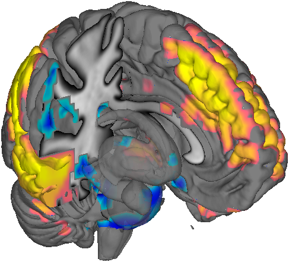
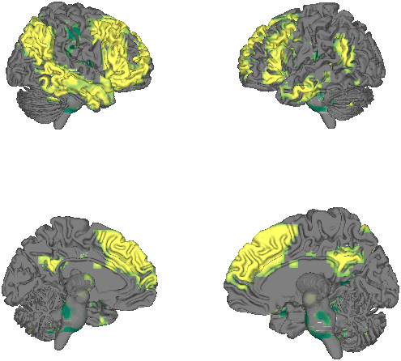
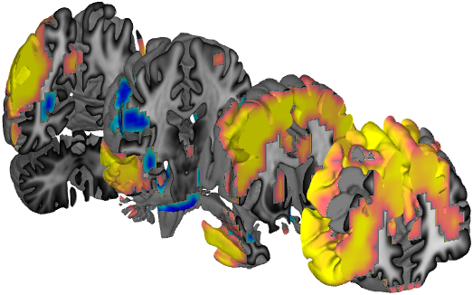
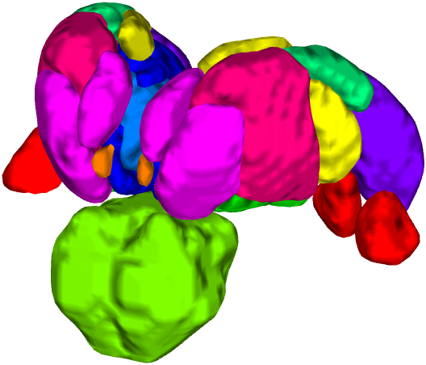
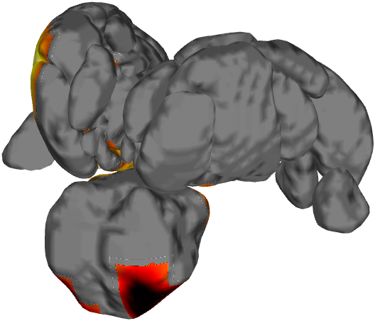

# 3. Surfaces and 3‑D rendering

[← 2. Montages](02_montages.md) · [Back to index](index.md) · Next: [4. Colors and colormaps →](04_colormaps.md)

Surface renderings localize activity on the cortical sheet and in 3‑D subcortical structures, and make patterns comparable across studies. Most data objects (`fmri_data`, `statistic_image`, `region`) have a `surface()` method, and the underlying engine — `render_on_surface` — paints values onto any set of surface handles you build with `addbrain` or `isosurface`.

```matlab
obj = load_image_set('emotionreg', 'noverbose');
t   = threshold(ttest(obj), .05, 'unc');
```

---

## 3.1 The `surface()` method

Called with a layout keyword, `surface()` builds the surfaces and renders the map in one step. **`foursurfaces`** gives the standard lateral + medial view of both hemispheres:

```matlab
sh = surface(t, 'foursurfaces', 'noverbose');   % returns surface handles
```


Positive values are warm, negative cool, with a split colorbar in t units. The returned handles `sh` can be recolored, made transparent, or rotated afterward.

Called with no layout, `surface(t)` produces a **cutaway** that reveals medial cortex and subcortical structures together:

```matlab
surface(t);
```



---

## 3.2 Recoloring with `render_on_surface`

`render_on_surface` repaints existing surface handles — change the colormap, the color limits, or emphasize one sign. Here the same `foursurfaces` handles are recolored with a perceptual `summer` colormap:

```matlab
render_on_surface(t, sh, 'colormap', 'summer');
```



Key `render_on_surface` options:

| Option | Effect |
|--------|--------|
| `'colormap', name` | Any MATLAB colormap (`'hot'`, `'summer'`, `'winter'`, …) or an *n×3* matrix. |
| `'clim', [lo hi]` | Value→color limits. Use `[-3 3]` for a symmetric signed map, or `[2 6]` to emphasize positives. |
| `'splitcolor', {…}` | Custom warm/cool split colors. |
| `'srcdepth'`, `'sourcespace'`, `'targetsurface'` | Accurate volume→surface projection (see note below). |

> **Accurate projection.** MNI *volume* voxels don't map one‑to‑one onto standard *surface* vertices. For publication-grade cortical projection, pass `'sourcespace'` (e.g. `MNI152NLin2009cAsym`) and `'targetsurface'` (`fsLR_32k`, `fsaverage_164k`) so CANlab uses precomputed vertex mappings and samples across the cortical ribbon. See `help render_on_surface`.

---

## 3.3 Cutaways and slabs

`surface()` accepts many prepackaged 3‑D cutaways. **`coronal_slabs_4`** cuts the brain into four coronal slabs so you can see activation on interior cross-sections:

```matlab
surface(t, 'coronal_slabs_4');
```



Other cutaway keywords: `'left_cutaway'`, `'right_cutaway'`, `'left_insula_slab'`, `'right_insula_slab'`, `'accumbens_slab'`, `'coronal_slabs'`, `'coronal_slabs_5'`. Each can be passed to `surface()` (to render a map) or to `addbrain()` (to get bare surfaces).

---

## 3.4 Subcortical close-ups with `addbrain`

`addbrain` is the master surface builder: dozens of keywords return handles to cortical or subcortical anatomy that you compose and then color with `render_on_surface`. This builds a subcortical scene — thalamic nuclei, brainstem, amygdala — and renders the t‑map onto it:

```matlab
sh = addbrain('thalamus_group');
sh = [sh addbrain('brainstem')];
sh = [sh addbrain('amygdala')];
render_on_surface(t, sh, 'clim', [-3 3]);
set(sh, 'FaceAlpha', .9);
view(135, 12);  lightRestoreSingle;  camzoom(1.3);
```


`addbrain` knows individual structures, composites, and cortical surfaces (catalogued in §3.6 below). Handles are standard MATLAB graphics: set `FaceAlpha`, rotate with `view()`, zoom with `camzoom`, and re-fix lighting with `lightRestoreSingle`. `addbrain('eraseblobs', sh)` resets a surface to gray so you can render a different contrast on the same scene. Run `addbrain` with no arguments (`addbrain`) to print its built-in keyword list, and see `help addbrain` for the full reference. Many keywords resolve regions through `canlab_load_ROI` and the atlas objects in `Neuroimaging_Pattern_Masks` (see [6. Atlases and regions](06_atlases_and_regions.md)), so the exact anatomy depends on those installed atlases.

---

## 3.5 Isosurfaces from atlases and images

`isosurface()` turns any image or atlas into 3‑D mesh blobs. Here every nucleus of a thalamic atlas becomes a surface; then we render the t‑map onto them:

```matlab
atl = load_atlas('thalamus');
sh  = isosurface(atl);
axis image vis3d off;  material dull;  view(210, 20);  lightRestoreSingle
render_on_surface(t, sh, 'colormap', 'hot');
```

Atlas nuclei as bare isosurfaces | t‑map rendered onto them
:---:|:---:
 | 

`isosurface` also builds custom cutaways from any anatomical image via `'thresh'`, `'nosmooth'`, and `'xlim'/'ylim'/'zlim'` bounds — useful for a bespoke publication surface. See `help image_vector.isosurface`.

---

## 3.6 The surface catalog

Any of these keywords can be passed to `addbrain(keyword)` to get bare surface handles, or (for the whole-brain layouts) to `surface(obj, keyword)` to render a map in one step. The list below is the built-in set as of this writing; run `addbrain` with no arguments for the authoritative list in your install.

**Cortical surfaces (single hemisphere or pair).** `'left'` / `'right'`, `'hires left'` / `'hires right'` (higher-resolution pial), `'surface left'` / `'surface right'`, `'inflated left'` / `'inflated right'` (FreeSurfer inflated), plus template-specific meshes `'MNI152NLin2009cAsym white|midthickness|pial left|right'`, `'MNI152NLin6Asym …'`, `'hcp inflated left|right'`, `'hcp sphere …'`, `'freesurfer inflated|white|sphere left|right'`, `'bigbrain left|right'`, `'flat left'` / `'flat right'`.

**Whole-brain surface layouts** (pass to `surface()` to render a map): `'foursurfaces'` (lateral + medial, both hemispheres — shown in §3.1), `'foursurfaces_hcp'`, `'inflated surfaces'`, `'flat surfaces'`, `'insula surfaces'`, `'multi_surface'`.

**Cutaways and slabs** (reveal interior anatomy): `'cutaway'`, `'left_cutaway'`, `'right_cutaway'`, `'left_insula_slab'`, `'right_insula_slab'`, `'accumbens_slab'`, `'coronal_slabs'`, `'coronal_slabs_4'`, `'coronal_slabs_5'`, `'brainbottom'`.

**Individual subcortical / brainstem structures:** `'thalamus'`, `'amygdala'` (+ `'amygdala hires'`), `'hippocampus'` (+ `'hippocampus hires'`), `'brainstem'`, `'pag'`, `'nucleus accumbens'` (`'nacc'`), `'caudate'`, `'putamen'`, `'globus pallidus'` (`'GP'`/`'GPe'`/`'GPi'`), `'cerebellum'` (`'cblm'`), `'hypothalamus'`, `'habenula'`, `'STN'`, `'SN'` (`'SNc'`/`'SNr'`), `'VTA'`, `'red nucleus'` (`'rn'`), `'LC'`, `'PBP'`, `'BST'`/`'BNST'`, `'vmpfc'`, and many more brainstem nuclei (`'rvm'`, `'nts'`, `'drn'`, `'mrn'`, `'PBN'`, `'medullary_raphe'`, …).

**Composites** (several structures at once): `'limbic'` (+ `'limbic hires'`), `'basal ganglia'` (`'BG'`), `'brainstem_group'`, `'thalamus_group'`, `'midbrain_group'`, `'subcortex'`, `'CIT168'`, `'pauli_subcortical'`.

Because these are ordinary graphics handles, you compose them freely — concatenate handle arrays (`sh = [addbrain('thalamus') addbrain('brainstem')]`), then `render_on_surface` a map onto the whole scene (§3.4).

---

[← 2. Montages](02_montages.md) · [Back to index](index.md) · Next: [4. Colors and colormaps →](04_colormaps.md)
