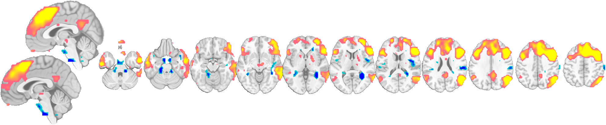
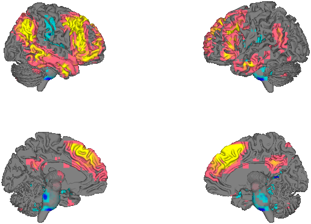
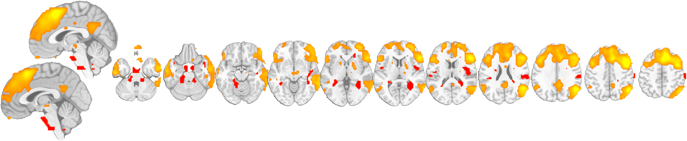
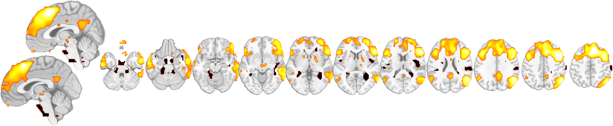
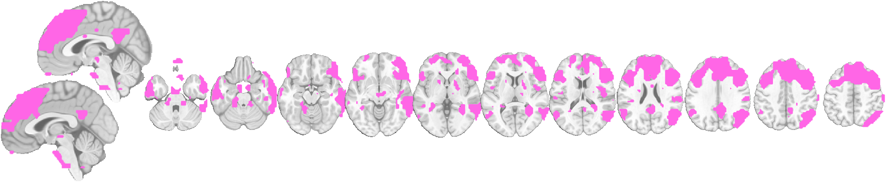
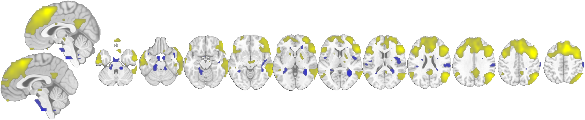

# 4. Colors and colormaps

[← 3. Surfaces](03_surfaces.md) · [Back to index](index.md) · Next: [5. The display controller →](05_controller.md)

CANlab display methods share **one** value→color pipeline (`canlab_colormap`). A montage, a surface, and the controller's legend of the *same* data all use the same mapping, so a result looks the same everywhere. This page shows the color modes, how to set color limits, and how to change colors on an existing display with `set_colormap`.

```matlab
obj = load_image_set('emotionreg', 'noverbose');
t   = threshold(ttest(obj), .05, 'unc');
o   = canlab_results_fmridisplay(t, 'compact2', 'noverbose');
```

---

## 4.1 One colormap, montage and surface

The point of the shared pipeline: render the same map on a montage and a surface and the value→color mapping is **identical** — same limits, same colors — with no extra arguments.

```matlab
o = canlab_results_fmridisplay(t, 'compact2', 'noverbose');
o = surface(o, 'foursurfaces');     % montage + surface on one object
```

Montage | Surface (same colors, same scale)
:---:|:---:
 | 

---

## 4.2 Color modes

The colormap type is chosen by which color option you pass (to `addblobs`, `canlab_results_fmridisplay`, or `set_colormap`). All five modes flow through the same central map:

**Split (signed).** The default for signed maps: separate warm/cool arms for positive and negative values, scaled independently. Two presets:

```matlab
set_colormap(o, 'splitcolor', {[0 0 1] [0 1 1] [1 .5 0] [1 1 0]});   % hot/cool (default)
set_colormap(o, 'splitcolor', {[.5 0 1] [0 .8 .3] [1 .2 1] [1 1 .3]}); % "mango"
```

hot/cool | mango
:---:|:---:
 | 

**Single ramp.** One color at the low limit interpolating to another at the high limit — set with `maxcolor`/`mincolor`:

```matlab
set_colormap(o, 'maxcolor', [1 1 0], 'mincolor', [1 0 0]);   % red -> yellow
```



**Continuous LUT.** Any perceptual/MATLAB colormap mapped continuously across the value range:

```matlab
set_colormap(o, 'colormap', hot(256));   % or viridis, inferno, turbo, ...
```



**Solid.** One flat color for every suprathreshold voxel — good for masks or overlaying several maps:

```matlab
set_colormap(o, 'color', [1 .4 .9]);
```



**Indexed.** Each value is a row index into a color table — the mode atlases use to give every region a distinct color (see [6. Atlases and regions](06_atlases_and_regions.md)).

---

## 4.3 Color limits: `cmaprange`

By default the color limits are set robustly from the data (percentiles, so a few extreme voxels don't wash out the scale). Override them with `cmaprange` to make maps comparable or to change contrast:

```matlab
set_colormap(o, 'cmaprange', [-6 6]);   % wider limits -> lower-contrast, comparable across maps
```

Default (data-driven limits) | Fixed `cmaprange` `[-6 6]`
:---:|:---:
 | 

Fixing `cmaprange` to the same value across several maps makes their colors quantitatively comparable — essential when you show more than one result.

---

## 4.4 `set_colormap` and `set_opacity`

Because an `fmridisplay` object retains each layer's source and options, you recolor **in place** — no re-thresholding, no re-supplying data — and every view (montage + surface) updates together:

```matlab
set_colormap(o, 'splitcolor', {...});        % change colors
set_colormap(o, 'cmaprange', [-4 4]);        % change limits
set_colormap(o, 'color', [1 0 0]);           % switch to solid
set_opacity(o, 0.5);                         % half-transparent blobs
set_colormap(o, ..., 'layers', 2);           % target one layer only
```

All of these are also exposed as clickable controls in the [display controller](05_controller.md).

---

[← 3. Surfaces](03_surfaces.md) · [Back to index](index.md) · Next: [5. The display controller →](05_controller.md)
