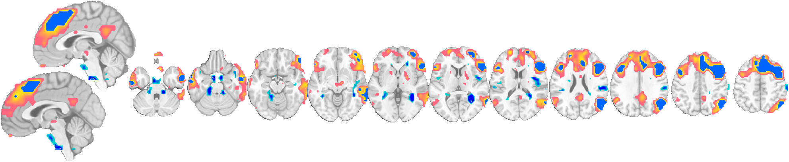
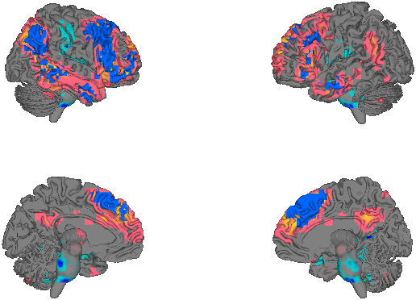
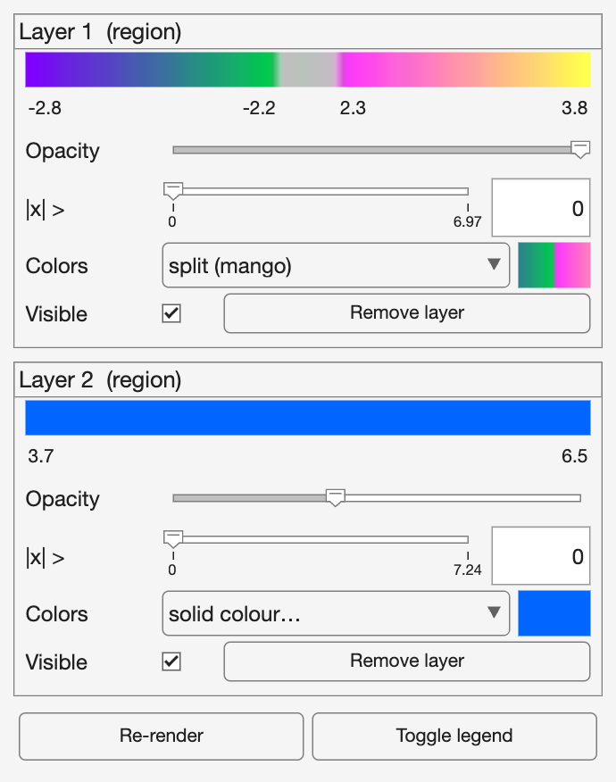
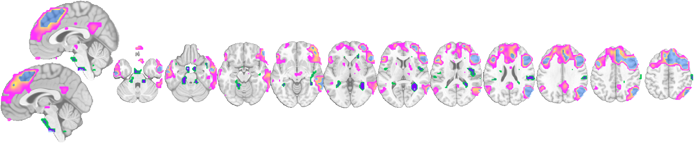

# 5. The display controller

[← 4. Colors](04_colormaps.md) · [Back to index](index.md) · Next: [6. Atlases and regions →](06_atlases_and_regions.md)

The **controller** is an interactive panel bound to an `fmridisplay` object. Because `fmridisplay` is a handle class whose layers remember their source and options, the controller can re-threshold, recolor, and re-render every view — montages *and* surfaces — live. Every control has a one-line command-line equivalent, and the controller echoes that line to the command window when you use it. So you can work by clicking or by scripting, interchangeably.

---

## 5.1 Build a composite and open the controller

Put a montage and a surface on one object, add a second blob layer, then open the controller:

```matlab
obj     = load_image_set('emotionreg', 'noverbose');
t       = threshold(ttest(obj), .05, 'unc');
tstrict = threshold(ttest(obj), .001, 'unc');

o = canlab_results_fmridisplay(t, 'compact2', 'noverbose');  % montage
o = surface(o, 'foursurfaces');                              % + surface, same object
o = addblobs(o, region(tstrict), 'color', [0 .4 1]);        % 2nd layer (solid blue)

controller(o);
```

The controller shows **one panel per blob layer**, plus global buttons at the bottom:


The montage and surface it drives:

Montage | Surface
:---:|:---:
 | 

---

## 5.2 What each control does — and its command-line twin

Per-layer panel:

| Control | What it does | Command-line equivalent |
|---------|--------------|--------------------------|
| **Color stripe + numeric labels** | Shows the layer's colormap and value limits (the legend). | — (reflects the current colormap) |
| **Opacity slider** | Blends the layer with what's beneath it. | `set_opacity(o, value, 'layers', k)` |
| **Threshold slider + box** | Re-thresholds from retained source; p-value (log scale) for stat images, `\|x\|` for masks. | `rethreshold(o, p, 'unc', 'layers', k)` |
| **Colors dropdown** | Pick a colormap: split (hot/cool, mango), warm/cool ramps, perceptual (viridis, inferno, turbo…), indexed (atlas), or solid. | `set_colormap(o, …, 'layers', k)` |
| **Color swatch** (click) | Opens a color picker for a solid color. | `set_colormap(o, 'color', [r g b], 'layers', k)` |
| **Visible checkbox** | Hides/shows the layer (lower layers show through on surfaces). | (layer `visible` flag) |
| **Remove layer** | Deletes the layer from all views. | `remove_layer(o, k)` / `removeblobs(o)` |

Global footer:

| Button | Action | Command line |
|--------|--------|--------------|
| **Re-render** | Redraw all layers on all views. | `refresh(o)` |
| **Toggle legend** | Put/remove colorbar legends on the montage & surface figures. | `remove_legend(o)` |

---

## 5.3 Command line and GUI are the same thing

Anything you do in the panel you can script, and the object updates every view in place. These two command-line actions — recolor layer 1 to *mango*, and make layer 2 half-transparent — are exactly what dragging the dropdown and the opacity slider would do:

```matlab
set_colormap(o, 'splitcolor', {[.5 0 1] [0 .8 .3] [1 .2 1] [1 1 .3]}, 'layers', 1);
set_opacity(o, 0.4, 'layers', 2);
```

Controller after the change | Montage after the change
:---:|:---:
 | 

Layer 1 is now mango; layer 2's blue blobs are translucent, letting layer 1 show through. The montage updated without redrawing the underlay, and the surface (not shown) updated identically — one object, all views in sync.

> **Tip.** Change a layer from the command line while its controller is open and the panel refreshes to match — the controller always reflects the object's true state. Conversely, the controller echoes the equivalent code to the command window, which is a good way to learn the scripting API.

---

## 5.4 Composing views: `multiview`

`multiview` lays a canonical multi-panel composition (any montage type) onto an existing object and renders its current layers there — handy for building a full figure from a display you were exploring interactively:

```matlab
o = multiview(o, 'full');   % re-compose this object's blobs onto the 'full' layout
```

### The full catalog of layouts and surfaces

It's worth having one place that lists everything you can compose. There are three families:

**Montage sets** — pass to `canlab_results_fmridisplay(t, set)`, `montage(t, set)`, or `multiview(o, set)`:

| Set | Layout |
|-----|--------|
| `'compact'` | Default: midline sagittal + two axial rows. |
| `'compact2'` | Single row: sagittal + axials. |
| `'full'` | All 3 planes + 4 cortical surfaces. |
| `'full hcp'` | `full` with HCP surfaces and subcortical volumes. |
| `'multirow'` | Several `compact2` rows stacked, to compare maps. |
| `'regioncenters'` | One axis per region, centered on each blob. |
| `'subcortex compact'` / `'subcortex 3d'` | Subcortical-focused layouts. |

You can also build a montage set by hand with `fmridisplay.montage` — choosing orientation, slice range, and spacing yourself (see [§2.6](02_montages.md#26-rolling-your-own-slices-fmridisplaymontage)).

**Whole-brain surface layouts** — pass to `surface(t, layout)`: `'foursurfaces'`, `'foursurfaces_hcp'`, `'inflated surfaces'`, `'flat surfaces'`, `'insula surfaces'`, `'multi_surface'`, plus the cutaways (`'coronal_slabs_4'`, `'left_cutaway'`, …).

**Surfaces and composites** for building custom 3‑D scenes with `addbrain` — the full list of hemispheres, subcortical structures, and composites (`'limbic'`, `'basal ganglia'`, `'thalamus_group'`, …) is catalogued in [§3.6 The surface catalog](03_surfaces.md#36-the-surface-catalog).

---

[← 4. Colors](04_colormaps.md) · [Back to index](index.md) · Next: [6. Atlases and regions →](06_atlases_and_regions.md)
