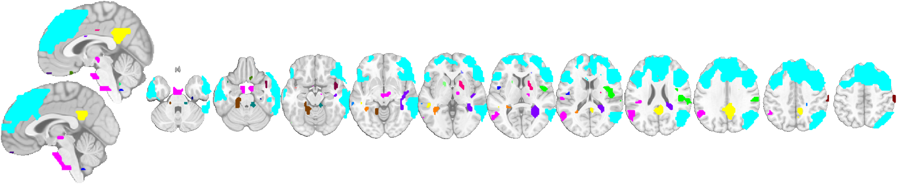
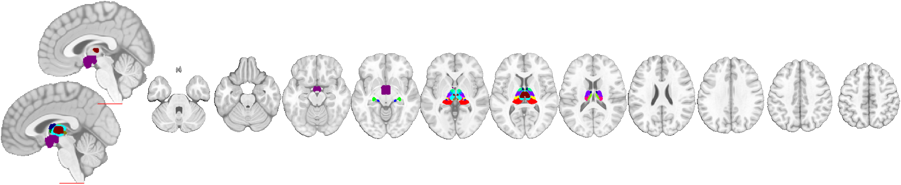

# 6. Atlases and regions

[← 5. The controller](05_controller.md) · [Back to index](index.md)

Atlases and region objects are collections of discrete parcels, so they use **indexed** coloring — every region gets its own color from a color table — rather than a value ramp. CANlab renders that indexed coloring identically on slices, surfaces, and 3‑D isosurfaces.

```matlab
obj = load_image_set('emotionreg', 'noverbose');
t   = threshold(ttest(obj), .05, 'unc');
```

---

## 6.1 Regions in unique colors

Convert a thresholded map to a `region` object and montage it — each contiguous blob gets a distinct color:

```matlab
r = region(t);
montage(r, 'compact2', 'noverbose');   % one color per region
```



Region coloring options: `'color', [r g b]` (all one color), `'colors', {…}` (a cell array, one color per region), or `'indexmap', cmap` (values index a color table — best for parcellations, since it avoids color bleed between adjacent regions). Add `'symmetric'` to mirror left/right homologues in matching colors.

---

## 6.2 Atlases on slices

An `atlas` object displays its parcels in unique colors with a single call. Here a thalamic atlas shows each nucleus in a distinct color:

```matlab
atl = load_atlas('thalamus');
montage(atl, 'compact2', 'noverbose');
```



`atlas/montage` converts the atlas to regions and assigns `scn_standard_colors` by default, matching left/right homologues. Subset first with `select_atlas_subset(atl, {'PAG'})` or a laterality filter to focus on specific structures.

---

## 6.3 Atlases on cortical surfaces

The same indexed coloring renders on surfaces. Build cortical surfaces and paint the atlas onto them with `render_on_surface`, using `'indexmap'` (each value is a color-table row) and nearest-neighbor sampling so region boundaries stay crisp:

```matlab
ctx  = select_atlas_subset(load_atlas('canlab2018_2mm'), {'Ctx'});   % 360 cortical parcels
cmap = cat(1, scn_standard_colors(num_regions(ctx)){:});
sh   = addbrain('foursurfaces');
render_on_surface(ctx, sh, 'colormap', cmap, 'indexmap', 'interp', 'nearest');
```


The value→color mapping here is the same one montages use, so a parcel is the same color on a slice and on the surface.

---

## 6.4 Atlases as 3‑D isosurfaces (subcortical close-ups)

`isosurface` turns each atlas parcel into a 3‑D mesh, giving a close-up of subcortical anatomy in unique colors:

```matlab
atl = load_atlas('thalamus');
create_figure('iso'); axis off
isosurface(atl);
axis image vis3d off;  material dull;  view(210, 20);  lightRestoreSingle;  camzoom(1.4)
```


This is the natural way to show deep-brain parcellations (thalamic nuclei, brainstem, basal ganglia) that don't sit on the cortical sheet. You can also render a statistic map onto these nuclei with `render_on_surface` (see [3. Surfaces](03_surfaces.md#34-subcortical-close-ups-with-addbrain)).

---

## 6.5 Labeling regions from an atlas

To annotate your own results with anatomical names, label a region object against an atlas — the names then appear in `regioncenters` montages and in `region.table()`:

```matlab
r = region(t);
r = autolabel_regions_using_atlas(r);        % default: canlab2018_2mm
montage(r, 'regioncenters', 'colormap', 'noverbose');
r.table();                                    % printed table with labels
```

---

[← 5. The controller](05_controller.md) · [Back to index](index.md)

*This walkthrough is part of the CanlabCore documentation. See also [`fmridisplay_methods.md`](../fmridisplay_methods.md) and the frozen tutorial snapshots under `CanlabCore/Unit_tests/walkthroughs/private/`.*
