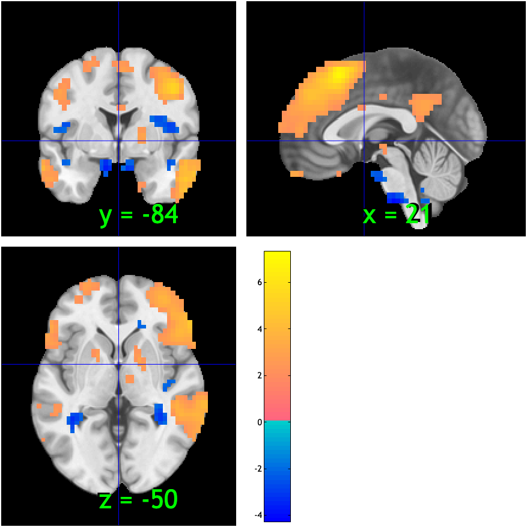
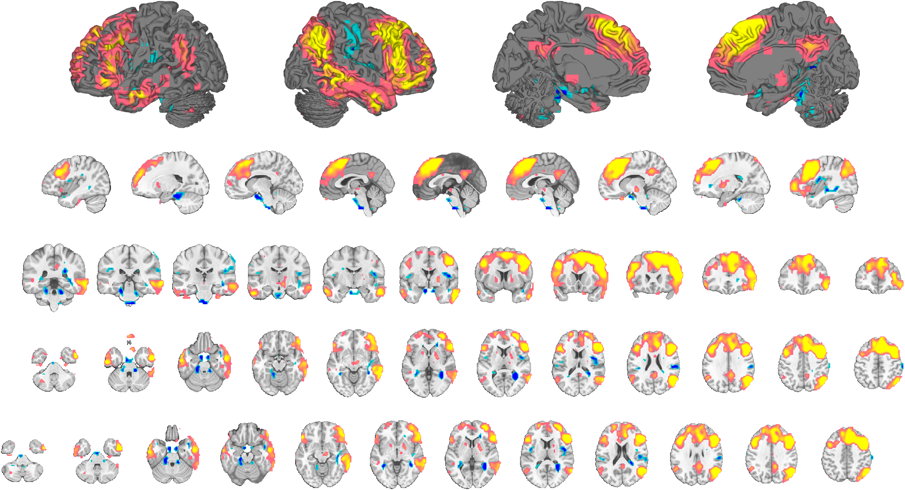
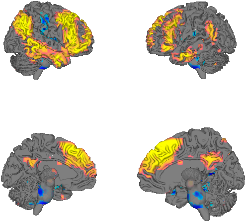
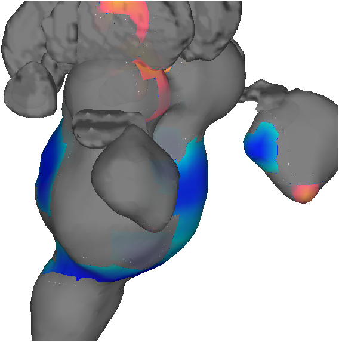
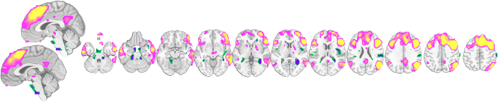
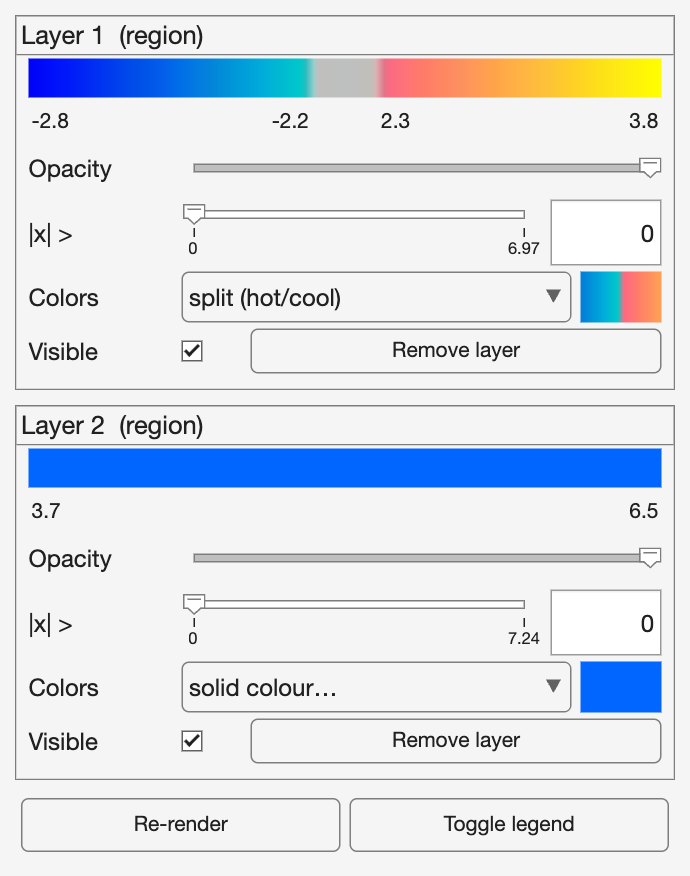
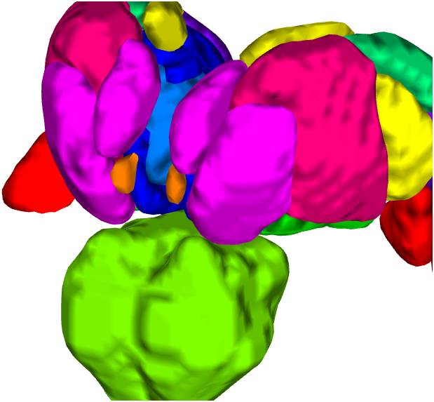
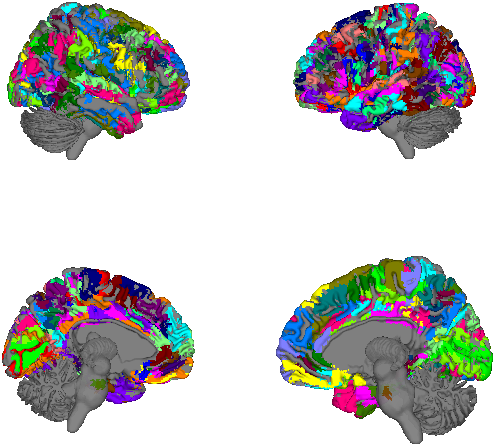

# CANlab Visualization Walkthrough

A hands-on guide to visualizing brain data and results with the CanlabCore MATLAB tools — montages, 3‑D surfaces, the interactive display controller, colormaps, and atlases. Every section pairs runnable code with the figure it produces, and shows both the **command-line** commands and the equivalent **controller** (GUI) actions.

All examples use the bundled `emotionreg` sample dataset, so they run anywhere CanlabCore is installed:

```matlab
obj = load_image_set('emotionreg', 'noverbose');
t   = threshold(ttest(obj), .05, 'unc');
```

---

## Contents

### [1. Getting started](01_getting_started.md)
The object classes you'll display (`fmri_data`, `statistic_image`, `region`, `atlas`, `fmridisplay`), loading data, quick QC with `plot`, and a first interactive look with `orthviews`.



### [2. Montages and slices](02_montages.md)
Publication slice arrays with `canlab_results_fmridisplay` (`compact2`, `full`, …), a close-up of every blob in its own axis (`regioncenters`), and blob customization — color, outline, transparency, overlaying maps.



### [3. Surfaces and 3‑D rendering](03_surfaces.md)
Cortical surfaces (`foursurfaces`), recoloring with `render_on_surface`, cutaways and coronal slabs, subcortical close-ups built with `addbrain`, and 3‑D isosurfaces from atlases and images.

 

### [4. Colors and colormaps](04_colormaps.md)
The shared value→color pipeline: one colormap drives montages, surfaces, and the legend identically. Split / single / solid / continuous / indexed modes, and color limits (`cmaprange`) for comparable maps.



### [5. The display controller](05_controller.md)
The interactive panel bound to an `fmridisplay` object — opacity, threshold, colormap, visibility, per layer — acting on montages and surfaces together, with a one-line command-line equivalent for every control.



### [6. Atlases and regions](06_atlases_and_regions.md)
Parcellations in unique colors — regions and atlases on slices, on cortical surfaces, and as 3‑D subcortical isosurfaces — plus labeling your own results from an atlas.

 

---

## Two ways to work

Everything here can be done two ways, interchangeably:

- **From the command line** — scriptable, reproducible, good for papers and pipelines.
- **From the display controller** — an interactive panel for exploring thresholds, colors, and opacity, that echoes the equivalent code to the command window as you click.

Because `fmridisplay` is a handle class whose layers remember their source and options, both routes update every montage and surface of an object in place. Section 5 shows the correspondence in detail.

## Reproducing the figures

Every figure in this walkthrough is produced by a single master script, [`_gen/visualization_walkthrough.m`](_gen/visualization_walkthrough.m) — one section per page (1.1, 1.2, … 6.5). Run it in MATLAB with CanlabCore (and, for the atlas sections, `Neuroimaging_Pattern_Masks`) on the path to regenerate every PNG in [`figures/`](figures/), or copy any section as a starting point. The per-page generators (`gen_02_montages.m`, `gen_03_surfaces.m`, …) remain in [`_gen/`](_gen/) for regenerating one page at a time. All of them write via the helper `wt_save.m`.

## See also

- Method reference: [`../fmridisplay_methods.md`](../fmridisplay_methods.md), [`../individual_functions/`](../individual_functions/)
- Frozen tutorial snapshots: `CanlabCore/Unit_tests/walkthroughs/private/canlab_help_2b_basic_image_visualization.m`, `…_4b_3D_visualization.m`
- Online docs and tutorials: <https://canlab.github.io>
