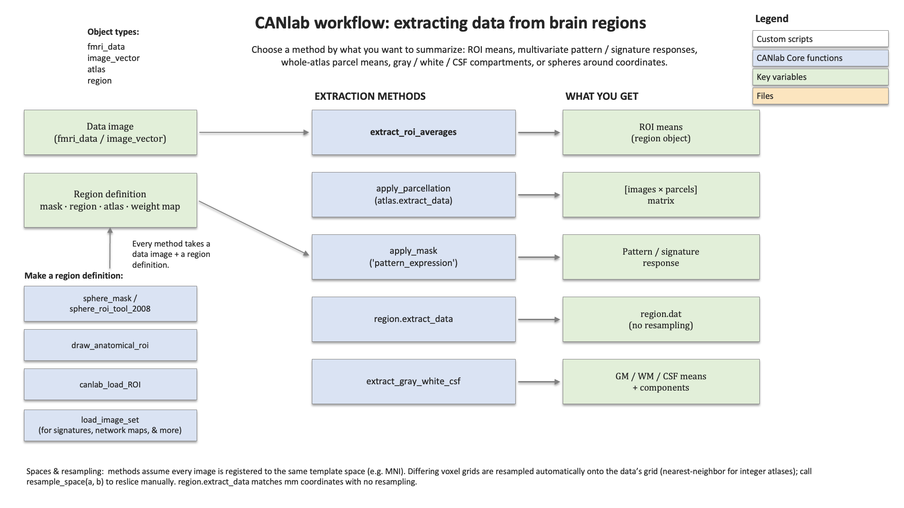

# Extracting and summarizing data from brain regions — a roadmap

CanlabCore gives you several ways to pull numbers out of brain images: the average activity in a region of interest (ROI), the response of a multivariate "signature" pattern, the signal in gray/white/CSF tissue compartments, or the data in a sphere around a coordinate. This page is a conceptual map of those options — what each one does, what it operates on, and how to choose between them. It is the overview half of the **ROI / atlas data-extraction workflow**; for runnable, copy-pasteable code (with figures) on built-in datasets, follow the companion **[how-to walkthrough](extract_roi_data_howto.md)**.



---

## 1. The big picture: two ingredients, several kinds of summary

Every extraction combines **a data image** with **a region definition**, and returns **a summary** (usually one number per image per region).

**Data images** are CANlab image objects — most often an `fmri_data` object holding `[voxels × images]` (e.g. one contrast image per subject, or one volume per timepoint). `statistic_image` (thresholded maps) and other `image_vector` subclasses work the same way.

**Region definitions** come in a few flavors:

- a **mask** — a binary image (a file, or an image object) marking which voxels belong to one region;
- a **`region` object** — CANlab's container for one or more labeled clusters (e.g. the blobs from a thresholded result);
- an **`atlas` object** — a labeled parcellation with many integer-coded regions and names (loaded by keyword with `load_atlas`);
- a **weight map** — a continuous image of voxel weights (a multivariate *pattern* or *signature*), used for weighted summaries rather than a plain average.

Given those ingredients, the kinds of summary you can extract are:

- **ROI averages** — the mean value across the voxels in one or more regions. The everyday "what's the activity in the amygdala?" measure.
- **Pattern / signature responses** — instead of a plain average, apply a *weight map*: a dot-product, cosine similarity, or correlation between each image and a continuous pattern. This covers both "average over a mask or network" and "express a published multivariate signature" (e.g. a pain or emotion signature). The masking-and-weighting primitive is `apply_mask`; whole-atlas weighted summaries come from `apply_parcellation`.
- **Tissue-compartment summaries** — the mean signal in **gray matter, white matter, and CSF**, via `extract_gray_white_csf`. Widely used for quality control and as nuisance regressors.
- **Components** — rather than a single mean, summarize a compartment or region by its top **principal components** (e.g. the white-matter / CSF components used for aCompCor-style denoising). `extract_gray_white_csf` returns these alongside the means.
- **Spheres around coordinates** — build a spherical ROI of a chosen radius at an `[x y z]` MNI coordinate (`sphere_mask`, `sphere_roi_tool_2008`) and extract from it — handy for reproducing a peak reported in a paper.
- **Hand-drawn ROIs** — draw a region interactively on the anatomy (`draw_anatomical_roi`) and save it as a mask to extract from.

---

## 2. The methods

### (a) Primary, recommended methods

These are the current object-oriented methods. Prefer them for new code.

**`extract_roi_averages`** — *the default ROI extractor.*
Give it a data object and a region definition; get back a `region` object whose `.dat` is one mean per image for each region.
*Operates on:* an `fmri_data`/`image_vector` data object **+** a mask (filename or image object), `region`, or `atlas`.
By default (`'unique_mask_values'`) it averages each integer-labeled region of an atlas; `'contiguous_regions'` averages each separate blob instead. With `'pattern_expression'` (fmri_data only) it returns a weighted response — dot product, `'cosine_similarity'`, or `'correlation'` — instead of a plain mean.

**`apply_parcellation`** — *all parcels of an atlas at once.*
Returns an `[images × parcels]` matrix of (optionally weighted) means — the fast path when you want every region of an atlas summarized in one call.
*Operates on:* an `fmri_data`/`image_vector` data object **+** an `atlas` (preferred) or an integer-coded parcellation image. A continuous weight map can be supplied for per-parcel pattern responses.

**`extract_data`** (`atlas` method) — *atlas-first parcel extraction.*
A thin wrapper over `apply_parcellation` for when the atlas is your primary object; same `[images × parcels]` output.
*Operates on:* an `atlas` object **+** an `fmri_data` data object.

**`extract_data`** (`region` method) — *attach data to existing regions, no interpolation.*
When you already have `region` objects (e.g. from a thresholded map), this fills in their `.dat`/`.all_data` by matching millimeter coordinates directly — no resampling, so it avoids interpolation artifacts.
*Operates on:* a `region` object array **+** an `fmri_data`/`image_vector` data object.

**`apply_mask`** — *the masking-and-weighting primitive.*
Restricts a data object to a single mask, **or** computes a whole-image pattern response (dot product / cosine / correlation) when given a continuous weight map. This is the building block much of the above is made from, and the entry point for applying a multivariate signature.
*Operates on:* an `fmri_data`/`image_vector` data object **+** a mask, weight map, or `statistic_image`.

**`extract_gray_white_csf`** — *tissue compartments (and components).*
Returns the mean signal in gray, white, and CSF using canonical tissue masks, plus optional principal components and norms per compartment.
*Operates on:* an `fmri_data`/`image_vector` data object (uses built-in canonical tissue masks).

### (b) Other current tools

Useful for specific jobs; not the everyday ROI-mean path.

| Tool | What it does | Operates on |
|---|---|---|
| `canlab_load_ROI` | Load a named, published ROI as a `region`/`atlas` object, ready to extract from | a region name (string) → returns `region`/`atlas` |
| `sphere_roi_tool_2008` / `sphere_mask` | Build a spherical ROI of a given radius around an `[x y z]` coordinate | MNI coordinate(s) + radius (+ image files / `fmri_data`) |
| `draw_anatomical_roi` | Interactively draw an ROI on the anatomy and save it as a mask | mouse drawing on a displayed image → mask image |
| `canlab_extract_ventricle_wm_timeseries` | aCompCor-style ventricle + white-matter nuisance timeseries and components | image files / `fmri_data` timeseries + tissue masks |
| `canlab_maskstats` | Summary stats (mean / dot-product / cosine / correlation) of weight masks vs. image sets, used inside the GLM batch pipeline | mask image(s) + a set of image files / `fmri_data` |
| `timeseries_extract_slice` | Pull one slice across all volumes of a 4-D series | SPM volume handles (`spm_vol`) of `.nii`/`.img` files |

### (c) Legacy

A pre-object-oriented family (`tor_extract_rois`, `extract_image_data`, `extract_from_rois`, `extract_raw_data`, `extract_indiv_peak_data`, `extract_contrast_data`) operates on raw image files and the old `clusters` struct. These still work but are superseded by the object methods above; new code should not call them. (See the maintainers' **[streamlining plan](../ROI_extraction_streamlining_plan.md)** for their disposition.)

---

## 3. Which method should I use?

| Your goal | Reach for |
|---|---|
| Mean of one or a few ROIs, per image | `extract_roi_averages` |
| Every parcel of an atlas, in one matrix | `apply_parcellation` (or `atlas.extract_data`) |
| A multivariate signature / weight-map response | `apply_mask` with `'pattern_expression'`, or `extract_roi_averages` / `apply_parcellation` with a weight map |
| Data for `region` objects you already have, without interpolation | `region.extract_data` |
| Gray / white / CSF means or nuisance components | `extract_gray_white_csf` |
| A sphere around a published coordinate | `sphere_mask` / `sphere_roi_tool_2008`, then `extract_roi_averages` |
| A hand-drawn ROI | `draw_anatomical_roi`, then `extract_roi_averages` |
| A named, published ROI | `canlab_load_ROI`, then `extract_roi_averages` |

---

## 4. Spaces and resampling (important)

Brain images only line up if they are in the **same underlying space**. CanlabCore methods assume your data, masks, atlases, and parcellations are all **registered to the same template space** (typically MNI) — i.e. that voxel `[x y z]` in one image corresponds to the same anatomy in another. They do **not** perform registration; that is your responsibility during preprocessing.

What they *do* handle automatically is **resampling to a common voxel grid**. Two images can share MNI space but differ in voxel size or matrix dimensions (say 2 mm vs. 3 mm voxels). When you call an extraction method, it transparently **resamples the mask/atlas/parcels onto the data's grid** (using nearest-neighbor interpolation for integer-labeled atlases, so labels are not corrupted) before intersecting voxels. You normally don't have to think about it — the ROI means come out essentially identical whichever grid is used, up to small interpolation differences.

The one method that deliberately does *no* resampling is `region.extract_data`: it matches millimeter coordinates directly, which avoids interpolation entirely (at the cost of requiring an exact voxel match).

If you want to control reslicing yourself — for example to put many images on a common grid once, up front — use the **`resample_space`** method:

```matlab
mask     = resample_space(mask, data_obj);    % put the mask on the data's grid
data_obj = resample_space(data_obj, atlas_obj); % or bring data onto an atlas grid
```

Resampling changes only the voxel grid, never the registration: it cannot fix images that are in different template spaces.

---

## 5. For maintainers

This page is the user-facing overview. The internal call-graph, redundancy analysis, and a phased plan to consolidate these methods onto a single core live in the **[ROI extraction streamlining plan](../ROI_extraction_streamlining_plan.md)**.
