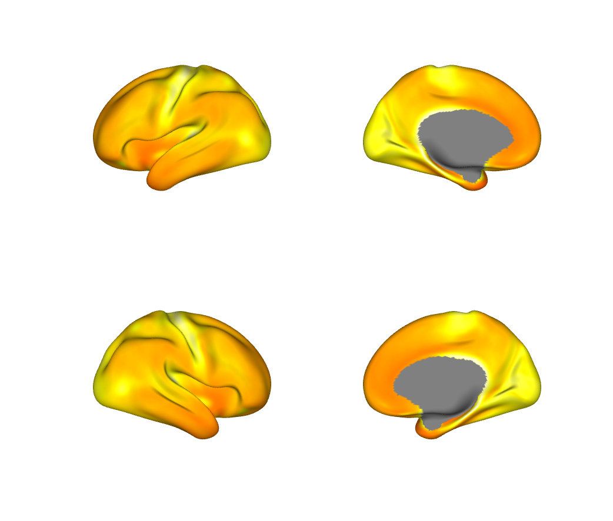
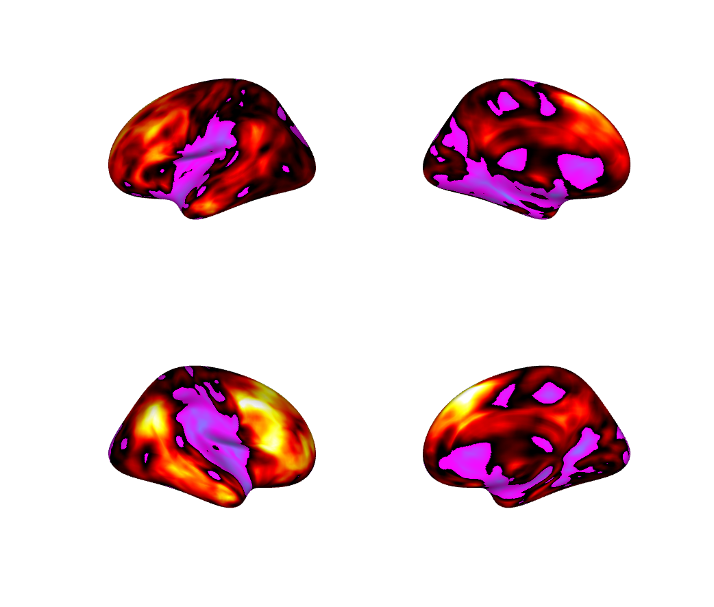
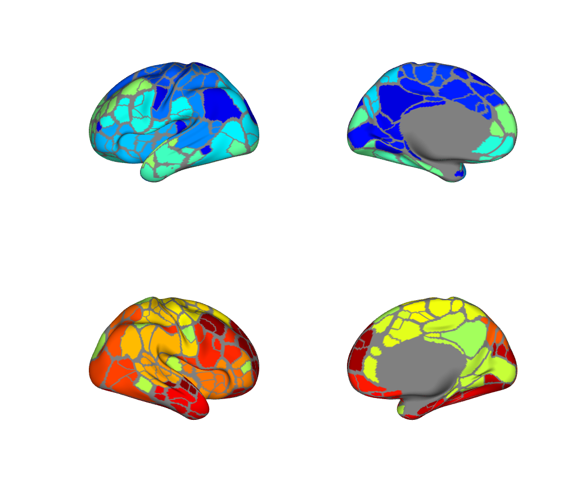

# Surface & grayordinate data with `fmri_surface_data` — how-to

This walkthrough introduces **`fmri_surface_data`**, the CANlab object for
cortical-surface and grayordinate (HCP CIFTI) data. It is the surface analogue
of `fmri_data`: data live in a flat `[grayordinates × maps]` `.dat` matrix, and
the familiar method names (`surface`, `threshold`, `mean`, `apply_parcellation`,
`write`, …) work on surface data.

By the end you will be able to:

- load CIFTI/GIFTI surface data and **visualize it on the cortical surface**,
- **map a volumetric `fmri_data` result onto the surface** with object methods,
- **bring surface data back to a volumetric `fmri_data`** (and write NIfTI),
- and use the core `fmri_surface_data` methods.

Everything runs natively in MATLAB — no gifti toolbox, FieldTrip, Connectome
Workbench, or FreeSurfer is required.

**See also:** the full method reference,
[`fmri_surface_data_methods.md`](../fmri_surface_data_methods.md); the runnable
script `CanlabCore/docs/fmri_surface_data_walkthrough.m`.

## Quick reference

```matlab
s   = fmri_surface_data(which('S1200.MyelinMap_MSMAll.32k_fs_LR.dscalar.nii'));  % load CIFTI
surface(s);                                    % render on the native fs_LR surface
r   = reconstruct_image(s);                    % dense vertex arrays + subcortex volume
vol = to_fmri_data(s);                          % subcortex -> fmri_data (writeable .nii)
ssurf = vol2surf(ttest(load_image_set('emotionreg')));   % volume result -> surface
back  = surf2vol(ssurf);                        % surface -> MNI volume (fmri_data)
write(s, 'out.dscalar.nii');                    % write CIFTI natively
```

## Setup

You need CanlabCore on your path (`canlab_toolbox_setup`), which puts
`@fmri_surface_data/`, `Surface_tools/`, and the sample data under
`CanlabCore/Sample_datasets/CIFTI_surface_examples/` on the path. The
volume→surface example also uses the built-in `emotionreg` dataset.

CanlabCore ships one small continuous CIFTI example (see that folder's `README.md`):

- `S1200.MyelinMap_MSMAll.32k_fs_LR.dscalar.nii` — HCP group cortical myelin map
  (continuous; 59,412 fs_LR-32k cortical grayordinates).

**Surface atlases and other CIFTI maps** used below (e.g. the Gordon+Tian
parcellation, the transcriptomic gradients) come from the companion
**`Neuroimaging_Pattern_Masks`** repository — a standard CANlab dependency that
`canlab_toolbox_setup` adds to the path. See the inventory table in
[`fmri_surface_data_methods.md`](../fmri_surface_data_methods.md#surface-data-in-neuroimaging_pattern_masks).
The atlas examples below are wrapped in `if ~isempty(which(...))` so the
walkthrough still runs if NPM is not installed.

## Section A — Load surface data and visualize it

The constructor auto-detects CIFTI (`.dscalar/.dtseries/.dlabel.nii`) and GIFTI
(`.surf/.func/.shape/.label.gii`) by extension and reads them natively.

```matlab
s = fmri_surface_data(which('S1200.MyelinMap_MSMAll.32k_fs_LR.dscalar.nii'));

s.intent            % 'dscalar'
s.surface_space     % 'fsLR_32k'
size(s.dat)         % [59412 1]  (grayordinates x maps)
```

`surface` loads the bundled mesh that matches the object's `surface_space` and
colors the vertices directly — no resampling. The default is a 4-panel figure
(left/right × lateral/medial); the medial wall renders gray.

```matlab
surface(s, 'pos_colormap', hot(256));
```



You can pick a different map (`'which_image'`), color range (`'clim'`), colormap,
or surface (`'surftype'`, e.g. `'midthickness'`). The object also renders on any
existing surface — see Section D.

## Section B — The grayordinate model

`brain_model` mirrors the CIFTI BrainModels: one entry per cortical hemisphere
(surface vertices) and per subcortical structure (voxels). It plays the role that
`volInfo` plays for `fmri_data`.

```matlab
% Gordon+Tian atlas ships with Neuroimaging_Pattern_Masks (a CANlab dependency):
atl = fmri_surface_data(which('Gordon333.32k_fs_LR_Tian_Subcortex_S2.dlabel.nii'));

atl.brain_model.grayordinate_type      % '91k'
numel(atl.brain_model.models)          % 21  (2 cortex + 19 subcortical)
cellfun(@(m) m.struct, atl.brain_model.models, 'UniformOutput', false)'
```

`reconstruct_image` unpacks the flat `.dat` into its natural spatial forms — dense
per-hemisphere vertex arrays (medial wall = `NaN`) and a subcortical volume:

```matlab
r = reconstruct_image(atl);
size(r.cortex_left)     % [32492 x 1] dense vertices
size(r.volume)          % [X Y Z x 1] subcortical volume
```

## Section C — Volume → surface (and back)

Project any volumetric `fmri_data` / `statistic_image` (in MNI152) onto the
cortical surface with `vol2surf`. It samples the vendored CBIG registration-fusion
MNI↔fsaverage mapping — fully native. Here we project a group t-map:

```matlab
img   = load_image_set('emotionreg');      % 30 contrast images (fmri_data)
t     = ttest(img);                        % volumetric statistic_image
ssurf = vol2surf(t);                       % -> fmri_surface_data (fsaverage_164k)
surface(ssurf, 'clim', [-6 6]);
```



`surf2vol` is the self-consistent inverse — surface data back to an MNI `fmri_data`
volume, which you can montage, threshold, or write to NIfTI:

```matlab
backvol = surf2vol(ssurf);                 % -> fmri_data in MNI 2 mm
% backvol.fullpath = fullfile(pwd,'surf_back.nii'); write(backvol);
```

For the **subcortical (volumetric) grayordinates** of a native CIFTI object, use
`to_fmri_data`, which returns them directly as an `fmri_data` in MNI space:

```matlab
subctx = to_fmri_data(atl);                % 31,870 subcortical voxels as fmri_data
% subctx.fullpath = fullfile(pwd,'subctx.nii'); write(subctx);
```

## Section D — Render on any existing surface

Because `addbrain('hcp inflated')` is the fs_LR-32k template and
`addbrain('inflated')` is fsaverage, an object's data can be painted directly onto
those meshes. For a *different* surface (e.g. an MNI pial surface), the data is
projected through a volume automatically:

```matlab
% Native mesh you already created (direct, no resampling):
h = addbrain('hcp inflated left');
surface(s, 'existingsurface', h);

% An addbrain MNI surface (auto volume projection):
surface(ssurf, 'mni_surface', 'left');
```

## Section E — Parcellation, thresholding, and clusters

A surface atlas is simply a `.dlabel` `fmri_surface_data`. `apply_parcellation`
averages each map within its parcels (background / medial wall excluded). The data
and the atlas must be on the **same grayordinate space** (`compare_space == 0`).
Here we load the Gordon+Tian atlas (from `Neuroimaging_Pattern_Masks`) and
parcellate a continuous map built on its own grayordinate set:

```matlab
atl = fmri_surface_data(which('Gordon333.32k_fs_LR_Tian_Subcortex_S2.dlabel.nii'));

mydata = atl;                                 % same grayordinate space as the atlas
mydata.dat = single(sqrt(double(atl.dat)));   % any continuous map on those grayordinates
mydata.intent = 'dscalar';

[parcel_means, labels] = apply_parcellation(mydata, atl);   % [nMaps x nParcels]
```

Threshold (raw value, with optional cluster extent), then summarize contiguous
clusters as region-like structs. `ssurf` is the surface t-map from Section C:

```matlab
tthr = threshold(ssurf, 3, 'positive', 'k', 20);   % t > 3, clusters >= 20 grayordinates
reg  = surface_region(tthr);
[reg.numVox]                                        % cluster sizes
```



## Section F — Group analysis and writing

Concatenate per-map/per-subject objects, run analyses, and write results. Here we
build a small "group" by projecting individual `emotionreg` contrast images to the
surface (`img` is the `fmri_data` loaded in Section C):

```matlab
subj = cell(1, 5);
for i = 1:5
    subj{i} = vol2surf(get_wh_image(img, i));   % each subject's contrast on the surface
end
group = cat(subj{:});                            % one object, 5 maps (or [subj{:}])

tmap = ttest(group);                             % grayordinate-wise one-sample t-test

group.X = [ones(5,1), (1:5)'];                   % set the design BEFORE regress
b = regress(group);                              % OLS; betas in b.dat, t/p in additional_info

group.Y = (1:5)';                                % set the outcome BEFORE predict
[cverr, stats] = predict(group, 'algorithm_name', 'cv_lassopcr', 'nfolds', 5);

write(tmap,  'group_t.dscalar.nii');             % native CIFTI
write(ssurf, 'emo_surface.func.gii');            % native GIFTI
```

## Notes

- **Spaces.** Native CIFTI is `fsLR_32k`; `vol2surf` produces `fsaverage_164k`.
  These have different mesh topologies and cannot be combined without resampling
  (an fsaverage↔fs_LR deformation is a planned enhancement).
- **Group-template mapping.** `vol2surf`/`surf2vol` use a fixed group
  MNI152↔fsaverage correspondence (correct for group MNI maps; not a per-subject
  ribbon mapper).
- **No external toolbox** is required at runtime (sole exception: `ica`, which
  needs the GIFT/`icatb` toolbox like the base `image_vector` method).

## See also

- [`fmri_surface_data_methods.md`](../fmri_surface_data_methods.md) — full method / option reference
- [`Object_methods.md`](../Object_methods.md) — all CanlabCore object classes
- `CanlabCore/docs/fmri_surface_data_walkthrough.m` — the runnable script version
- `CanlabCore/docs/fmri_surface_data_design_plan.md` — design rationale and roadmap
