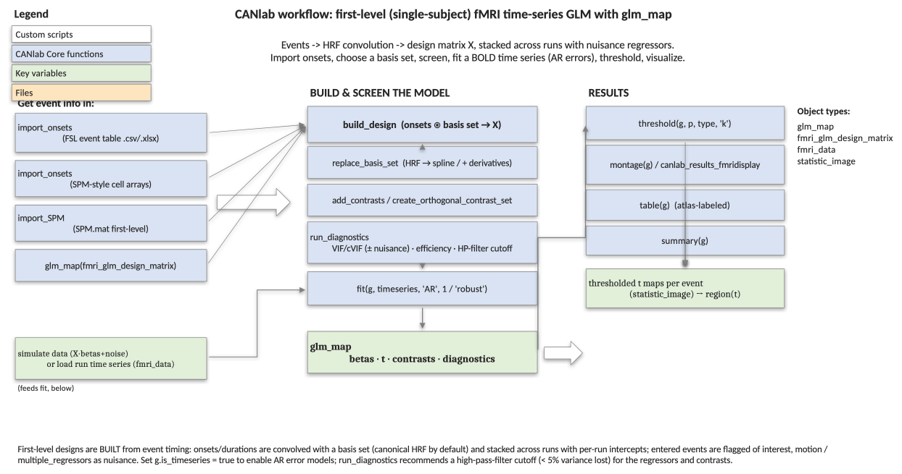
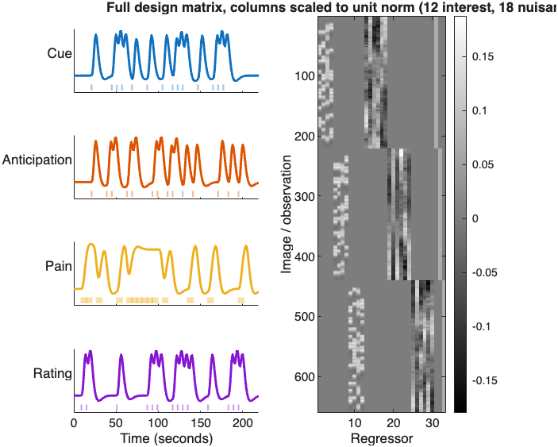
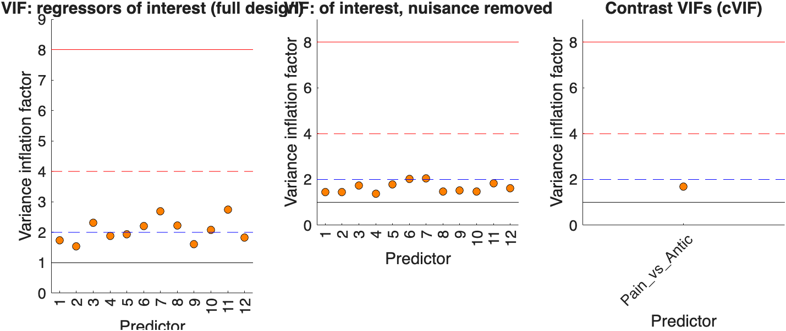
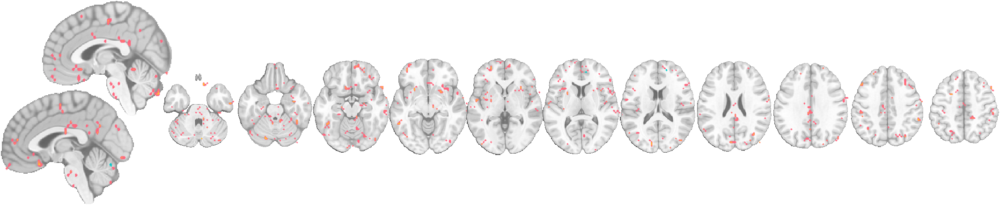

# First-level fMRI time-series modeling with `glm_map` — a roadmap

A **first-level** (single-subject, within-run) analysis models a BOLD **time
series**: you specify *when* events happen (onsets, durations), convolve them
with a hemodynamic response to predict the BOLD signal, add nuisance
regressors, and estimate one response amplitude per event type per run. The
[`glm_map`](../glm_map_methods.md) object can **store and build** these models
from event information and fit them, with autoregressive error models
appropriate for serially correlated time series.

This page is the conceptual map of the first-level workflow. For runnable,
copy-pasteable code (with figures) using a synthetic multi-run design, follow
the companion [**how-to walkthrough**](glm_map_first_level_howto.md). For
group-level analysis of contrast images, see the
[**second-level roadmap**](glm_map_second_level_roadmap.md).



---

## 1. The big picture

The design matrix `X` is *built*, not supplied: each event type becomes a
column by placing impulses (or boxcars, for events with duration) at the
onsets and **convolving with a basis set** (by default the canonical
hemodynamic response). Multiple runs (sessions) are stacked with per-run
intercepts; nuisance regressors (motion, drift, physio) are added as
covariates. The result is a `glm_map` whose `X` you can screen, then fit to a
BOLD time series.

The example design below has four event types (`Cue`, `Anticipation`, `Pain`,
`Rating`) across three runs, with six motion-like nuisance regressors per run.
`plot_design` shows the basis-convolved regressors per event type and the full,
block-structured design matrix:



---

## 2. Getting event information in — three import routes

| Source | Method | Notes |
|---|---|---|
| **FSL-style event table** (onset / duration / name or integer event-code columns, in a `.csv`/`.xlsx`/table) | `import_onsets(g, 'events.csv', 'TR', tr, 'nscan', n)` | events become the regressors **of interest** automatically |
| **SPM-style cell arrays** (onsets, durations, parametric modulators — one cell per condition) | `import_onsets(g, onsets, durations, pmods, 'names', {...})` | the classic SPM multiple-conditions layout |
| **A complete SPM first-level model** | `import_SPM(g, 'SPM.mat')` | copies the built design; derives event-of-interest vs nuisance from SPM's naming |

You can also wrap an `fmri_glm_design_matrix` directly
(`g = glm_map(d); g = build_design(g)`).

Whichever route, the events you enter are flagged **of interest** and other
regressors (motion / `multiple_regressors`) are flagged **nuisance** — so
diagnostics and contrasts focus on the events.

---

## 3. Choosing a basis set

The basis set defines the assumed response shape:

- **Canonical HRF** (default) — one regressor per event type; the standard
  choice.
- **HRF + temporal/dispersion derivatives** or a **spline / FIR basis** —
  several regressors per event type, capturing latency/shape variability. Swap
  it in per condition with `replace_basis_set(g, cond, xBF)` (the design is
  rebuilt; one line per basis function appears in each event's `plot_design`
  panel).

Mark `g.is_timeseries = true` so that `fit` can use AR error models. This
flag also switches `run_diagnostics` into time-series mode, adding the
high-pass-filter cumulative-power assessment described below (which is skipped
for static second-level designs).

---

## 4. Contrasts and diagnostics

Add linear contrasts over the regressors (`add_contrasts`), or an orthogonal
set spanning the events of interest (`create_orthogonal_contrast_set`). Then
**screen the design** with `run_diagnostics(g)`, which for a time-series design
reports:

- **VIF / cVIF** for the regressors of interest, **with and without** the
  nuisance covariates (does motion inflate your event estimates?), and for the
  contrasts;
- design **efficiency** for the contrasts;
- the **temporal frequency content** of each regressor/contrast and a
  recommended **high-pass-filter cutoff** that removes < 5 % of the signal
  variance.

`plot_design(g)` draws the VIFs with severity reference lines:



---

## 5. Simulating data (for the demo) and fitting

To exercise the pipeline without real scans, build a synthetic BOLD data set —
`X · betas + noise` over a template brain space.
[`fmri_data.sim_data`](../fmri_data_methods.md) does exactly this in one line:
pass the convolved design `g.X` and a `[regressors × voxels]` coefficient map,
borrowing any object for the brain space:

```matlab
template = load_image_set('emotionreg', 'noverbose');     % borrow a brain space
sim = sim_data(template, 'design', g.X, 'betas', betas_true);   % X·betas + noise
```

On real data you load the run's time series as an `fmri_data` object instead.

| Estimator | Call | When |
|---|---|---|
| **OLS** | `fit(g, data)` | fast baseline |
| **AR(p)** | `fit(g, data, 'AR', 4)` | recommended for time series — AR(4) captures BOLD serial autocorrelation better than AR(1) |
| **Robust** | `fit(g, data, 'robust')` | down-weights outlier time points |

> **AR dependencies.** AR(p) fitting needs the **Econometrics Toolbox**
> (`fgls`, the GLS fit) and the **Signal Processing Toolbox** (`aryule`, the
> AR coefficients). `fit` checks for both up front and errors with a clear
> message if either is missing — fall back to OLS or `'robust'` in that case.

`fit` populates `betas`, `t`, `df`, `sigma`, and the diagnostics.

---

## 6. Results — threshold and visualize

The fit produces `statistic_image` maps, one per regressor (and contrast).
Re-threshold without refitting (`threshold(g, .001, 'unc', 'k', 5)`), select a
map with `get_wh_image`, and render it:



---

## 7. At a glance

```
event info ── import_onsets (FSL table / SPM cells)   ─┐
            ── import_SPM (SPM.mat)                     │
            ── glm_map(fmri_glm_design_matrix)          │
                                                        ▼
   build_design   (onsets ⊛ basis set → X; + nuisance + run intercepts)
        │   replace_basis_set (HRF → spline / derivatives, optional)
        ▼
   add_contrasts / create_orthogonal_contrast_set
        │
   run_diagnostics   (VIF/cVIF interest±nuisance, efficiency, HP-filter cutoff)
        │
   fit(g, timeseries[, 'AR',4 / 'robust'])     ← simulate data, or load a run
        │
   threshold(g) → montage(g) / table(g) / summary(g)
```

## See also

- [`glm_map` methods](../glm_map_methods.md)
- [`fmri_glm_design_matrix`](../fmri_glm_design_matrix_methods.md) — the wrapped design object (`build`, `replace_basis_set`)
- [Second-level (group) roadmap](glm_map_second_level_roadmap.md)
