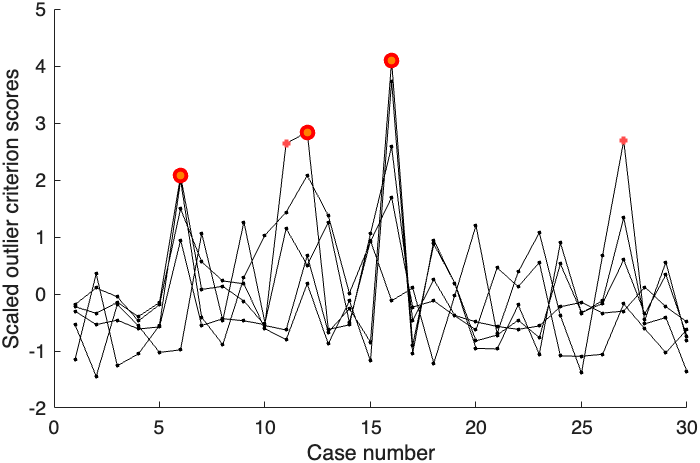
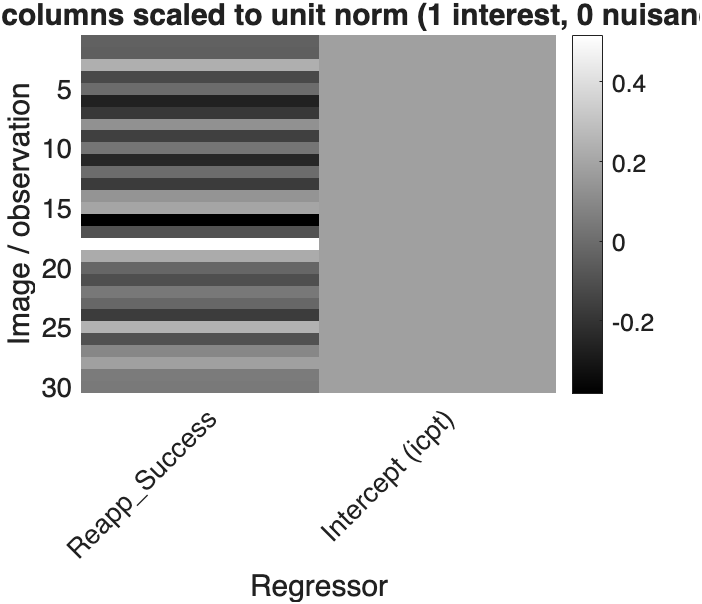
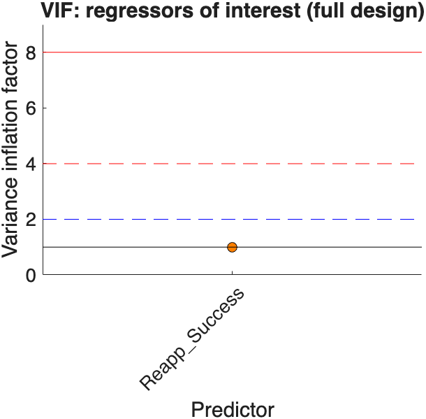
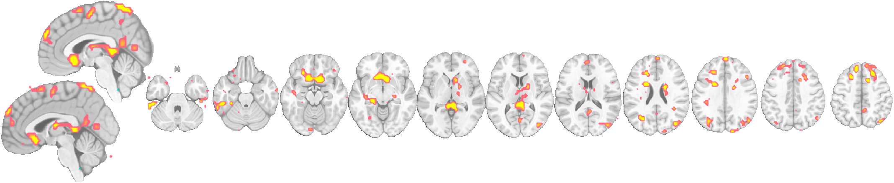
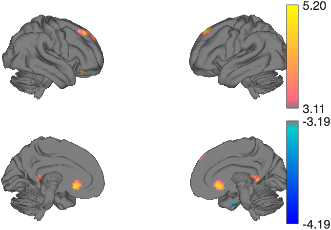

# Second-level fMRI group analysis with `glm_map` — how-to

A practical, copy-pasteable guide to running a **group (second-level)**
regression on contrast images with the [`glm_map`](../glm_map_methods.md)
object: building the design two ways, handling outliers and nuisance signals,
OLS vs robust fitting, design diagnostics, and visualizing results. This is the
**code walkthrough**; for the conceptual overview of *which* option to use and
why, see the [**second-level roadmap**](glm_map_second_level_roadmap.md).

All code runs on the built-in `emotionreg` dataset (30 single-subject contrast
images from Wager et al. 2008, with a `Reappraisal_Success` behavioral score).

## Quick reference

| Goal | Call |
|---|---|
| Quick fit (object from `regress`) | `g = regress(dat, .01, 'unc')` after setting `dat.X` |
| Estimator API | `g = glm_map('X', X, 'level', 2)` → `add_contrasts` → `run_diagnostics` → `fit(g, dat)` |
| Flag outlier images | `[~, wh] = outliers(dat, 'notimeseries')` |
| WM/CSF nuisance signals | `gwcsf = extract_gray_white_csf(dat)` |
| Normalize gray matter by WM/CSF | `dat = normalize_gm_by_wm_csf(dat)` |
| Robust regression | add `'robust'` to `regress` / `fit` |
| Screen the design | `g = run_diagnostics(g)` |
| Re-threshold / table / montage | `threshold(g, ...)`, `table(g)`, `montage(g, 't')` |

---

## Setup

Add CanlabCore (with subfolders) and make sure SPM is on the path — it is used
for all image I/O.

```matlab
addpath(genpath('/path/to/CanlabCore/CanlabCore'))
% SPM12+ on the path; verify:
assert(~isempty(which('spm_vol')), 'SPM is not on the MATLAB path.')
```

The sample dataset and tissue masks resolve by keyword from the companion
`Neuroimaging_Pattern_Masks` repo.

---

## Section A — Load data and define the design

Each image is one subject's contrast map; the design predicts those maps from a
centered behavioral covariate plus an intercept. Centering the covariate makes
the **intercept** map the group-average response.

```matlab
dat = load_image_set('emotionreg', 'noverbose');     % fmri_data, [voxels x 30]
n   = size(dat.dat, 2);

reapp = dat.metadata_table.Reappraisal_Success;      % one score per subject
dat.X = [reapp - mean(reapp), ones(n, 1)];           % covariate + intercept
```

## Section B — Two ways to build the `glm_map`

**Quick path — `fmri_data.regress` returns a `glm_map`:**

```matlab
g = regress(dat, .01, 'unc', 'names', {'Reapp_Success','Intercept'}, ...
            'analysis_name', 'EmotionReg group');
g                       % typing the name lists all properties
```

**Estimator API — build, screen, then fit** (handy when you want contrasts and
diagnostics *before* fitting):

```matlab
g = glm_map('X', dat.X, 'level', 2, ...
            'regressor_names', {'Reapp_Success','Intercept'}, ...
            'analysis_name', 'EmotionReg group');
g = run_diagnostics(g, 'noverbose');     % screen the (data-free) design
g = fit(g, dat);                         % runs fmri_data.regress under the hood
```

Both produce the same fitted object. `summary(g)` prints the model, diagnostics,
and (once fitted) how many significant voxels each regressor and contrast has.

## Section C — Find and exclude outlier subjects

`outliers` flags images that don't look like the rest (global signal, spatial
variability, and Mahalanobis distance among images). Use `'notimeseries'` for
group data.

```matlab
[~, wh_outliers] = outliers(dat, 'notimeseries');
find(wh_outliers)                                    % e.g. cases 11 12 16

dat_clean = get_wh_image(dat, ~wh_outliers);         % drop flagged images
dat_clean.X = dat.X(~wh_outliers, :);                % and matching design rows
g_clean = regress(dat_clean, .01, 'unc', 'names', {'Reapp_Success','Intercept'});
```



## Section D — Nuisance covariates: white matter & CSF

Mean white-matter and CSF signals capture image-wide confounds. Add them as
columns of `X` and mark them as nuisance so diagnostics report VIFs *with and
without* them.

```matlab
gwcsf = extract_gray_white_csf(dat);                 % [n x 3]: gray, white, CSF means
dat.X = [reapp - mean(reapp), gwcsf(:,2), gwcsf(:,3), ones(n,1)];   % + WM + CSF
g_cov = glm_map('X', dat.X, 'level', 2, ...
                'regressor_names', {'Reapp_Success','WM','CSF','Intercept'}, ...
                'nuisance_columns', [2 3]);          % mark WM, CSF as nuisance
g_cov = fit(g_cov, dat);
```

Alternatively, rescale each image's gray matter against its own WM/CSF
references at the source (instead of, or in addition to, covarying):

```matlab
dat_norm = normalize_gm_by_wm_csf(dat);
dat_norm.X = [reapp - mean(reapp), ones(n,1)];
g_norm = regress(dat_norm, .01, 'unc', 'names', {'Reapp_Success','Intercept'});
```

## Section E — Diagnostics

`run_diagnostics` prints a narrative report and stores everything in
`g.diagnostics`. With nuisance covariates present it shows VIFs for the
regressors of interest **with and without** the nuisance columns — a quick check
of whether your covariate is entangled with WM/CSF. `plot_design` draws the
design and (once diagnostics exist) the VIFs with severity reference lines.

```matlab
g = add_contrasts(g, [1 0], {'Reapp_effect'});       % a simple contrast
g = run_diagnostics(g);                              % prints the report
plot_design(g);                                      % design + VIF figure
```





## Section F — OLS vs robust fitting

Robust regression down-weights influential subjects voxelwise — a principled
alternative to hard outlier exclusion. It is slower than OLS.

```matlab
g_ols    = regress(dat, .01, 'unc', 'names', {'Reapp_Success','Intercept'});
g_robust = regress(dat, .01, 'unc', 'robust', 'names', {'Reapp_Success','Intercept'});
% compare montages of the Reapp_Success t map (image 1)
montage(get_wh_image(g_ols.t, 1));
montage(get_wh_image(g_robust.t, 1));
```

## Section G — Threshold, table, and visualize

The fit produces `statistic_image` maps. Re-threshold without refitting, make
an atlas-labeled table, and render a montage. Select an individual regressor or
contrast with `get_wh_image`.

```matlab
g = threshold(g, .005, 'unc', 'k', 10);              % both t and contrast_t
table(g, 't');                                       % atlas-labeled results

t_reapp = get_wh_image(g.t, 1);                      % the Reapp_Success effect
o2 = canlab_results_fmridisplay(t_reapp, 'compact2');

% Interactive inspection:
canlab_orthviews(t_reapp);   % MATLAB 3-plane viewer; names the atlas region at the crosshair
orthviews_niivue(t_reapp);   % one-liner: pop the map open as a web viewer in your browser
```



`orthviews_niivue(t_reapp)` (a thin wrapper around `canlab_niivue`) writes a self-contained,
point-and-click web viewer of this same map and opens it. The live version is embedded below —
click any slice to move the crosshair (its MNI coordinate, t-value, and **atlas region name** print
under the canvas), and use the **Atlas region** dropdown to outline/shade the region at the crosshair:

<iframe src="../niivue_demo/glm_map_2ndlevel_reapp.html" width="100%" height="480"
        style="border:1px solid #d4d8dd; border-radius:6px;" loading="lazy"></iframe>

*If the frame is blank in your environment,
[open it directly](../niivue_demo/glm_map_2ndlevel_reapp.html). See the
[`canlab_niivue` guide](../canlab_niivue_guide.md) for the full option set.*

The same map renders on inflated cortical surfaces with `surface` — the `'foursurfaces_hcp'` style
gives lateral and medial views of both hemispheres (with brainstem) on HCP pial surfaces:

```matlab
surface(t_reapp, 'foursurfaces_hcp');
```



---

## Putting it together

```matlab
dat   = load_image_set('emotionreg', 'noverbose'); n = size(dat.dat,2);
reapp = dat.metadata_table.Reappraisal_Success;

[~, wh] = outliers(dat, 'notimeseries');             % screen images
dat = get_wh_image(dat, ~wh);
reapp = reapp(~wh); n = size(dat.dat,2);

gwcsf = extract_gray_white_csf(dat);
dat.X = [reapp - mean(reapp), gwcsf(:,2), gwcsf(:,3), ones(n,1)];

g = glm_map('X', dat.X, 'level', 2, ...
            'regressor_names', {'Reapp_Success','WM','CSF','Intercept'}, ...
            'nuisance_columns', [2 3]);
g = add_contrasts(g, [1 0 0 0], {'Reapp_effect'});
g = fit(g, dat, 'robust');                           % robust group regression
g = run_diagnostics(g);
g = threshold(g, .005, 'unc', 'k', 10);
montage(g, 'contrast_t');  table(g, 'contrast');
```

## See also

- [`glm_map` methods](../glm_map_methods.md) · [second-level roadmap](glm_map_second_level_roadmap.md)
- [First-level (time-series) how-to](glm_map_first_level_howto.md)
- [`fmri_data`](../fmri_data_methods.md) — `regress`, `outliers`, `extract_gray_white_csf`, `normalize_gm_by_wm_csf`
