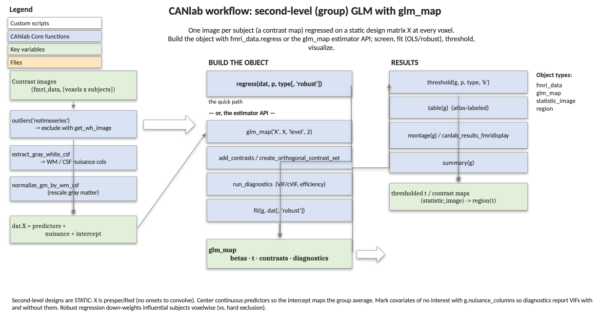

# Second-level fMRI group analysis with `glm_map` — a roadmap

A **second-level** (group) analysis takes one image per subject — usually a
first-level contrast image — and asks where in the brain the effect is reliable
across people, and whether it depends on a covariate (a behavioral score, a
group label, a nuisance measure). CanlabCore expresses this as a
**mass-univariate multiple regression** at every voxel, and the
[`glm_map`](../glm_map_methods.md) object is the container for the design, the
fit, and the diagnostics.

This page is the conceptual map of the second-level workflow: the choices you
make and the methods that implement them. For runnable, copy-pasteable code on
the built-in `emotionreg` dataset (with figures), follow the companion
[**how-to walkthrough**](glm_map_second_level_howto.md). For first-level
(within-run time series) modeling, see the
[**first-level roadmap**](glm_map_first_level_roadmap.md).



---

## 1. The big picture

A group analysis combines a **stack of brain images** (`[voxels × subjects]`,
one column per subject) with a **design matrix `X`** (`[subjects × regressors]`,
e.g. an intercept plus a centered covariate) and fits

> `image = X · betas + error`

independently at each voxel. The output is a `glm_map`: a beta map and a
thresholded *t* map per regressor (and per contrast), plus diagnostics. Unlike
a first-level model there are **no onsets to convolve** — `X` is static and
prespecified, which is the defining feature of second-level designs.

---

## 2. Building the object — two equivalent entry points

| You want… | Use | You get |
|---|---|---|
| The fastest path | `g = regress(dat, p, type, ...)` | a fitted `glm_map` (set `dat.X` first) |
| Control + screening before fitting | the estimator API: `glm_map('X', X, 'level', 2)` → `add_contrasts` → `run_diagnostics` → `fit(g, dat)` | the same fitted `glm_map` |

Both return the **same** object, so everything downstream (`threshold`,
`table`, `montage`, `summary`) is identical. Use `regress` for a one-liner;
use the estimator API when you want to add contrasts and screen the design's
collinearity/efficiency *before* spending compute, or to keep the design as a
reusable object.

---

## 3. The design choices

**Predictors of interest.** The regressors you care about — a behavioral
covariate, a continuous moderator, dummy codes for groups. Centering continuous
predictors makes the intercept interpretable as the group-average map.

**Nuisance covariates.** Variables of no interest that you regress out to
clean up the estimate:

- **Tissue-compartment signals** — mean **white-matter** and **CSF** values
  (`extract_gray_white_csf`) capture image-wide confounds and global scaling.
  Add them as columns of `X`, and mark them nuisance with
  `g.nuisance_columns` so diagnostics treat them correctly.
- **Global normalization** — instead of (or in addition to) covarying, you can
  rescale each image's gray-matter values against its own WM/CSF references
  with `normalize_gm_by_wm_csf`, reducing between-subject scaling differences
  at the source.

**Outliers.** Subjects whose images don't look like the others inflate error
and can drive false positives. `outliers(dat, 'notimeseries')` flags them
(global signal, spatial variability, and Mahalanobis distance among images);
exclude the flagged images with `get_wh_image(dat, ~wh_outliers)` and re-fit.

---

## 4. Estimator: OLS vs robust

| Estimator | Call | When |
|---|---|---|
| **OLS** (default) | `regress(dat, ...)` / `fit(g, dat)` | the standard choice; fast |
| **Robust** (IRLS, bisquare) | `regress(dat, ..., 'robust')` / `fit(g, dat, 'robust')` | down-weights outlier subjects voxelwise; slower but resistant to a few influential images |

Robust regression is a principled alternative to hard outlier exclusion: it
keeps every subject but down-weights those that don't fit at each voxel.

---

## 5. Screening the design — `run_diagnostics`

Before trusting the maps, screen the design. `run_diagnostics(g)` reports:

- **VIF / cVIF** — variance inflation for each regressor and contrast, for the
  full design **and** for the regressors of interest only (so you can see
  whether nuisance covariates are collinear with your predictor);
- **condition number** (scaled, so it isn't fooled by regressor magnitude);
- **leverage** and **Cook's distance** — which subjects most influence the fit;
- **design efficiency** for the contrasts.

`plot_design(g)` visualizes the design matrix and, once diagnostics are
computed, the VIFs with severity reference lines.

---

## 6. Results — threshold, table, visualize

The fit produces `statistic_image` maps. Re-threshold without refitting
(`threshold(g, .005, 'unc', 'k', 10)`), make an atlas-labeled table
(`table(g)`), and render a montage (`montage(g, 't')`, or
`canlab_results_fmridisplay`). Pick an individual regressor or contrast with
`get_wh_image(g.t, k)`. For interactive inspection, open a map in
`canlab_orthviews` (MATLAB three-plane viewer with an atlas region-name readout
under the crosshair) or [`canlab_niivue`](../canlab_niivue_guide.md) (portable
web viewer you can email or embed in a report).

---

## 7. At a glance

```
contrast images (fmri_data)
        │
        ├─ outliers(dat,'notimeseries') ──► exclude with get_wh_image
        ├─ extract_gray_white_csf ─► add WM/CSF nuisance columns to dat.X
        ├─ normalize_gm_by_wm_csf ─► rescale gray matter (optional)
        │
   set dat.X (predictors + nuisance + intercept)
        │
        ├── regress(dat, p, type[, 'robust'])         ──┐
        └── glm_map('X',X,'level',2) → add_contrasts    │ ► glm_map
                 → run_diagnostics → fit(g, dat)        ──┘
        │
   threshold(g) → table(g) / montage(g) / summary(g)
```

## See also

- [`glm_map` methods](../glm_map_methods.md)
- [`fmri_data`](../fmri_data_methods.md) — `regress`, `outliers`, `extract_gray_white_csf`, `normalize_gm_by_wm_csf`
- [First-level (time-series) roadmap](glm_map_first_level_roadmap.md)
